# **Keyestudio Honeycomb Smart Wearable Coding Kit for Micro:bit**

# 1.Description:

The [BBC micro:bit](https://microbit.org/guide/features/) is a tiny programmable computer designed to make learning and teaching easy and fun! This embedded board has a Bluetooth, a USB interface, an accelerometer, a compass, a 5x5 LED dot matrix, light and temperature sensors, buttons, and edge connectors for accessories.

[Keyestudio Honeycomb Smart wearable Kit for Micro:bit](https://wiki.keyestudio.com/KS0456_Keyestudio_Honeycomb_Smart_Wearable_Coding_Kit_for_Micro:bit) is designed for people who is new to the knowledge about electric circuits and programming.

The kit has provided some basic electronic modules like RGB LED, button, buzzer, TEMT6000 light module and others. You can not only learn basic knowledge of these modules, but also use it to design circuits.

With the help of Micro:bit programming technique, your circuits become more animated. Micro:bit Starter kit can help you enter a wonderful world of electronics .

# 2.Kit List
| No.  |                         Component                         | QTY  |                 Picture                  |
| :--: | :-------------------------------------------------------: | :--: | :--------------------------------------: |
|  1   |                 BBC micro:bit main board                  |  1   |  |
|  2   | Keyestudio Edge Connector IO Breakout Board for micro:bit |  1   |  |
|  3   |            Keyestudio micro:bit 1W LED Module             |  1   |  |
|  4   |           Keyestudio micro:bit 5050 RGB Module            |  1   |  |
|  5   |        Keyestudio micro:bit Tactile Button Module         |  1   |  |
|  6   |       Keyestudio micro:bit Capacitive Touch Module        |  1   | 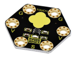 |
|  7   |        Keyestudio micro:bit TEMT6000 Light Module         |  1   | 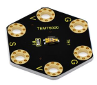 |
|  8   |          Keyestudio micro:bit PIR Motion Module           |  1   |  |
|  9   |          Keyestudio micro:bit Microphone Module           |  1   |  |
|  10  |        Keyestudio micro:bit Passive Buzzer Module         |  1   |  |
|  11  |                    Black USB cable 1m                     |  1   |  |
|  12  |                   Alligator clip cable                    |  10  |  |

# 3.Introduction

( 1 ) What is Micro:bit?

Designed by BBC, Micro:bit main board aims to help children aged above 10 years old to have a better learning of programming.

It is equipped with loads of components,including a 5\*5 LED dot matrix, 2 programmable buttons, a compass, a Micro USB interface and a Bluetooth module and others. Though it is just the size of a credit card, it boasts multiple functions. To name just a few, it can be applied in programming video games, making interactions between light and sound, controlling a robot, conducting scientific experiments, developing wearable devices and make some cool inventions like robots and musical instruments, basically everything imaginable.

This new version, that’s version 2.0, of Micro:bit main board has a touch-sensitive logo and a MEMS microphone. And there is a buzzer built in the other side of the board which makes playing all kinds of sound possible without any external equipment. The golden fingers and gears added provide a better fixing of crocodile clips. Moreover, this board has a sleeping mode to lower the power consumption of battery and it can be entered if users long press the Reset & Power button on the back of it. More importantly, the CPU capacity of this version is much better than that of the V1.5 and the V2 has more RMA.

In final analysis, the Micro:bit main board V2 can allow customers to explore more functions so as to make more innovative products.

Serving as a better device for learning some basic knowledge about microcontroller and electronics, this sensor kit is designed by Keyestudio to help programming enthusiasts enter this wonderful world. This kit consists of a micro:bit control board and some common sensors and modules. In application, we can plug a shield in with DC7-9V to power not only the Micro bit board but also the sensors/ modules. And the shield can be connected by jumper cap to control the voltage of ports V1 and V2 used to supply power for sensors. We plan to provide instructions for using this board and sensors/ modules, including offering connection diagrams and test code.

( 2 ) Comparison between V2.0 & V1.5

**Micro:bit main Board V2.0**：

**Micro:bit main Board V1.5**：

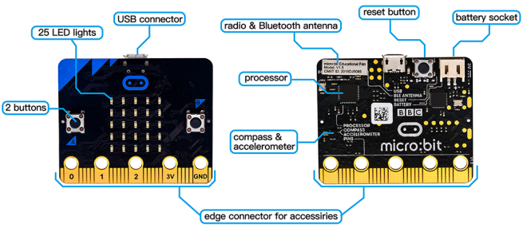

**More details:**

For the Micro: Bit main board V2, pressing the Reset & Power button , it will reset the Micro: Bit and rerun the program. If you hold it tight, the red LED will slowly get darker. When the power indicator flickers into darkness, releasing the button and your Micro: Bit board will enter sleep mode for power saving .This will make your battery more durable. And you could press this button again to ‘wake up’ your Micro:bit.

For more information,please resort to following links：

[https://tech.microbit.org/Components/](https://tech.microbit.org/hardware/)

https://microbit.org/new-microbit/

https://www.microbit.org/get-started/user-guide/overview/

<https://microbit.org/get-started/user-guide/features-in-depth/>

( 3 ) Pinout

Micro:bit main board V2.0 VS V1.5

Browse the official website for more details:

[https://tech.microbit.org/Components/edgeconnector/](https://tech.microbit.org/hardware/edgeconnector/)

[https://microbit.org/guide/Components/pins/](https://microbit.org/guide/hardware/pins/)

( 4 )Notes for the application of Micro:bit main board V2.0

a.It is recommended to cover it with a silicone protector to prevent short circuit for it has a lot of sophisticated electronic components.

b.Its IO port is very weak in driving since it can merely handle current less than 300mA. Therefore, do not connect it with devices operating in large current,such as servo MG995 and DC motor or it will get burnt. Furthermore, you must figure out the current requirements of the devices before you use them and it is generally recommended to use the board together with a Micro:bit shield.

c.It is recommended to power the main board via the USB interface or via the battery of 3V. The IO port of this board is 3V, so it does not support sensors of 5V. If you need to connect sensors of 5 V, a Micro: Bit expansion board is required.

d.When using pins(P3、P4、P6、P7、P10)shared with the LED dot matrix, blocking them from the matrix or the LEDs may display randomly and the data about sensors maybe wrong.

e.The battery port of 3V cannot be connected with battery more than 3.3V or the main board will be damaged.

f. Forbid to use it on metal products to avoid short circuit.

To put it simple, Micro:bit V2 main board is like a micro computer which has made programming at our fingertips and enhanced digital innovation. And about programming environment, BBC provides a website: <https://microbit.org/code/> which has a graphical MakeCode program easy for use.

# 4.Install Micro:bit Driver

If you have downloaded micro:bit driver, then no need to download it again.

If it is you first time to use micro:bit main board, then you will have to download the driver.

First of all, connect the micro:bit to your computer using a USB cable.

And enter the link https://fs.keyestudio.com/KS0456 to download the driver file of micro:bit, .

# 5.Getting Started with Micro:bit

The following instructions are applied for Windows system but can also serve as a reference if you are using a different system.

5.1 Write code and program

This chapter describes how to write program with the App Micro: Bit and load the program to the Micro: Bit main board V2.

You are recommended to browse the official website of Micro:bit for more details, and the link is attached below:

[https://microbit.org/guide/quick/](Https://microbit.org/guide/quick/)

**Step 1: connect the Micro: Bit main board V2 with your computer**

Firstly, link the Micro: Bit main board V2 with your computer via the USB cable.Macs、PCs、 Chromebooks and Linux （including Raspberry Pi）systems are all compatible with the Micro: Bit main board V2.

Note that if you are about to pair the board with your phone or tablet, please refer to this link:

<https://microbit.org/get-started/user-guide/mobile/>

Secondly, if the red LED on the back of the board is on, that means the board is powered. Then Micro: Bit main board V2 will appear on your computer as a driver named 'MICROBIT'. Please note that it is not an ordinary USB disk as shown below.

**Step 2: writing programs**

View the link https://makecode.microbit.org/ in your browser;

Click ‘New Project’;

The dialog box ‘Create a Project’ appears, fill it with ‘heartbeat’ and click ‘Create √’ to edit.

(If you are running Windows 10 system, it is also viable to edit on the APP MakeCode for micro:bit , which is exactly like editing in the website. And the link to the APP is https://www.microsoft.com/zh-cn/p/makecode-for-micro-bit/9pjc7sv48lcx?ocid=badgep&rtc=1&activetab=pivot:overviewtab

Write a set of micro:bit code. You can drag some modules in the Blocks to the editing area and then run your program in Simulator of MakeCode editor as shown in the picture below which demonstrates how to edit ‘heartbeat’ program .

As for loading test code , please turn to Chapter 5.5.

And introduction of Makecode is on the next chapter 5.2.

**Step 3: download test code**

If your computer is Windows 10 and you have downloaded the APP MakeCode for micro:bit to write program, what you will have to do to download the program to your Micro: Bit main board V2 is merely clicking the ‘Download’ button, then all is done.

If you are writing programs through the website, following these steps:

Click the ‘Download’ in the editor to download a "hex" file, which is a compact program format that the Micro: Bit main board can read.Once the hexadecimal file is downloaded, copy it to your board V2 just like the process that you copy the file to the USB drive. If you are running Windows system, you can also right-click and select ‘Send to → Microbit (E) ‘to copy the hex file to the Micro: Bit main board V2

You can also directly drag the "hex" file onto the MICROBIT (E) disk.

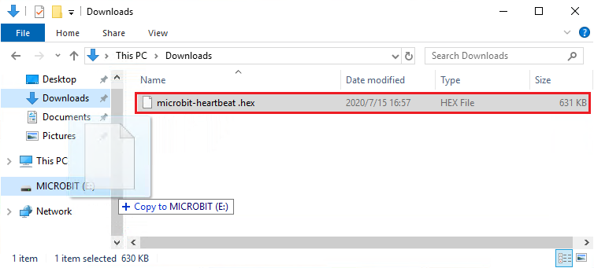

During the process of copying the downloaded hex file to the Micro: Bit main board V2, the yellow signal light on the back side of the board flashes. When the copy is completed, the yellow signal light will stop flashing and remain on.

**Step 4: run the program**

After the program is uploaded to the Micro: Bit main board V2, you could still power it via the USB cable or change to via an external power. The 5 x 5 LED dot matrix on the board displays the heartbeat pattern.

                         

​         micro USB cable                                                     external power（3V）

**Step 5：other programming languages**

This chapter has described how to use the Micro: Bit main board V2.

But except for the Makecode graphical programming introduced you can also write Micro: Bit programs in other languages. Go to the link: <https://microbit.org/code/> to know about other programming languages , or view the link: <https://microbit.org/projects/>, to find something you want to have a go.

5.2 Makecode

Browse <https://makecode.microbit.org/> and enter Makecode online editor or open the APP MakeCode for micro:bit of Windows 10.

Click“New Project”, and input“heartbeat”，then enter Makecode editor, as shown below:

There are blocks“on start”and“forever”in the code editing area.

When the power is plugged or reset,“on start”means that the code in the block only executes once, while“forever”implies that the code runs cyclically.

5.3.Quick Download

As mentioned before, if your computer is Windows 10 and you have downloaded the APP MakeCode for micro:bit to write programs, the program written can be quickly downloaded to the Micro: Bit main board V2 by selecting ‘Download’.

While it is a little more trickier if you are using a browser to enter makecode. However, if you use Google Chrome, suitable for Linux，macOS and Windows 10, the process can be quicker too.

We use the webUSB function of Chrome to allow the internet page to access the Components device connected USB. You could refer to the following steps to connect and pair devices.

**Device pairing :**

Connect micro:bit to your computer by USB cable. Click“...”beside“Download”and click“Pair device”.

Then click another“Pair device”as shown below.

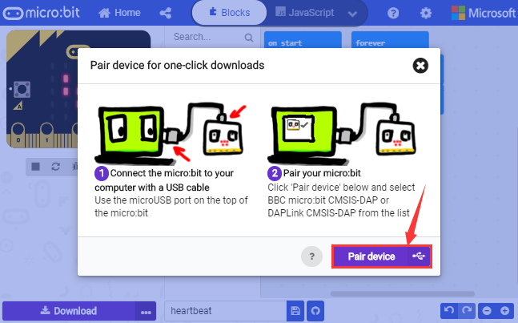

Then select ‘’BBC micro:bit CMSIS-DPA” and click “Connect”. If ‘’BBC micro:bit CMSIS-DPA”does not show up for selection, please refer to [https://makecode.microbit.org/device/usb/webusb/troubleshoot](https://makecode.microbit.org/device/usb/webusb/troubleshoot%20)

We also provide in the resource link.

What’s more, if you don’t know how to update the firmware of micro:bit, refer to the link: [https://microbit.org/guide/firmware/](https://microbit.org/guide/firmware/%20) or browse folderwe provide.

Then click ”Download”. The program is directly downloaded to Micro: Bit main board V2 and the sentence “Download completed!” appears.

5.4 Resources and test code

Tools ,test code and other resources can be downloaded via the link [https://fs.keyestudio.com/KS0456](https://fs.keyestudio.com/KS4005-4006) and it contains following files:

5.5 Input test code

We provide hexadecimal code files (project files) for each project. The file contains all the contents of the project and can be imported directly, or you can manually drag the code blocks to complete the program for each project. For simple projects, dragging a block of code to complete the program is recommended. For complex projects, it is recommended to conduct the program by importing the hexadecimal code file we provide.

Let's take the "Heatbeat" project as an example to show how to load the code.

Open the Web version of Makecode or the Windows 10 App version of Makecode.

Click “Import File”;

Select“ ../Makecode Code/Project 1\_ Heart beat/Project 1\_ Heart beat.hex” ;

Then click “Go ahead”.

In addition to importing the test code file provided into the Makecode compiler above, you can also drag the the test code file provided into the code editing area of the Makecode compiler, as shown in the figure below:

After a few seconds, it is done.

Note: if your computer system is Windows7 or 8 instead of Windows 10, the pairing cannot be done via Google Chrome. 

Therefore, digital signal or analog signal of sensors and modules cannot be shown on the serial port simulator. However, you need to read the corresponding digital signal or analog signal.So what can we do? You can use the CoolTerm software to read the serial port data of the micro:bit. 

Next chapter is about how to install CoolTerm.

5.6 CoolTerm Installation

CoolTerm program is used to read the data on serial port.

Download CoolTerm program: <https://freeware.the-meiers.org/>

1.  After the download, we need to install CoolTerm program file, below is Window system taken as an example.
    
2.  Choose“win”to download the zip file of CoolTerm

3.  Unzip file and open it. (also suitable for Mac and Linux system)

Double-click .

The functions of each button on the Toolbar are listed below: <http://wiki.keyestudio.com/index.php/File:IDE.png>

|                      ICON                       |                     FUCTION                      |
| :---------------------------------------------: | :----------------------------------------------: |
|  |             Opens up a new Terminal              |
|  |             Opens a saved Connection             |
|  |       Saves the current Connection to disk       |
|  |           Opens the Serial Connection            |
|  |           Closes the Serial Connection           |
|  |             Clears the Received Data             |
|  |       Opens the Connection Options Dialog        |
|  | Displays the Terminal Data in Hexadecimal Format |
|  |             Displays the Help Window             |

# 6.  Projects

(Note: project 1 to 12 will be conducted with the built-in sensors and LED dot matrix of the Micro:bit main board V2)

## **Project 1: Heartbeat**

**( 1 )Project Description**

This project is easy to conduct with a micro:bit V2 main board, a Micro USB cable and a computer. The micro:bit LED dot matrix will display a relatively big heart-shaped pattern and then a smaller one. This alternative change of this
pattern is like heart beating. This experiment serves as a starter for your entry to the programming world.

**( 2 )Components Needed:**

|      |  |
| -------------------------- | ---------------------- |
| Micro:bit Main Board V2 *1 | Micro USB Cable*1      |

**(3) Test Code:**

Attach the Micro:bit main board V2 to your computer via the Micro USB cable and begin editing.

Firstly, click”basic”module and find and drag the block “show icon  “ to module “forever”;

Secondly, click”basic”module again and find and drag the block “show icon  “ to module “forever”and click the little triangle to select “show icon ”;

Thirdly, click”basic”module and find and drag the block””to the code block and click the littler triangle to select 500;

Complete Program：

Note: the “on start”means that code in the block only executes once, while“forever”implies that the code runs cyclically.

Click”JS JavaScript”, you will find the corresponding programming languages.

Click the little triangle”of JS JavaScript”to choose “Python”, you will find the corresponding Python programming languages.

**( 4 )Test Results:**

After uploading test code to micro:bit main board V2 and keeping the connection with the computer to power the main board, the LED dot matrix shows pattern “”and then “”alternatively.

(Please refer to chapter 5.3 to know how to download test code quickly.)

If the downloading is not smooth, please remove the micro USB from the main board and then reconnect them and reopen Makecode to try again.

## **Project 2: Light A Single LED**

**( 1 )Project Description:**

The LED dot matrix consists of 25 LEDs arranged in a 5 by 5 square. In order to locate these LEDs quickly, as the figure shown below, we can regarded this matrix as a coordinate system and create two aces by marking those in rows from 0 to 4 from top to bottom, and the ones in columns from 0 to 4 from the left to the right. Therefore, the LED sat in the second of the first line is (1,0）and the LED positioned in the fifth of the fourth column is (3,4）and others likewise.

**( 2 )Components Needed:**

-   Micro:bit main board V2 \*1

-   Micro USB cable\*1

**( 3 )Test Code:**

Attach the Micro:bit main board V2 to your computer via the Micro USB cable and begin editing.

Firstly, click”Led”module and then the”more”module to find and drag the block “led enable false “ to block“on start”; click the little triangle of “led enable false “ to select”true”;

Secondly, click”Led”module and to find and drag the block “toggle x 0 y 0“ to block“forever”and alter “x0” to”x1”;

Thirdly, click”Basic”module to find and drag the block”pause(ms)100”to “forever” block and set pause to 500;

Fourthly, copy the block  and place it into forever” block;

Fifthly, click”Led”module to find and drag the block”plot x 0 y 0”to “forever” block and change the “x 0 y 0” to “x 3 y 4”;

Sixthly, copy the block “pause(ms)500” and place it into forever” block;

Lastly, click”Led”module to find and drag the block”unplot x 0 y 0”to “forever” block and change “x 0 y 0” to “x 3 y 4”;and copy and place the block“pause(ms)500”to block “forever”;

Complete Program：

Click”JS JavaScript”, you will find the corresponding programming languages.

Click the little triangle”of JS JavaScript”to choose “Python”, you will find the corresponding Python programming languages.

**( 4)Test Results**

After uploading test code to micro:bit main board V2 and powering the main board via the USB cable, the LED in (1,0) lights up for 0.5s and the one in (3,4) shines for 0.5s and repeat this sequence.

## **Project 3: LED Dot Matrix**

**( 1 )Project Description:**

Dot matrices are very commonplace in daily life. They have found wide applications in LED advertisement screens, elevator floor display, bus stop announcement and so on.

The LED dot matrix of Micro: Bit main board V2 contains 25 LEDs in a grid. Previously, we have succeeded in controlling a certain LED to light by integrating its position value into the test code. Supported by the same theory,
we can turn on many LEDs at the same time to showcase patterns, digits and characters.

What’s more, we can also click”show icon“ to choose the pattern we like to display. Last but not the least, we can our design patterns buy ourselves.

**( 2 )Components Needed:**

-   Micro:bit main board V2 \*1

-   Micro USB cable\*1

**( 3 )Test Code 1：**

Link computer with micro:bit board by micro USB cable, and program in MakeCode editor.

Enter“Led”→“more”→“led enable false” and click the drop-down triangle button to select “true”

Combine it with “on start” block

Click “Led” to move “plot x 0 y 0” into “forever”，then replicate “plot x 0 y 0” for 8 times, respectively set to “x 2”y 0”, “x 2”y 1”, “x 2”y 2”, “x 2”y 3”, “x2”y 4”, “x 1”y 3”, “x 0”y 2”, “x 3”y 3”, “x 4”y 2”.

Complete Program：

Select “JavaScript"  and “Python” to switch into JavaScript and Python language code:

**( 4 )Test Results 1：**

Upload code 1 and power on , we will see the icon 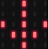 .

**( 5 ) Test Code 2：**

Link computer with micro:bit board by micro USB cable, and program in MakeCode editor.

1.  A. Enter“Basic”→“show number 0”block,

2.  Duplicate it for 4 times, then separately set to“show number 1”,“show number 2”,“show number 3”,“show number 4”,“show number 5”.

Click“Basic”→“show leds”, then put it into“forever”block，tick blue boxes to light LED and generate“↓”pattern.

Move out the block “show string” from “Basic” block, and leave it beneath the “show leds” block

Choose “show icon” from “Basic” block, and leave it beneath the block show string “Hello!” block

  Enter “Basic”→“show arrow North”;

Leave it into “forever” block, replicate “show arrow North” for 3 times, respectively set to “North East”, “South East”, “South West”, “North West”.

Click “Basic” to get block “clear screen” then remain it below the block “show arrow North West”.

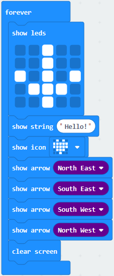

(5) Drag “pause (ms) 100” block from“Basic” block and set to 500ms, then leave it below “clear screen” block.

Complete Program:

Select “JavaScript" and “Python” to switch into JavaScript and Python language code:

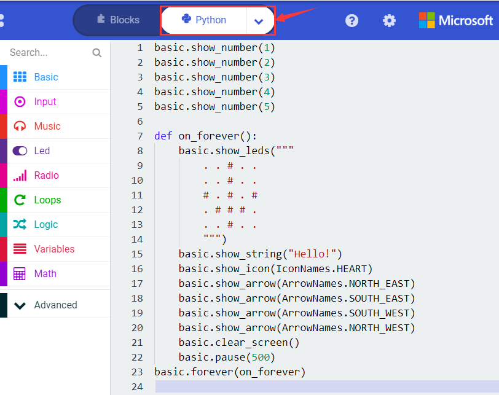

**( 6 )Test Results 2：**

Upload code 2 and plug micro:bit to power. Micro: bit starts showing number 1, 2, 3, 4, and 5, then cyclically display,“Hello!”,  ,  , ,  and patterns.

## **Project 4: Programmable Buttons**

**( 1 )Project Description:**

Buttons can be used to control circuits. In an integrated circuit with a button, the circuit is connected when pressing the button and it is open the other way around.

Micro: Bit main board V2 boasts three buttons, two are programmable buttons(marked with A and B), and the one on the other side is a reset button. By pressing the two programmable buttons can input three different signals. We can press button A or B alone or press them together and the LED dot matrix shows A,B and AB respectively. Let’s get tarted.

**( 2 )Components Needed:**

-   Micro:bit main board V2 \*1

-   Micro USB cable\*1

**( 3 )Test Code 1：**

Link computer with micro:bit board by micro USB cable, and program in MakeCode editor,

Delete“on start”and“forever”firstly，then click“Input”→“on button A pressed”

Click“Basic”→“show string”;

Then place it into“on button A pressed”block, change “Hello!”into“A”.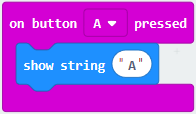

Copy code stringonce, tap the drop-down button“A”to select“B”and modify
character“A”into“B”.

Copyonce，and set to“on button A+B pressed”and“show string “AB”

Complete Code:

Select “JavaScript" and“Python”to switch into JavaScript and Python language code:

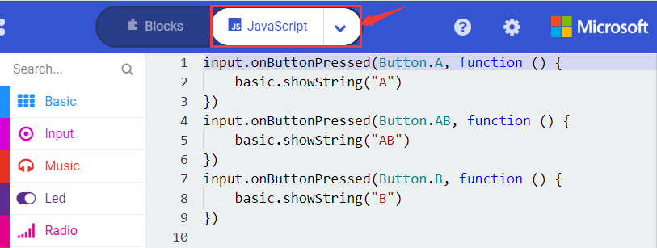

**( 4 )Test Results 1：**

After uploading test code 1 to micro:bit main board V2 and powering the main board via the USB cable, the 5\*5 LED dot matrix shows A if button A is pressed, B if button B pressed, and AB if button A and B pressed together.

**( 5 ) Test Code 2：**

 Click“Led”→“more”→“led enable false”,

Put it into the block“on start”，click drop-down triangle button to select“true” .

Tap“Variables”→“Make a Variable...”→“New variable name：”

Enter“item”in the dialog box and click“OK”，then variable“item”is produced. And move“set item to 0”into“on start”block

Click“Input”→“on button A pressed”.

Go to“Variables”→“ change item by 1 ”

Place it into“on button A pressed”and 1 is modified into Duplicatecode string once, click the drop-down button to select“B”，then set“change item by -5”.

Enter“Led”→“plot bar graph of 0 up to 0”

Keep it into“forever”block

Go to“Variables”to move“item”into 0 box，change 0 into 25.

Go to“Logic”to move out “if...true...then...”and “=”blocks，

Keep“=”into“true”box and set to “\>”

Select“item”in the “Variables” and lay it down at left box of “\>”，change 0 into 25；Enter “Variables” to drag “set item to 0” block into “if...true..then...”, alter 0 into 25.

Replicate code stringonce “\>” is modified into “\<” and 25 is changed into 0, Leave it beneath code string.

Complete Program：

Select “JavaScript" and“Python”to switch into JavaScript and Python language code:

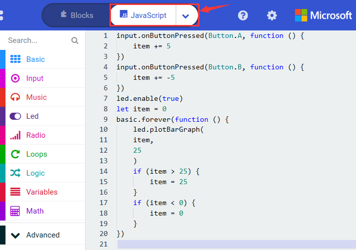

**( 6 )Test Results 2：**

Uploading test code 2 to micro:bit main board V2 and powering the main board via the USB cable, when pressing the button A the LEDs turning red increase while when pressing the button B the LEDs turning red reduce.

## **Project 5: Temperature Detection**

**( 1 )Project Description:**

Micro:bit main board V2 is not equipped with a temperature sensor, but uses the temperature sensor built into NFR52833 chip for temperature detection. Therefore, the detected temperature is more closer to the temperature of the
chip, and there maybe deviation from the ambient temperature.

**( 2 )Components Needed:**

-   Micro:bit main board V2 \*1

-   Micro USB cable\*

**( 3 )Test Code 1：**

Click“Advanced”→”Serial”→“serial redirect to USB” into “on start”

 Go to“Serial”→“serial write value“x”=0”into “forever”

Click“Input” → “temperature(℃)” into“into serial write value “x”=0 and change ”0” into “temperature”

Go to“Basic”→“pause (ms) 100”into “forever”and set pause to 500

Complete Program：

Select “JavaScript" and “Python” to switch into JavaScript and Python language code:

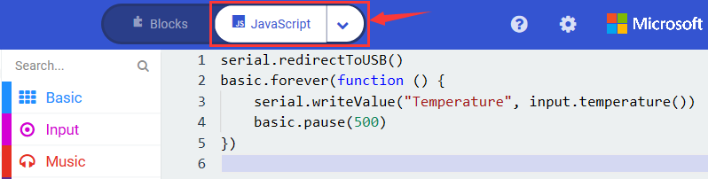

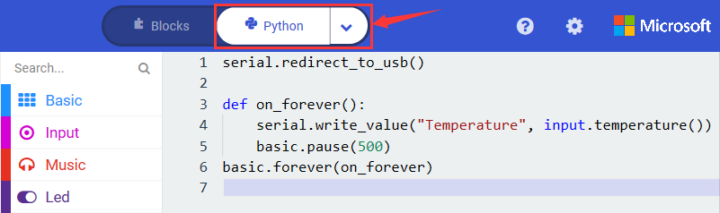

**( 4 )Test Results 1：**

After uploading test code 1 to micro:bit main board V2, powering the main board via the USB cable, and clicking “Show console Device”, the data of temperature shows in the serial monitor page as shown below.

If you're running Windows 7 or 8 instead of Windows 10, via Google Chrome won't be able to match devices. You'll need to use the CoolTerm serial monitor software to read data.

You could open CoolTerm software, click Options, select SerialPort, set COM port and baud rate to 115200 (after testing, the baud rate of USB SerialPort communication on Micro: Bit main board V2 is 115200), click OK, and Connect. The CoolTerm serial monitor shows the change of temperature in the current environment, as shown in the figures below :

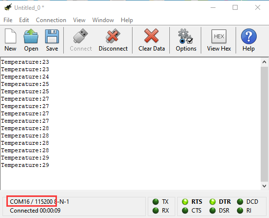

**( 5 )Test Code 2：**

Link computer with micro:bit board by micro USB cable, and program in MakeCode  editor,

Go to“Led”→“more”→“led enable false”block,

 Keep it into the“on start”block，tap the triangle button to select“true”.

Tap “Logic” and drag “if...then...else” into “forever” block; and then drag “=” into “true”

Enter “Input” to move “temperature(℃)” into the left side of “=”; click the little triangle of “=” to choose “≥”,and change the “0” to “35”

Click “Basic” to find out block “show icon” and move it into“then”; copy and place the block “show icon” to “else” and click the little triangle of  “”to select “”

Complete Program：

Select “JavaScript" and “Python” to switch into JavaScript and Python language code:

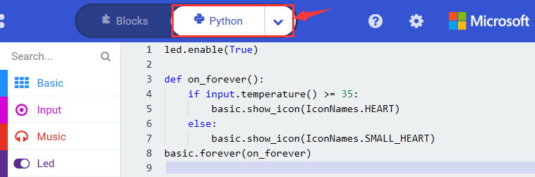

**( 6 )Test Results 2：**

After uploading the code 2, when the ambient temperature is less than 35℃, 5*5LED will show. When the temperature is equivalent to or greater than 35℃, the pattern will appear.

## **Project 6: Geomagnetic Sensor**

**( 1 )Project Description:**

This project aims to explain the use of the Micro: bit geomagnetic sensor, which can not only detect the strength of the geomagnetic field, but also be used as a compass to find bearings. It is also an important part of the attitude heading
reference system (AHRS). 

Micro: Bit main board V2 uses LSM303AGR geomagnetic sensor, and the dynamic range of magnetic field is ±50 gauss. In the board, the magnetometer module is used in both magnetic detection and compass. In this experiment, the compass will be introduced first, and then the original data of the magnetometer will be checked.

The main component of a common compass is a magnetic needle, which can be rotated by the geomagnetic field and point toward the geomagnetic North Pole (which is near the geographic South Pole) to determine direction.

**( 2 )Components Needed:**

-   Micro:bit main board V2 \*1

-   Micro USB cable\*1

**( 3 )Test Code 1：**

Link computer with micro:bit board by micro USB cable, and program in MakeCode editor.

Click“Input”→“more”→“calibrate compass”

Lay down it into block“on start”.

Go to“Input”→“on button A pressed”.

 Enter“Basic”→“show number”, put it into“on button A pressed”block;

Tap“Input”→“compass heading(℃)”， and place it into“show number”

Complete Program：

Select“JavaScript" and“Python”to switch into JavaScript and Python language code:

**( 4 )Test Results 1：**

After uploading test code to micro:bit main board V2 and powering the board via the USB cable, and pressing the button A, the board asks us to calibrate compass and the LED dot matrix shows “TILT TO FILL SCREEN”. Then enter the calibration page. Rotate the board until all 25 LEDs are on red as shown below.

After that, a smile pattern appears, which implies the calibration is done. When the calibration process is completed, pressing the button A will make the magnetometer reading display directly on the screen. And the direction north, east, south and west correspond to 0°, 90°, 180° and 270°.

**( 5 ) Test Code 2：**

This module can keep reading data to determine direction, so does point to the current magnetic North Pole by arrow.

For the above picture, the arrow pointing to the upper right when the value ranges from 292.5 to 337.5. Since 0.5 can’t be input in the code the values we get are 293 and 338.

Link computer with micro:bit board by micro USB cable, and program in MakeCode editor,

Enter“Input”→ “more”→“calibrate compass”

Move“calibrate compass”into“on start”

 Click“Variables”→“Make a Variable...”→“New variable name：”

Input“x”in the blank box and click“OK”, and the variable “x” is generated.

 Drag out“set x to”into“forever”block

Go to“Input”→“compass heading(℃)”, and keep it into“0”box

Tap“Logic”→“if...then...else”, leave it below block“sex x to compass heading”, then clickicon for
6 times.

Place“and”into“true”block, Then move“=”block to the left box of “and” Click“Variables”to drag“x”to the left “0”box, change 0 into 293 and set to “≥”; Then copy“x≥293”once and leave it to the right “0”box and set to“x\<338”

Go to“Basic”→“show leds” Lay it down beneath block, then click“show leds”and the pattern appears.

Duplicate for 6 times. Separately leave them into the blank boxes behind “else if”. Set to“x≥23 and x\<68”,“x≥68 and x\<113 ”,“x≥113 and x\<158 ”,“x≥158 and x\<203 ”,“x≥203 and x\<248 ”,“x≥248 and x\<293 ”respectively.

Then copy “show leds”for 7 times and keep them below the “else if.......then” block respectively. Click the blue boxes to form the pattern“”, “”, “”, “”, “”, “”and “”.

Complete Program：

Select“JavaScript" and“Python”to switch into JavaScript and Python language code:

**( 6 ) Test Results 2**

Upload code 2 and plug micro:bit to power. After calibration, tilt micro:bit board, the LED dot matrix displays the direction signs.

## **Project 7: Accelerometer**

**( 1 )Project Description:**

The Micro: Bit main board V2 has a built-in LSM303AGR gravity acceleration sensor, also known as accelerometer, with a resolution of 8/10/12 bits. The code section sets the range to 1g, 2g, 4g, and 8g.

We often use accelerometer to detect the status of machines.

In this project, we will introduce how to measure the position of the board with the accelerometer. And then have a look at the original three-axis data output by the accelerometer.

**( 2 )Components Needed:**

-   Micro:bit main board V2 \*1

-   Micro USB cable\*1

**( 3 )Test Code 1：**

Link computer with micro:bit board by micro USB cable, and program in MakeCode editor,

Enter“Input”→“on shake”，

Click“Basic”→“show number”, place it into“on shake”block, then change 0 into  ,  Copy code string for 7 times; separately click the triangle button to select“logo up”,“logo down”,“screen up”,“screen down”,“tilt left”,“tilt right”and“free fall”, then respectively change 1 into 2, 3, 4, 5, 6, 7, 8.

Complete Program：

 

 

Select“JavaScript" and“Python”to switch into JavaScript and Python language code:

**( 4 )Test Results 1:**

After uploading the test code 1 to micro:bit main board V2 and powering the board via the USB cable, if we shake the Micro: Bit main board V2. no matter at any direction, the LED dot matrix displays the digit “1”.

When it is kept upright （put its logo above the LED dot matrix）, the number 2 will show.

When it is kept upside down( make its logo below the LED dot matrix) , it will show as below.

When it is placed still on the desk, showing its front side, the number 4 appears.

When it is placed still on the desk, showing its back side, the number 5 will exhibit.

When the board is tilted to the left , the LED dot matrix shows the number 6 as shown below.

When the board is tilted to the right , the LED dot matrix displays the number 7 as shown below

When the board is knocked to the floor, this process can be considered as a free fall and the LED dot matrix shows the number 8. (please note that this test is not recommended for it may damage the main board.)

Attention: if you’d like to try this function, you can also set the acceleration to 3g, 6g or 8g. But still ,we don not recommend.

**( 5 )Test Code 2：**

Go to“Advanced”→“Serial”→“serial redirect to USB”

Drag it into“on start”

Enter“Serial”→“serial write value x =0”

 Leave it into“forever”block

 Click“Input”→“acceleration(mg) x”；

Keep it into“0”box and capitalize the“x”

Go to“Basic”and move out“pause (ms) 100”below theblock, then set to 100ms.

Replicate code string

for 3 times and keep them into“forever”block，separately set the whole code string as follows:

Complete Program：

Select “JavaScript" and “Python” to switch into JavaScript and Python language code:

**( 6 ) Test Results 2**

Upload test code to micro:bit main board V2, power the main board via the USB cable, and click “Show console Device”.

After referring to the MMA8653FC data manual and the Components schematic diagram of the Micro: Bit main board V2, the accelerometer coordinate of the Micro: Bit V2 motherboard are shown in the figure below:

The following interface shows the decomposition value of acceleration in X axis, Y axis and Z axis respectively, as well as acceleration synthesis (acceleration synthesis of gravity and other external forces).

If you're running Windows 7 or 8 instead of Windows 10, via Google Chrome won't be able to match devices. You'll need to use the CoolTerm serial monitor software to read data.

You could open CoolTerm software, click Options, select SerialPort, set COM port and baud rate to 115200 (after testing, the baud rate of USB SerialPort communication on Micro: Bit main board V2 is 115200), click OK, and Connect. The CoolTerm serial monitor shows the data of X axis, Y axis and Z axis , as shown in the figures below :

## **Project 8: Light Detection**

**( 1 )Project Description:**

In this project, we focus on the light detection function of the Micro: Bit main board V2. It is achieved by the LED dot matrix since the main board is not equipped with a photoresistor.

**( 2 )Components Needed:**

-   Micro:bit main board V2 \*1

-   Micro USB cable\*1

**( 3 )Test Code：**

Link computer with micro:bit board by micro USB cable, and program in MakeCode editor, Enter“Advanced”→“Serial”→“serial redirect to USB”; Drag it into“on start”block.

Go to“Serial”→“serial write value x =0”;

Move it into“forever”

 Click“Input”→“acceleration(mg) x”. Put“acceleration(mg) x”in the“0”box and change “x”into“Light intensity”.

Click“Basic”→“pause (ms) 100”; Lay it down into“forever”and set to 100ms.

Complete Program：

Select “JavaScript" and“Python”to switch into JavaScript and Python language code:

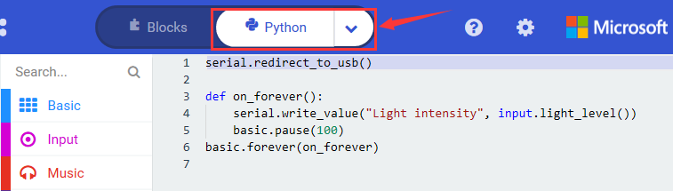

**( 4 )Test Results:**

Upload the test code to micro:bit main board V2, power the board via the USB cable and click “Show console Device”.

When the LED dot matrix is covered by hand, the light intensity showed is approximately 0; when the LED dot matrix is exposed to light,the light intensity displayed gets stronger with the light as shown below.

If you're running Windows 7 or 8 instead of Windows 10, via Google Chrome won't be able to match devices. You'll need to use the CoolTerm serial monitor software to read data.

You could open CoolTerm software, click Options, select SerialPort, set COM port and baud rate to 115200 (after testing, the baud rate of USB SerialPort communication on Micro: Bit main board V2 is 115200), click OK, and Connect. The CoolTerm serial monitor shows the value of light intensity , as shown in the figures below :

## **Project 9: Speaker**

**( 1 )Project Description:**

The Micro: Bit main board V2 has an built-in speaker, which makes adding sound to the programs easier. We can program the speaker to air all kinds of tones like playing the song *Ode to Joy*.

**( 2 )Components Needed:**

-   Micro:bit main board V2 \*1

-   Micro USB cable\*1

**( 3 )Test Code：**

Link computer with micro:bit board by micro USB cable, and program in MakeCode editor,

Enter“Basic”module to find “show icon”and drag it into “on start”block;

Click the little triangle to find

Enter“Music”module to find and drug“play sound giggle until done” into “forever”block;

Enter“Basic”module to find and drug“pause(ms) 100” into “forever” block ;

Change 100 into 1000;

Copy  three times and place it into “forever” block ; Click the little triangle to select “happy”, ”hello”, ”yawn”;

Complete Program：

Select“JavaScript" and“Python”to switch into JavaScript and Python language code:

**( 4 )Test Results:**

After uploading the test code to micro:bit main board V2 and powering the board via the USB cable, the speaker utters sound and the LED dot matrix shows the logo of music.

## **Project 10: Touch-sensitive Logo**

**( 1 )Project Description:**

The Micro: Bit main board V2 is equipped with a golden touch-sensitive logo, which can act as an input component and function like an extra button.

It contains a capacitive touch sensor that senses small changes in the electric field when pressed (or touched), just like your phone or tablet screen do.When you press it , you can activate the program.

**( 2 )Components Needed:**

-   Micro:bit main board V2 \*1

-   Micro USB cable\*1

**( 3 )Test Code：**

Link computer with micro:bit board by micro USB cable, and program in MakeCode editor,

( 1 ) Delete block“on start”and“forever”;

( 2 )Enter“Input”module to find and drag“on logo pressed” ;

Click the little triangle to find “touched”’;

( 3 ) Enter module “Variables”→choose“Make a Variable”→input “start”→click “OK”

The variable“start”is established;

Enter“Variables”module to find and drag “set start to 0” into “on logo touched”block;

( 4 )Enter“Input”module →click “more”→ find and drag“running time(ms)” into the “0” of “set start to 0” block;

( 5 )Enter“Basic”module to find and drag“show icon” into “on logo touched”block;

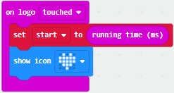

( 6 )Enter“Input”module to find and drag“on logo pressed”→choose “released”→ establish variable “time”; Enter“Variables”module to find and drag “set time to 0”into “on logo pressed”block; Enter“Math”module to find and drag “0-0”into the “0”of“set start to 0”block;

( 7 )Enter“Input”module→ “more” → find and drag “running time(ms)” into “0”on the left side of “0-0”;

Enter“Variables”module to find and drag“start” into “0”on the right side of “0-0”;

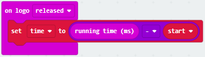

( 8 )Enter“Basic”module to find and drag“show number” into “on logo released”block;

Enter“Math”module to find and drag“square root 0” into “0”; Click the little triangle to find”integer÷”;

( 9 ) Enter“Variables”module to find and drag“time” into “0”on the left side of “0-0”and change the “0”on the right side to”1000”;

Complete Program：

Select “JavaScript" and “Python” to switch into JavaScript and Python language code:

**( 4 )Test Results:**

After uploading the test code to micro:bit main board V2 and powering the board via the USB cable, the LED dot matrix exhibits the heart pattern when the touch-sensitive logo is pressed or touched while displays digit when the logo is released.

## **Project 11: Microphone**

**( 1 )Project Description:**

The Micro: Bit main board V2 is built with a microphone which can test the volume of ambient environment. When you clap, the microphone LED indicator will turn on. Since it can measure the intensity of sound, you can make a noise scale or disco lighting changing with music. The microphone is placed on the opposite side of the microphone LED indicator and in proximity with holes that lets sound  pass.When the board detects sound, the LED indicator lights up.

**( 2 )Components Needed:**

-   Micro:bit main board V2 \*1

-   Micro USB cable\*1

**( 3 )Test Code 1：**

Link computer with micro:bit board by micro USB cable, and program in MakeCode editor,

( 1 ) Delete block“on start”and“forever”;

( 2 ) Enter“Input”module to find and drag“on loud sound”;

Enter“Basic”module to find and drag “show number”into “on loud sound”block ;

( 3 )Copy  once; Click the little triangle of “lond” to choose”quiet”; Click the little triangle of “” to choose””;

Complete Program：

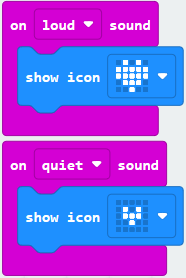

Select“JavaScript" and“Python”to switch into JavaScript and Python language code:

**( 4 )Test Results 1:**

Uploading test code to micro:bit main board V2 and powering the board via the USB cable, the LED dot matrix displays pattern when you claps and pattern  when it is quiet around.

**( 5 )Test Code 2:**

Link computer with micro:bit board by micro USB cable, and program in MakeCode editor,

( 1 )Enter“Advanced”module→ choose“Serial”to find and drag“serial redirect to USB”into “on start”block ;

( 2 )Enter“Variables”module→ choose“Make a Variable”→ input “maxSound”→click “OK”,variable ”maxSound”is established;

Enter“Variables”module to find and drag“set maxSound to 0”into “on start”block ;

( 3 )Enter“Logic”module to find and drag“if true then...else”into “forever” block ; Enter“Input”module to find and dragbutton A is pressed”into “then” ;

( 4 )Enter“Basic”module to find and drag“show number”into “then” ; Enter“Variables”module to find and drag“maxSound”into “0” ;

( 5 )Establish variable“soundLevel”;

Enter“Variables”module to find and drag“set soundLevel to 0”into “else”;

Enter“Input”module to find and drag“sound level” into “0”;

( 6 )Enter“Led”module to find and drag“plot bar graph of 0 up to 0” into “else”;

Enter“Variables”module to find and drag“soundLevel”into the “0”behind “of”;

Change the “0”behind “up” to “255”;

( 7 )Enter“Logic”module to find and drag“if true then”into “else”block ;

Enter“Logic”module to find and drag“0 \> 0”into “then” ;

Enter“Variables”module to find and drag“soundLevel”into “0”on the left side of “0-0” ;

Enter“Variables”module to find and drag“maxSound” into “0” on the right side;

( 8 )Enter“Variables”module to find and drag“set maxSound to 0”into the second “then” ;

Enter“Variables”module to find and drag“soundLevel”into the “0” ;

Complete Program：

Select “JavaScript" and“Python”to switch into JavaScript and Python language code:

**( 6 )Test Results 2:**

Upload test code to micro:bit main board V2, power the board via the USB cable and click “Show console Device”as shown below.

When the sound is louder around, the sound value shows in the serial port is bigger as shown below.

What’s more, when pressing the button A, the LED dot matrix displays the value of the biggest volume( please note that the biggest volume can be reset via the Reset button on the other side of the board ) while when clapping, the LED dot matrix shows the pattern of the sound.

## **Project 12: Bluetooth Wireless Communication**

**( 1 )Project Description:**

The Micro: Bit main board V2 comes with a nRF52833 processor (with built-in Bluetooth 5.1 BLE(Bluetooth Low Energy) device) and a 2.4GHz antenna for Bluetooth wireless communication and 2.4GHz wireless communication. With the help of them, the board is able to communicate with a variety of Bluetooth devices, including smart phones and tablets.

In this project, we mainly concentrate on the Bluetooth wireless communication function of this main board. Linked with Bluetooth, it can transmit code or signals. To this end, we should connect an Apple device (a phone or an iPad) to the board.

Since setting up Android phones to achieve wireless transmission is similar to that of Apple devices, no need to illustrate again.

**( 2 ) Preparation**

Attachment of the Micro:bit main board V2 to your computer via the Micro USB cable.

An Apple device (a phone or an iPad) or an Android device;

**( 3 ) Procedures:**

For Apple devices, enter this link <https://www.microbit.org/get-started/user-guide/ble-ios/> with your computer first, and then click “Download pairing HEX file” to download the Micro: Bit firmware to a folder or desk, and upload the downloaded firmware to the Micro: Bit main board V2.

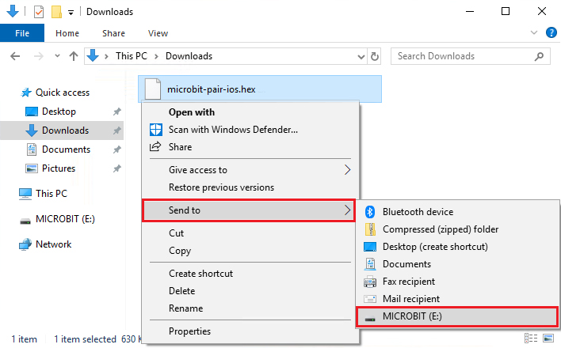

Search “micro bit”in your App Store to download the APP micro:bit.

Connect your Apple device with Micro: Bit main board V2:

Firstly, turn on the Bluetooth of your Apple device and open the APP micro:bit to select item “Choose micro:bit”to start pairing Bluetooth.

Please make sure that the Micro: Bit main board V2 and your computer are still linked via the USB cable.

Secondly, click“Pair a new micro:bit”;

Following the instructions to press button A and B at the same time(do not release them until you are told to) and press Reset & Power button for a few seconds.

Release the Reset & Power button, and a password-like pattern shows on the LED dot matrix. Now , release buttons A and B and click Next.

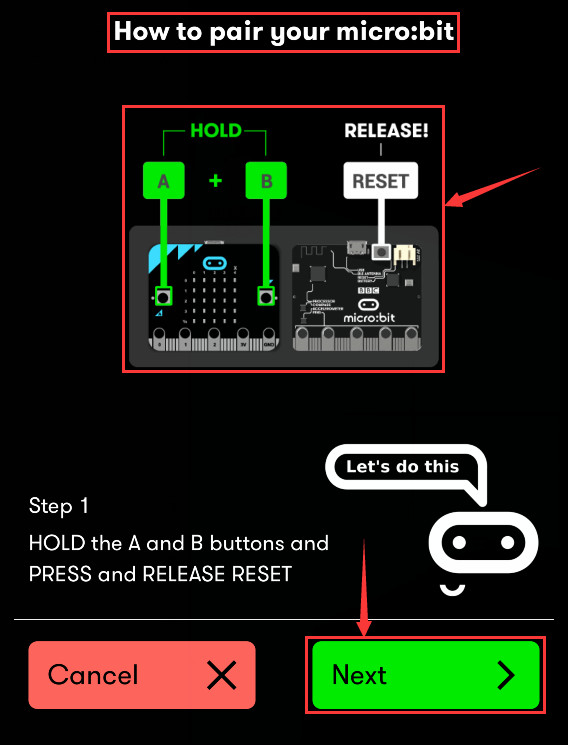

Set the password pattern on your Apple device as the same pattern showed on the matrix and click Next.

Still click Next and a dialog box props up as shown below. Then click "Pair". A few seconds later, the match is done and the LED dot matrix displays the "√" pattern.

After the match with Bluetooth, write and upload code with the App.

Click “Create Code” to enter the programming page and write code.

Click  and the box  appears, and then select “Create √”.

Name the code as “1 “and click to save it.

Click the third item“Flash”to enter the uploading page. The default code program for uploading is the one saved just now and named "1" and then click the other "Flash" to upload the code program "1".

If the code is uploaded successfully a few seconds later, the App will emerge as below and the LED dot matrix of the Micro: Bit main board V2 will exhibit a heart pattern.

Projects below all conduct with the built-in sensors and the LED dot matrix while the following ones will carry out with the help of external sensors.

**（Attention：to avoid burning the the Micro:bit main board V2, please remove the USB cable and the external power from the board before fix it with a T-shaped shield; likewise, the USB cable and the external power should be cut from the main board before disconnect the shield from the board.)**

## **Project 13: LED Flashes**

**Overview**

**keyestudio 1W LED Module For BBC micro:bit (Black and Eco-friendly)**

This LED module is fully compatible with micro:bit control board. It can emit white light. Its maximum operating current is 400mA, and the maximum power is 1W. When using, connect the LED module to micro:bit control board using Crocodile clip line.

There are total 6 rings on the module, namely two G rings, two V rings and two S rings which are separately connected.

When using, G ring is for ground; V for 3V; S for signal pin (0 1 2). When the signal end is HIGH, LED lights.

**Technical Parameters**

-   Working voltage: DC 3.0-3.3V

-   Working current: 400mA

-   Power: 1W

-   Light Color: white

-   Dimensions: 31mm\*27mm\*8mm

-   Weight: 2.4g

-   Environmental attributes: ROHS

**Components Required:**

-   Micro:bit main board \*1

-   keyestudio 1W LED Module for micro:bit \*1

-   Alligator clip cable \*3

-   USB cable \*1

**Connection Diagram**

Connect the keyestudio 1W LED Module to micro:bit main board with 3 Alligator clip cables. Ring S to P0, V to 3V, G to GND. 

Connect the micro:bit to your computer with a micro USB cable.

**Coding**

So now let's move to coding. Let us see how to code the LED to flash. Below are some steps to follow.

Open the [https://makecode.micro:bit.org/\#editor](https://makecode.microbit.org/#editor) to write your code.

Microsoft MakeCode is actually a platform that allows us to code with a micro:bit, and also provides an interactive simulator where we can debug and run our code, and will be able to see what to expect out right there on the site.

Go to MakeCode and choose **My Projects** and click on **New Projects**.

If you want to see the codes behind, then you can click on JavaScript and it will display JavaScript code there in IDE.

**LED Flashes**

Let's get started and code the LED to flash. To do so, you just need to go to **Basic** and scroll down to see an **on start** block.

Now drag and drop, and go to **Led** and click **more** to drag out the block **led enable(false)** into **on start** block.

And again go to **Basic** and drag the **forever** block beneath the on start block you just made.

Go to the **Pins**, drag and drop the **digital write pin(P0) to (0)** block into **forever** block.

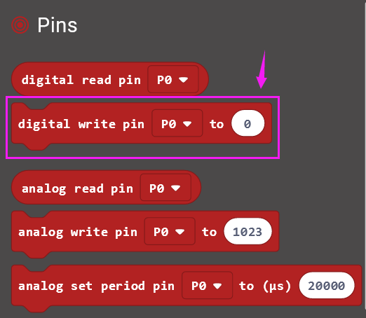

Look back at the connection diagram, we connect the signal pin to P0. So we select the **P0** in the code; and change the 0 to **1**, which means input a **HIGH** level to the pin so as to **lit** the LED.

Then we can duplicate the block and change the value to **0**, means input a **LOW** level to the pin to **turn off** the LED.

If we want to make the LED keep ON for a few seconds, able to add a **pause (ms)** block. This delay period is in milliseconds, so if you want the LED display as fast, change the value, try 500ms.

After completing the code, let's move on to name and download the program we’vewritten.

**Test Code:**

**Result**

Connect the micro:bit to your computer with a micro USB cable. You can right-click the microbit HEX file to send to your micro:bit main board.

Powered the microbit with batteries, the LED on the module should flash for one second, then off for one second, circularly and alternately.

## **Project 14: RGB Flashes**

**Overview**

**keyestudio 5050 RGB Module For BBC micro:bit**

This module mainly contains a 5050 RGB LED, fully compatible with micro:bit control board. When using, connect the RGB module to micro:bit control board using Crocodile clip line.

There are total 6 rings on the module. Note that three V rings are connected. V ring for 3V; R G B ring is separately connected to signal pin (0 1 2) of micro:bit main board.

When three signal pins are LOW, this module gradually shows red, green and blue light.

**Technical Parameters**

-   Working voltage: DC 3.0-3.3V

-   Control mode: active LOW(common anode)

-   Dimensions: 31mm\*27mm\*3mm

-   Weight: 1.8g

-   Environmental attributes: ROHS

**Components Required:**

-   Micro:bit main board \*1

-   keyestudio 5050 RGB Module for micro:bit \*1

-   Alligator clip cable \*4

-   USB cable \*1

**Connection Diagram**

Connect the keyestudio 5050 RGB Module to micro:bit main board with 4 Alligator clip cables. Ring B to P0, R to P1, G to GND, V to 3V.

**Coding**

So now let's move to coding. Let us see how to code the RGB LED to flash. Below are some steps to follow.

Open the [https://makecode.micro:bit.org/\#editor](https://makecode.microbit.org/#editor) to write your code.

Microsoft MakeCode is actually a platform that allows us to code for a micro:bit, and also provides an interactive simulator where we can debug and run our code, and will be able to see what to expect out right there on the site.

Go to MakeCode and choose **My Projects** and click on **New Projects**.

If you want to see the codes behind, then you can click on JavaScript and it will display JavaScript code there in IDE.

**RGB LED Flashes**

Let's get started and code RGB LED to shine three colors. To do so, you just need to go to **Basic** and scroll down to see an **on start** block.

Now drag and drop, and go to **Led** and click **more** to drag out the block **led enable(false)** into **on start** block.

Go to the **Pins**, drag and drop the **analog write pin(P0) to (1023)** block into **forever** block. Duplicate this block twice, and change the pin to **P1**, **P2**.

Look at the connection diagram, **we separately connect the Red,Green, Blue pin to P1, P2, P0. Connect the V pin to 3.3V.**

So we first set all the pin value to 1023, which means input a **HIGH** level 3.3V (no voltage difference) to **turn off** all the LEDs;

And again go to **Basic** and drag the **forever** block beneath the on start block you just made.

We duplicate and drag the **analog write pin(P0) to (1023)** block into the **forever** block. Change the P0 value to **0**, which means input a **LOW** level (0V)(with voltage difference) so as to **lit** the Blue LED.

Add a **pause** block in millisecond; and then duplicate the **analog write pin(P0) to (1023)** block several times.

We first turn on the Blue LED (P0) for 1 second then off, followed by turn Red LED (P1) on for 1 second then off; and turn Green LED (P2) on for 1 second then off.

Now let's move on code the program we’ve written. Go to make the RGB led change in different brightness.

Go to **Loops**, drag and drop the **repeat()times do()** block into the block just made. Repeat 1 times.

Then we drag the block **for (index) from 0 to (4) do** into the **repeat()times do()** block; and set to the variable **val** from 0 to **512**.

After that, duplicate the **analog write pin** block three times; then call the **Variables** and **Math** block.

Using the variables adjust the RGB color-ratio to make the color change.

Finally we duplicate and set the **analog write pin** **2, 1, 0** value to 1023, which means input a **HIGH** level (no voltage difference) to **turn off** all the LEDs.

You can click on **JavaScript** and it will display JavaScript code there in IDE.

After completing the code, let's move on to name and download the program we’ve written.

**Test Code:**

**Result**

Connect the micro:bit to your computer with a micro USB cable. You can right-click the micro:bit HEX file to send to your micro:bit main board.

Powered on, the RGB LED on the module will alternately flash red, blue and green light and make a slight change of brightness .

## **Project 15: Tactile Button**

**Overview**

**keyestudio Tactile Button Module For BBC micro:bit**

This keyestudio tactile button module is fully compatible with micro:bit control board. It mainly uses a button element, which is a digital signal output device. When using, connect the module to micro:bit control board using Crocodile clip line.

There are total 6 rings on the module. Note that two G rings, two V rings and two S rings are connected. G for ground; V for 3V; S for signal pin(0 1 2).When press the button, the signal end of micro:bit main board will input HIGH level signal.

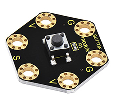

**Technical Parameters**

-   Working voltage: DC 3.0-3.3V

-   Output Signal: Digital

-   Dimensions: 31mm\*27mm\*6.5mm

-   Weight: 1.8g

-   Environmental attributes: ROHS

**Components Required:**

-   Micro:bit main board \*1

-   Keyestudio Tactile Button Module for micro:bit \*1

-   Alligator clip cable \*3

-   USB cable \*1

**Connection Diagram**

Connect the keyestudio Tactile Button Module to micro:bit main board with 4 Alligator clip cables. Ring S to P0, V to 3V, G to GND.

Connect the micro:bit to your computer with a micro USB cable.

**Coding**

So now let's move to coding. Let us see how to code the microbit LED matrix to show icons with button module. Below are some steps to follow.

Open the [https://makecode.micro:bit.org/\#editor](https://makecode.microbit.org/#editor) to write your code.

Microsoft MakeCode is actually a platform that allows us to code for a micro:bit, and also provides an interactive simulator where we can debug and run our code, and will be able to see what to expect out right there on the site.

Go to MakeCode and choose **My Projects** and click on **New Projects**.

If you want to see the codes behind, then you can click on JavaScript and it will display JavaScript code there in IDE.

**Use Button to Control LED Display**

Let's get started and show icons on micro:bit using button control. To do so, you just need to go to **Basic** and scroll down to see an **on start** and **clear screen** block.

Now drag and drop, and go to **Led** and click **more** to drag out the block **led enable(true)** into **on start** block.

And again go to **Basic** and drag the **forever** block beneath the on start block you just made.

Now drag and drop, and go to **Logic** and search for **if (true) then...else...**block.

Drag this logic conditional block into **forever** block.

And add a comparison block to the logic conditional block.

Go to the **Pins**, drag and drop the **digital read pin(P0)** block into **if (0)=(1) then...else...**block, replacing the “**0**” field.

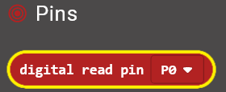

Look back at the connection diagram, we connect the signal pin to P0. So we select the **P0** in the code; and input **1**, which means input a **HIGH** level to the pin so as to **lit** the LED.

And then again go to **Basic** and drag the **show icon** block beneath the logic block you just made. Otherwise show another icon.

****

You can click the drop-down triangle to scroll down to choose the icon you want.

After completing the code, let's move on to name and download the program we’ve written.

**Test Code:**

****

**Result**

Connect the micro:bit to your computer with a micro USB cable. You can right-click the microbit HEX file to send to your micro:bit main board.

Powered the microbit with batteries, press the button, the micro:bit main board will show a heart shape icon; release the button, show another icon.

## **Project 16: Capacitive Touch Module**

**Overview**

**keyestudio Capacitive Touch Module For BBC micro:bit**

This keyestudio capacitive touch module is fully compatible with micro:bit control board.

There are total 6 rings on the module. Note that two G rings, two V rings and two S rings are separately connected. G for ground; V for 3V; S for signal pin(0 1 2).

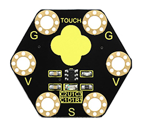

It mainly uses touch detection IC, which is a digital signal output device.

The touch detection IC is designed to replace the traditional button with a variable area key, featuring low power consumption and wide operating voltage.

When power on the module, it needs a stabilization time of about 0.5 sec. During this time period, do not touch the keypad. At this time, all functions are disabled, and self-calibration is always performed. No touching the key, the recalibration period is about 4.0sec.

Capacitive touch sensors are used in many devices such as laptop trackpads, digital audio players, computer displays, mobile phones, mobile devices, tablets and others.

When using, connect the module to micro:bit control board using Crocodile clip line.

When touch the sensing area, input HIGH level signal to micro:bit signal end, LED on the module will turn on; or else, turn off.

**Technical Parameters**

-   Working voltage: DC 3.0-3.3V

-   Output Signal: Digital

-   Dimensions: 31mm\*27mm\*2.5mm

-   Weight: 1.7g

-   Environmental attributes: ROHS

**Components Required:**

-   Micro:bit main board \*1

-   Keyestudio Capacitive Touch Module for micro:bit \*1

-   Alligator clip cable \*3

-   USB cable \*1

**Connection Diagram**

Connect the keyestudio Capacitive Touch Module to micro:bit main board with 3 Alligator clip cables. Ring S to P0, V to 3V, G to GND.

Connect the micro:bit to your computer with a micro USB cable.

**Coding**

So now let's move to coding. Let us see how to code the microbit LED matrix to show icons with Capacitive Touch module. Below are some steps to follow.

Open the [https://makecode.micro:bit.org/\#editor](https://makecode.microbit.org/#editor) to write your code.

Microsoft MakeCode is actually a platform that allows us to code for a micro:bit, and also provides an interactive simulator where we can debug and run our code, and will be able to see what to expect out right there on the site.

Go to MakeCode and choose **My Projects** and click on **New Projects**.

If you want to see the codes behind, then you can click on JavaScript and it will display JavaScript code there in IDE.

**Use Capacitive Touch to Control LED**

Let's get started and show icons on micro:bit via Capacitive Touch control. To do so, you just need to go to **Basic** and scroll down to see an **on start** and **clear screen** block.

Now drag and drop, and go to **Led** and click **more** to drag out the block **led enable(true)** into **on start** block.

And again go to **Basic** and drag the **forever** block beneath the on start block you just made.

Now drag and drop, and go to **Logic** and search for **if (true) then...else...**block.

Drag this logic conditional block into **forever** block.

And add a comparison block to the logic conditional block.

Go to the **Pins**, drag and drop the **digital read pin(P0)** block into **if (0)=(1) then...else...**block, replacing the “**0**” field.

Look back at the connection diagram, we connect the signal pin to P0. So we select the **P0** in the code; and input **1**, which means input a **HIGH** level to the pin so as to **lit** the LED.

And then again go to **Basic** and drag the **show icon** block beneath the logic block you just made. Otherwise show another icon.

You can click the drop-down triangle to scroll down to choose the icon you want.

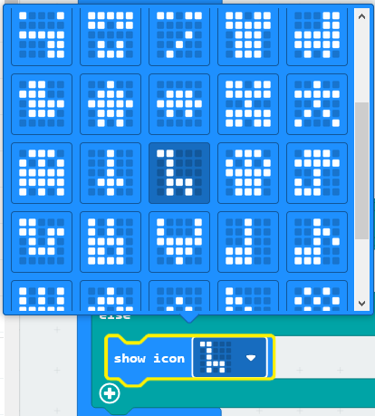

After completing the code, let's move on to name and download the program we’ve written.

**Test Code:**

**Result**

Connect the micro:bit to your computer with a micro USB cable. You can right-click the microbit HEX file to send to your micro:bit main board.

Touch the module’s sensing area, the micro:bit main board will show a heart shape icon. No touch, the LED matrix will show another icon.

## **Project 17: Ambient Light**

**Overview**

**keyestudio TEMT6000 Light Module For BBC micro:bit**

This keyestudio TEMT6000 light module is fully compatible with micro:bit control board.

****

This module is mainly composed of a highly sensitive visible photocell (NPN type) triode, which can magnify the captured tiny light illumination changes by about 100 times, and is easily recognized by the microcontroller for AD conversion.

Its response to visible light illumination is similar to that of the human eye, so that can detect the intensity of ambient light.

There are total 6 rings on the module. Note that two G rings, two V rings and two S rings are connected. G for ground; V for 3V; S for signal pin(0 1 2).

It is an analog signal output device.

When using, connect the module to micro:bit control board using Crocodile clip line.

You can use it to detect the ambient light intensity by reading the analog value of signal pin.

**Technical Parameters**

-   Working voltage: DC 3.0-3.3V

-   Output Signal: Analog signal

-   Dimensions: 31mm\*27mm\*2.5mm

-   Weight: 1.7g

-   Environmental attributes: ROHS

**Components Required:**

-   Micro:bit main board \*1

-   Keyestudio TEMT6000 Light Module for micro:bit \*1

-   Alligator clip cable \*3

-   USB cable \*1

**Connection Diagram**

Connect the keyestudio TEMT6000 Light Module to micro:bit main board with 3 Alligator clip cables. Ring S to P0, V to 3V, G to GND.

Connect the micro:bit to your computer with a micro USB cable.

**Coding**

So now let's move to coding. Let us see how to code and display the analog value of ambient light. Below are some steps to follow.

Open the [https://makecode.micro:bit.org/\#editor](https://makecode.microbit.org/#editor) to write your code.

Microsoft MakeCode is actually a platform that allows us to code for a micro:bit, and also provides an interactive simulator where we can debug and run our code, and will be able to see what to expect out right there on the site.

Go to MakeCode and choose **My Projects** and click on **New Projects**.

If you want to see the codes behind, then you can click on JavaScript and it will display JavaScript code there in IDE.

**Analog Value Display**

Let's get started and display the analog value of ambient light on our micro:bit. To do so, you just need to go to **Basic** and scroll down to see an **on start** block.

Now drag and drop, and again go to **Basic** and click **more** to drag the block **clear screen** out; means turn off all LEDs.

Now go to the **Basic** and scroll down to see a **forever** and **show number(0)** block. Drag the **forever** block beneath the **on start** block. And drag the **show number(0)** block into the **forever** block.

Go to **Pins**, drag and drop the block **analog read pin(P0)** into **show number(0)** block, replacing the “**0**” field.

At this moment, we can add a **pause (ms)** block into the block just made. This delay period is in milliseconds, so if you want the value display as fast, change the value, try 100ms.

Next, we go to **Serial**, drag and drop the block **serial write value(x)=(0)** In this way it can write the brightness value to the serial port and show it on monitor.

Change the “**x**” to **brightness** and duplicate the block **analog read pin(P0)** to replace the the “**0**” field.

After completing the code, let's move on to name and download the program we’ve written.

**Test Code:**

****

**Result**

Connect the micro:bit to your computer with a micro USB cable. You can right-click the microbit HEX file to send to your micro:bit main board.

You should see the LED matrix show the scrolling number. You could read the analog value of ambient light intensity via software.

The stronger the ambient light intensity, the greater the analog value is.

Note: the baud rate of micro:bit is defaulted by 115200.

## **Project 18: PIR Motion**

**Overview**

**keyestudio PIR Motion Module For BBC micro:bit**

This keyestudio PIR motion module is fully compatible with micro:bit control board.It is mainly composed of a digital pyroelectric infrared sensor, which is a digital signal output device.

This sensor has built-in filters, strong anti-interference, low voltage and micro power consumption. The detection distance of the module is 3-5 meters.

The detection angle in the horizontal direction is less than 80°; the detection angle in the vertical direction is less than 55°

There are total 6 rings on the module. Note that two G rings, two V rings and two S rings are separately connected. G for ground; V for 3V; S for signal pin(0 1 2).

When using, connect the module to micro:bit control board using Crocodile clip line.

Once detecting someone moving nearby, the signal pin of micro:bit main board will input HIGH level; LED on the module lights.

**Technical Parameters**

-   Working voltage: DC 3.0-3.3V

-   Working current: 100mA

-   Maximum power: 0.5W

-   Output signal: digital signal

-   Detection distance: 3-5 meters

-   Operating temperature range: -30℃\~ +80℃

-   Detection angle: less than 80°in the horizontal direction and less than 55° in the vertical direction
    
-   Dimensions: 31mm\*27mm\*6mm

-   Weight: 2g

-   Environmental attributes: ROHS

**Components Required:**

-   Micro:bit main board \*1

-   Keyestudio PIR Motion Module for micro:bit \*1

-   Alligator clip cable \*3

-   USB cable \*1

**Connection Diagram**

Connect the keyestudio PIR Motion Module to micro:bit main board with 3 Alligator clip cables. Ring S to P0, V to 3V, G to GND.

Connect the micro:bit to your computer with a micro USB cable.

****

**Coding**

So now let's move to coding. Let us see how we can code the micro:bit and PIR motion sensor to detect whether there is someone moving nearby.

Below are some steps to follow:

Open the [https://makecode.micro:bit.org/\#editor](https://makecode.microbit.org/#editor) to write your code.

Microsoft MakeCode is actually a platform that allows us to code for a micro:bit, and also provides an interactive simulator where we can debug and run our code, and will be able to see what to expect out right there on the site.

Go to MakeCode and choose **My Projects** and click on **New Projects**.

If you want to see the codes behind, then you can click on JavaScript and it will display JavaScript code there in IDE.

**PIR Motion Sensing**

Let's get started and show icons on micro:bit when detects someone moving nearby. To do so, you just need to go to **Basic** and scroll down to see an **on start** block.

Now drag and drop, and go to **Led** and click **more** to drag out the block **led enable(true)** into **on start** block.

And again go to **Basic** and drag the **forever** block beneath the on start block you just made.

Now drag and drop, and go to **Logic** and search for **if (true) then...else...**block.

Drag this logic conditional block into **forever** block.

And add a comparison block to the logic conditional block.

Go to the **Pins**, drag and drop the **digital read pin(P0)** block into **if (0)=(1) then...else...**block, replacing the “**0**” field.

Look back at the connection diagram, we connect the signal pin to P0. So we select the **P0** in the code; and input **1**, which means input a **HIGH** level to the pin so as to **lit** the LED.

And then again go to **Basic** and drag the **show leds** block beneath the logic block you just made. Otherwise show another icon.

You can draw an image on the LED screen as you wish.

****

After completing this step micro:bit will restart itself and run the code. It will display icons on the simulator. Quite easy? Yeah, quite easy. So let's move on and name and download the program we’ve written.

**Test Code:**

****

**Result**

Connect the micro:bit to your computer with a micro USB cable. You can right-click the microbit HEX file to send to your micro:bit main board.

When detecting someone moving nearby, the LED matrix on the micro:bit main board will show a heart shape icon, and led on the PIR module lights.

Or else, it will show another image and led turns off.

## **Project 19: Microphone**

**Overview**

**keyestudio Microphone Module For BBC micro:bit**

This keyestudio microphone module is fully compatible with micro:bit control board. It is a sound detection device, an analog signal output device.

It is mainly composed of a MIC head, a LM358D chip and a potentiometer.

When the microphone detects sound, and converts it into a voltage signal; then amplifies it through the LM358D chip.

The potentiometer is used to adjust the signal amplification.

There are total 6 rings on the module. Note that two G rings, two V rings and two S rings are separately connected. G for ground; V for 3V; S for signal pin(0 1 2).

We can work out the sound volume by reading the analog value of signal end.

When using, connect the module to micro:bit control board using Crocodile clip line.

**Technical Parameters**

-   Working voltage: DC 3.0-3.3V

-   Output signal: Analog signal

-   Dimensions: 31mm\*27mm\*4mm

-   Weight: 2g

-   Environmental attributes: ROHS

**Components Required:**

-   Micro:bit main board \*1

-   Keyestudio Microphone Module for micro:bit \*1

-   Alligator clip cable \*3

-   USB cable \*1

**Connection Diagram**

Connect the keyestudio Microphone Module to micro:bit main board with 3 Alligator clip cables. Ring S to P0, V to 3V, G to GND.

Connect the micro:bit to your computer with a micro USB cable.

****

**Coding**

So now let's move to coding. Let us see how to code and display the analog value of microphone sound. Below are some steps to follow.

Open the [https://makecode.micro:bit.org/\#editor](https://makecode.microbit.org/#editor) to write your code.

Microsoft MakeCode is actually a platform that allows us to code for a micro:bit, and also provides an interactive simulator where we can debug and run our code, and will be able to see what to expect out right there on the site.

Go to MakeCode and choose **My Projects** and click on **New Projects**.

If you want to see the codes behind, then you can click on JavaScript and it will display JavaScript code there in IDE.

**Analog Value Display**

Let's get started and display the analog value of microphone sound on micro:bit. To do so, you just need to go to **Basic** and scroll down to see an **on start** block.

Now drag and drop, and again go to **Basic** and click **more** to drag the block **clear screen** out; means turn off all LEDs.

Now go to the **Basic** and scroll down to see a **forever** and **show number(0)** block. Drag the **forever** block beneath the **on start** block.
And drag the **show number(0)** block into the **forever** block.

Go to **Pins**, drag and drop the block **analog read pin(P0)** into  **shownumber(0)** block, replacing the “**0**” field.

Next, we go to **Serial**, drag and drop the block **serial write value(x)=(0)** In this way it can write the sound value to the serial port and show it on monitor.

Change the “**x**” to **noise** and duplicate the block **analog read pin(P0)** to replace the “**0**” field.

After completing the code, let's move on to name and download the program we’ve written.

**Test Code:**

****

**Result**

Connect the micro:bit to your computer with a micro USB cable. You can right-click the microbit HEX file to send to your micro:bit main board.

You should see the LED matrix show the scrolling digit. Read the analog value of sound through the software.

The louder the sound, the greater the analog value is.

Note: the baud rate of micro:bit is defaulted by 115200.

Pay close attention that you can turn the potentiometer on the module to adjust the sound magnification, which also will enlarge the analog value.

## **Project 20: Buzzer**

**Overview**

**keyestudio Passive Buzzer Module For BBC micro:bit**

This keyestudio passive buzzer is fully compatible with micro:bit control board.

It is mainly composed of a passive buzzer without oscillation circuit. It cannot be actuated by itself, but by external pulse frequencies.

Different frequencies produce different sounds. Even can code the melody of a song.

There are total 6 rings on the module. Note that two G rings, two V rings and two S rings are connected. G for ground; V for 3V; S for signal pin(0 1 2).

When using, connect the module to micro:bit control board using Crocodile clip line.

**Technical Parameters**

-   Working voltage: DC 3.0-3.3V

-   Output signal: Digital signal (square wave)

-   Dimensions: 31mm\*27mm\*4.5mm

-   Weight: 2.3g

-   Environmental attributes: ROHS

**Components Required:**

-   Micro:bit main board*1
    
-   Keyestudio Passive Buzzer Module for micro:bit \*1

-   Alligator clip cable \*3

-   USB cable \*1

**Connection Diagram**

Connect the keyestudio Passive Buzzer Module to micro:bit main board with 3 Alligator clip cables. Ring S to P0, V to 3V, G to GND.

**Coding**

So now let's move to coding. Let us see how we can code the buzzer play tune. Below are some steps to follow.

Open the [https://makecode.micro:bit.org/\#editor](https://makecode.microbit.org/#editor) to write your code.

Microsoft MakeCode is actually a platform that allows us to code for a micro:bit, and also provides an interactive simulator where we can debug and run our code, and will be able to see what to expect out right there on the site.

Go to MakeCode and choose **My Projects** and click on **New Projects**.

If you want to see the codes behind, then you can click on JavaScript and it will display JavaScript code there in IDE.

**Buzzer**

Let's get started and code the buzzer play a tone. To do so, you just need to go to **Basic** and scroll down to see an **on start** block.

Now drag and drop, and again go to **Basic** and click **more** to drag the block **clear screen** out; means turn off all LEDs.

Now go to the **Basic** and scroll down to see a **forever** block. Drag the **forever** block beneath the **on start** block.

Go to **Loops**, drag and drop the **while(true)...do** block and drag out the Comparison statement from **Logic**.

In the forever block, we set to output 2 kinds of square wave of different frequencies, so as to output a tone of corresponding frequency.

First, set a variable to output 80 pulse square wave, with a period of 2 milliseconds, and the frequency is 500 Hz, so the passive buzzer outputs 500 Hz frequency sound for 160 milliseconds.

Then delay 100 milliseconds.

And set to output 100 pulse square wave, with a period of 4 milliseconds, and the frequency is 250Hz, so the passive buzzer outputs 250Hz frequency sound for 400 milliseconds.

**Code 1:**

After completing the code, let's move on to name and download the program we’ve written.

**Result 1**

Connect the micro:bit to your computer with a micro USB cable. You can right-click the microbit HEX file to send to your micro:bit main board.

Done sending the code 1 to micro:bit, the passive buzzer will alternately make two sounds.

Moreover, we can use the buzzer module to code a melody of a song.

**Code 2:**

****

**Note:**

If you drag the source code we provided to the Microsoft MakeCode Block editor [https://makecode.micro:bit.org/\#editor](https://makecode.microbit.org/#editor)

Click the icon ,you can check the frequency of each tone as follows:

**Result 2**

Done sending the code 2 to micro:bit, the buzzer plays the song *Ode to Joy.*

## **Project 21: Two Lights**

**Overview**

**keyestudio Edge Connector IO Breakout Board For BBC micro:bit**

It's what you've been waiting for, the keyestudio Edge Connector IO Breakout Board For BBC micro:bit.

Want to connect a bunch of sensors and modules to micro:bit development board? Try this keyestudio Edge Connector IO Breakout Board.

This breakout board has been designed to offer an easy way to connect additional circuits and Components to the edge connector on the BBC micro:bit.

It provides an easy way of connecting circuits using Alligator clip lines.

This edge connector offers access to a number of the BBC micro:bit processor pins, such as power IO (input/output) interface, connection pins P0, P1, P2, P3, P12, P13, P14, P15, P16, P19, P20.

There are 2 kinds of power supply for the breakout board and micro:bit main board.

-   Direct to connect the battery case carried with batteries to micro:bit main board for powering;
    
-   Connect the golden rings 3V GND with alligator clip lines for power supply;

The breakout board also comes with 4 fixed holes at the edge, easy to mount on any other devices.

**Specification**

-   Operating voltage: DC3.0-3.3V

-   Dimensions: 89mm\*33mm\*12mm

-   Weight:14.8g

**Components Required:**

-   Micro:bit main board \*1

-   keyestudio Edge Connector IO Breakout Board for micro:bit \*1

-   Alligator clip cable \*7

-   USB cable \*1

**Connection Diagram**

Connect the keyestudio Passive Buzzer Module to micro:bit main board with 3 Alligator clip cables. Ring S to P0, V to 3V, G to GND.

Connect the micro:bit to your computer with a micro USB cable.

**Coding**

So now let's move to coding. Let us see how to code the 2 LED modules to flash. Below are some steps to follow.

Open the [https://makecode.micro:bit.org/\#editor](https://makecode.microbit.org/#editor)to write your code.

Microsoft MakeCode is actually a platform that allows us to code for a micro:bit, and also provides an interactive simulator where we can debug and run our code, and will be able to see what to expect out right there on the site.

Go to MakeCode and choose **My Projects** and click on **New Projects**.

If you want to see the codes behind, then you can click on JavaScript and it will display JavaScript code there in IDE.

**Light Flashes**

Let's get started and code the 2 light modules flash on. To do so, you just need to go to **Basic** and scroll down to see an **on start** block.

Now drag and drop, and go to **Led** and click **more** to drag out the block **led enable(false)** into **on start** block.

And again go to **Basic** and drag the **forever** block beneath the on start block you just made.

Go to the **Pins**, drag and drop the **digital write pin(P0) to(0)** block into **forever** block and duplicate it several times.

Look at the connection diagram, **we separately connect the Red,Green, Blue pin to P1, P2, P3. The white LED’s signal pin to P0.**

So we first set the white LED’s signal pin value to **1**, which means input a **HIGH** level to **turn on** the white LED. Set to 0 to turn it off.

The RGB pins are active at **LOW (record 0)**, which means set to 0 to turn on; so we can set the RGB pins to **HIGH (record 1)** to turn off.

If you want the LED flash as fast, add a **pause** block in millisecond, try 200ms.

Now we separately turn the white LED (P0) on for 1 second then off, followed by turn Red LED (P1) on for 1 second then off; turn Green LED (P2) on for 1 second then off; turn the Blue LED (P3) on for 1 second then off.

**Test Code:**

****

After completing the code, let's move on to name and download the program we’ve written.

**Result**

Connect the micro:bit to your computer with a micro USB cable. You can right-click the microbit HEX file to send to your micro:bit main board.

The white LED module will turn on then off, followed by RGB turning on red, green and blue, with an interval of 200ms, alternately and circularly.

## **Project 22: Use Button to Control Light**

**Overview**

In the above projects, we’ve introduced each sensor module. We now combine those sensor modules to make interactive projects.

In this project, we would like to turn an LED on and off via a tactile button.

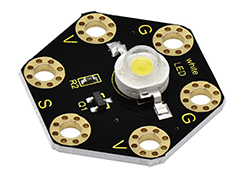

**Components Required:**

-   Micro:bit main board \*1

-   Keyestudio Tactile Button Module for micro:bit \*1

-   keyestudio 1W LED Module for micro:bit \*1
    
-   Alligator clip cable \*6

-   USB cable \*1

**Connection Diagram**

Insert firmly the micro:bit main board into keyestudio Edge Connector IO Breakout Board. Then connect the sensor module to micro:bit main board with alligator clip lines.

For keyestudio Tactile Button Module, connect Ring S to P0, V to 3V, G to GND.

For keyestudio 1W LED Module, connect Ring S to P1, V to 3V, G to GND.

Connect the micro:bit to your computer with a micro USB cable.

**Coding**

So now let's move to coding. Let us see how to code the LED module on with tactile button module. Below are some steps to follow.

Open the [https://makecode.micro:bit.org/\#editor](https://makecode.microbit.org/#editor) to write your code.

Microsoft MakeCode is actually a platform that allows us to code for a micro:bit, and also provides an interactive simulator where we can debug and run our code, and will be able to see what to expect out right there on the site.

Go to MakeCode and choose **My Projects** and click on **New Projects**.

If you want to see the codes behind, then you can click on JavaScript and it will display JavaScript code there in IDE.

**Use Button to Control LED**

Let's get started and turn on LED via button control. To do so, you just need to go to **Basic** and scroll down to see an **on start** block.

Now drag and drop, and go to **Led** and click **more** to drag out the block **led enable(false)** into **on start** block.

And again go to **Basic** and drag the **forever** block beneath the on start block you just made.

Now drag and drop, and go to **Logic** and search for **if (true) then...else...**block.

Drag this logic conditional block into **forever** block. And add a comparison block to the logic conditional block.

Go to the **Pins**, drag and drop the **digital read pin(P0)** block into **if (0)=(1) then...else...**block, replacing the “**0**” field.

Look back at the connection diagram, we connect the button’s signal pin to P0, LED’s signal pin to P1. So if set the **P0** to **1**, means the button is pressed, then set the **P1** to **1**, means input a **HIGH** level to **lit** the LED. Or else, do the contrary action, release the button to turn the led off.

After completing the code, let's move on to name and download the program we’ve written.

**Test Code:**

**Result**

Connect the micro:bit to your computer with a micro USB cable. You can right-click the microbit HEX file to send to your micro:bit main board.

Powered on, press the button, the LED on the module should turn on; release the button, the LED turns off.

## **Project 23: RGB Colors**

**Overview**

In the above projects, we’ve introduced each sensor module. We now combine those sensor modules to make interactive projects.

In this project, we are going to turn RGB LED alternately on red, green and blue via capacitive touch control.

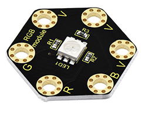

**Components Required**

-   Micro:bit main board \*1

-   Keyestudio Capacitive Touch Module for micro:bit \*1

-   keyestudio 5050 RGB Module for micro:bit \*1
    
-   Alligator clip cable \*7

-   USB cable \*1

**Connection Diagram**

Insert firmly the micro:bit main board into keyestudio Edge Connector IO Breakout Board. Then connect the sensor module to micro:bit main board with alligator clip lines.

For keyestudio Capacitive Touch Module, connect Ring S to P0, V to 3V, G to GND.

For keyestudio RGB LED Module, connect Ring R to P1, G to P2, B to P3, V to 3V.

Connect the micro:bit to your computer with a micro USB cable.

**Test Code**

Open the [https://makecode.micro:bit.org/\#editor](https://makecode.microbit.org/#editor) to write your code. Or can direct download and send the micro:bit.hex file to your micro:bit.

**Code Explanation:**

Look back at the connection diagram, we have connected the touch module to **P0**; **Red, Green, Blue LED to P1, P2, P3**.

The RGB pins are active at **LOW (record 0)**, which means set to 0 to turn on; so we can set the RGB pins to **HIGH (record 1)** to turn off.

On start block, we initially set the variables **flag** and **count** block to 0;

For the forever block, when detects the touch signal, we set the **flag** to 1, and add 10ms block for delay;

If **flag** equals to 1, run the **flag** to 0, set **count** plus 1;

If **count** equals to 0, run the action that RGB light turns on red;

If **count** equals to 1, run the action that RGB light turns on green;

If **count** equals to 2, run the action that RGB light turns on blue;

If **count** is greater than and equals to 3, then set the count to 0, run the action that RGB light turns on red;

**Result**

Connect the micro:bit to your computer with a micro USB cable. You can right-click the microbit HEX file to send to your micro:bit main board.

Done uploading the code, the RGB module will turn on red;

Tap the capacitive touch module with your finger, RGB will turn green; tap the touch area, turn on blue; tap again, turn on red. It will form a loop.

## **Project 24: Motion Alarm**

**Overview**

In the above projects, we’ve introduced each sensor module. We now combine those sensor modules to make interactive projects.

In this project, you will learn how to trigger a buzzer alarm when detecting someone moving nearby.

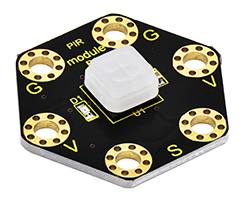

**Components Required:**

-   Micro:bit main board \*1

-   Keyestudio Passive Buzzer Module for micro:bit \*1

-   keyestudio PIR Motion Module for micro:bit \*1

-   Alligator clip cable*6
    
-   USB cable \*1

**Connection Diagram**

Insert firmly the micro:bit main board into keyestudio Edge Connector IO Breakout Board. Then connect the sensor module to micro:bit main board with alligator clip lines.

For keyestudio Passive Buzzer Module, connect Ring S to P0, V to 3V, G to GND.

For keyestudio PIR Motion Module, connect Ring S to P1, V to 3V, G to GND.

Connect the micro:bit to your computer with a micro USB cable.

**Coding**

So now let's move to coding. Let us see how to code the passive buzzer to alarm when PIR motion module detects someone moving nearby.

Below are some steps to follow.

Open the [https://makecode.micro:bit.org/\#editor](https://makecode.microbit.org/#editor) to write your code.

Microsoft MakeCode is actually a platform that allows us to code for a micro:bit, and also provides an interactive simulator where we can debug and run our code, and will be able to see what to expect out right there on the site.

Go to MakeCode and choose **My Projects** and click on **New Projects**.

If you want to see the codes behind, then you can click on JavaScript and it will display JavaScript code there in IDE.

**Motion Alarm**

Let's get started with triggering the buzzer sound. To do so, you just need to go to **Basic** and scroll down to see an **on start** block.

Now drag and drop, and go to **Led** and click **more** to drag out the block **led enable(false)** into **on start** block.

And again go to **Basic** and drag the **forever** block beneath the on start block you just made.

Now drag and drop, and go to **Logic** and search for **if (true) then...else...**block.

Drag this logic conditional block into **forever** block. And add a comparison block to the logic conditional block.

Go to the **Pins**, drag and drop the **digital read pin(P0)** block into **if (0)=(1) then...else...**block, replacing the “**0**” field.

Look back at the connection diagram, we connect the PIR motion sensor’s signal pin to P1. So change the pin **P0** to **P1.**

Then go to **Music**, drag and drop the block **play tone(Middle C) for (1beat)** and **rest(ms)(1 beat)**

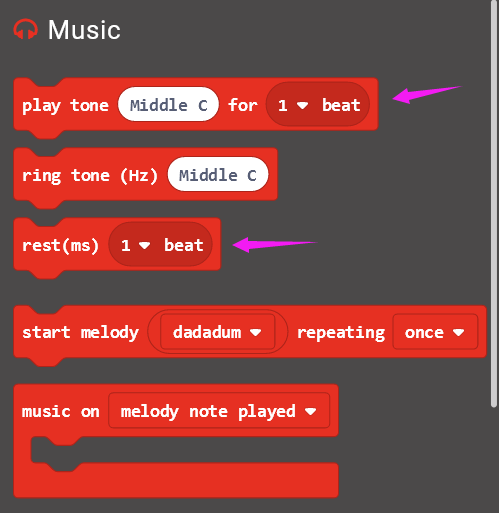

If the PIR motion sensor detects someone moving nearby, then the buzzer will play a tone (Middle C); otherwise, buzzer turns off.

After completing the code, let's move on to name and download the program we’ve written.

**Test Code:**

**Result**

Connect the micro:bit to your computer with a micro USB cable. You can right-click the microbit HEX file to send to your micro:bit main board.

When someone is moving nearby, the built-in led on PIR motion sensor lights and buzzer will play a tone (Middle C). otherwise, the led is off and buzzer not sounds.

## **Project 25: Make A Tone**

**Overview**

In the above projects, we’ve introduced each sensor module. We now combine those sensor modules to make interactive projects.

In this project, you will learn how to make a buzzer play different tones based on the measured analog value of both ambient light and microphone sound.

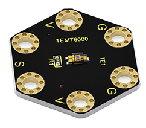

**Components Required:**

-   Micro:bit main board \*1

-   Keyestudio Passive Buzzer Module for micro:bit \*1
    
-   Keyestudio TEMT6000 Light Module for micro:bit \*1

-   Keyestudio Microphone Module for micro:bit \*1

-   Alligator clip cable*9
    
-   USB cable \*1

**Connection Diagram**

Insert firmly the micro:bit main board into keyestudio Edge Connector IO Breakout Board. Then connect the sensor module to micro:bit main board with alligator clip lines.

For keyestudio Passive Buzzer Module, connect Ring S to P0, V to 3V, G to GND.

For keyestudio TEMT6000 Light Module, connect Ring S to P1, V to 3V, G to GND.

For keyestudio Microphone Module, connect Ring S to P2, V to 3V, G to GND.

Connect the micro:bit to your computer with a micro USB cable.

**Coding**

So now let's move to coding. Let us see how we can code buzzer sound according to the analog value of both TEMT6000 light module and microphone module. Below are some steps to follow.

Open the [https://makecode.micro:bit.org/\#editor](https://makecode.microbit.org/#editor) to write your code.

Microsoft MakeCode is actually a platform that allows us to code for a micro:bit, and also provides an interactive simulator where we can debug and run our code, and will be able to see what to expect out right there on the site.

Go to MakeCode and choose **My Projects** and click on **New Projects**.

If you want to see the codes behind, then you can click on JavaScript and it will display JavaScript code there in IDE.

**Ring Tone**

Let's get started with playing tones. To do so, you just need to go to **Basic** and scroll down to see an **on start** block.

Now drag and drop, and go to **Led** and click **more** to drag out the block **led enable(false)** into **on start** block.

And again go to **Basic** and drag the **forever** block beneath the on start block you just made.

Next, go to **Serial**, drag and drop the block **serial write value(x)=(0)** into the **forever** block and duplicate once.

In this way it can write both brightness and sound value to the serial port and show it on monitor.

Separately change the “**x**” to **brightness** and **noise**;

And drag out the block **analog read pin(P0)** from **Pins** to replace the “**0**” field.

According to the connection, microphone module’s signal pin is connected to P2; light module’s signal pin is connected to P1.

So we should write as follows:

Now by followed, we are ready to add Loops and logic comparison function.

Supposed that both light and MIC analog value are smaller than or equal to 100, buzzer not beeps. How should we code?

First drag the **while(true)...do** block out from the **Loops**. Then add the Boolean and Comparison logic statements.

We duplicate and drag the Comparison block into Boolean block.

Then drag this block into the **while(true)...do** block, replacing the “**true**” field. And again duplicate the block **analog read pin(P1)** and the block **analog read pin(P2)** and drag them into the first input. Set both values smaller than and equal to 100.

While the condition is met, run the action that buzzer not beeps. We can go to drag the **rest(ms)(1 beat)** from **Music** into the while block just made.

Now we’ve set both light and MIC analog value are smaller than or equal to 100, buzzer not beeps. As shown below.

Furthermore, if we want to add several condition statements, be able to duplicate the **while...do...** block several times, and set to different input values to trigger buzzer ring different tones.

Have your try! Write the conditions as follows:

-   When the light analog value is greater than 100, and MIC analog value is smaller than or equal to 100, the buzzer will play a tone (Low B);
    
-   When the light analog value is smaller than or equal to 100, and MIC analog value is greater than 100, the buzzer will play a tone (Middle D);
    
-   When both light and MIC analog value are greater than 100, the buzzer play a tone (High E).

After completing the code, let's move on to name and download the program we’ve written.

**Test Code:**

**Result**

Connect the micro:bit to your computer with a micro USB cable. You can right-click the microbit HEX file to send to your micro:bit main board.

Done uploading the code, it measures the analog value of ambient light and microphone sound, which can be applied to make a buzzer sound.

When both light and MIC analog value are less than or equal to 100, buzzer not beeps; When the light analog value is greater than 100, and MIC analog value is less than or equal to 100, the buzzer will play a tone (Low B); When the light analog value is less than or equal to 100, and MIC analog value is greater than 100, the buzzer will play a tone (Middle D); When both light and MIC analog value are greater than 100, the buzzer play a tone (High E).

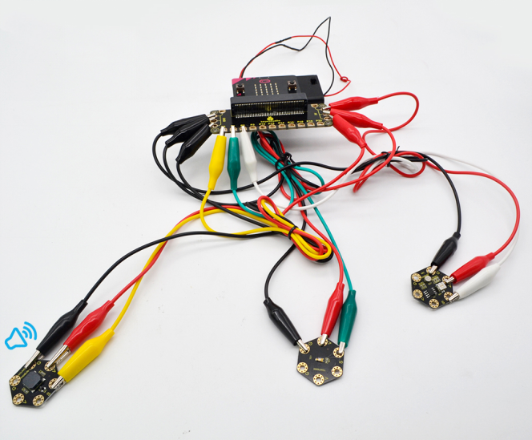

## **Project 26: Use Light to Control RGB**

**Overview**

In the above projects, we’ve introduced each sensor module. We now combine those sensor modules to make interactive projects.

In this project, you will learn how to trigger the RGB light shining colors based on the measured analog value of ambient light.

**Components Required:**

-   Micro:bit main board \*1

-   Keyestudio TEMT6000 Light Module for micro:bit \*1

-   Keyestudio 5050 RGB Module for micro:bit \*1
    
-   Alligator clip cable \*6

-   USB cable \*1

**Connection Diagram**

Insert firmly the micro:bit main board into keyestudio Edge Connector IO Breakout Board. Then connect the sensor module to micro:bit main board with alligator clip lines.

For keyestudio TEMT6000 Light Module, connect Ring S to P0, V to 3V, G to GND.

For keyestudio RGB LED Module, connect Ring R to P1, G to P2, B to P3, V to 3V.

Connect the micro:bit to your computer with a micro USB cable.

**Coding**

So now let's move to coding. Let us see how we can code the RGB flash on different colors in different analog value of ambient light.

Below are some steps to follow.

Open the [https://makecode.micro:bit.org/\#editor](https://makecode.microbit.org/#editor) to write your code.

Microsoft MakeCode is actually a platform that allows us to code for a micro:bit, and also provides an interactive simulator where we can debug and run our code, and will be able to see what to expect out right there on the site.

Go to MakeCode and choose **My Projects** and click on **New Projects**.

If you want to see the codes behind, then you can click on JavaScript and it will display JavaScript code there in IDE.

**Use Light to Control RGB**

Let's get started with controlling RGB colors with light sensor. To do so, you just need to go to **Basic** and scroll down to see an **on start** block.

Now drag and drop, and go to **Led** and click **more** to drag out the block **led enable(false)** into **on start** block.

And again go to **Basic** and drag the **forever** block beneath the on start block you just made.

Then go to **Variables**, search for **set (val) to (0)** block and drag this block into **forever** block.

Go to **Pins**, drag and drop the block **analog read pin(P0)** into **set (val) to (0)** block, replacing the “**0**” field.

Look back at the connection diagram, we have connected the TEMT6000 light module to P0; **Red, Green, Blue LED to P1, P2, P3**.

The RGB pins are active at **LOW (record 0)**, which means set to 0 to turn on; so we can set the RGB pins to **HIGH (record 1)** to turn off.

Now we set to print the light value to the serial port using the **serial write number(0)** block from **Serial** and set the logic conditionals.

Drag the **val** block from the **Variables** and drop into **serial write number(0),** replacing the “**0**” field.

Then add the logic conditionals block, we go to use light value to turn the RGB LED on.

Now go to **Logic** and search for **if (true) then...**block.

Drag this logic conditionals block beneath the **serial write number** block.

And add a comparison block to the logic conditional block, replacing **(true)**.

We set to if val value is less than or equal to 300, then turn Red LED on.

In other word, go to drag and duplicate **digital write pin(P0) to (0)** block twice. For RGB, separately **set Pin1 to 0 (LOW, turn on); Pin2, Pin3 to 1 (HIHG, turn off)**

Furthermore, you can follow the same method to turn on the Green LED or Blue LED.

Set the light value is greater than 300 and less than 800, turn Green LED on;

Set the light value is greater than or equal to 800, turn Blue LED on.

After completing the code, let's move on to name and download the program we’ve written.

**Test Code:**

**Result**

Connect the micro:bit to your computer with a micro USB cable. You can right-click the microbit HEX file to send to your micro:bit main board.

When analog value of ambient light is less than or equal to 300, RGB light turns on red; when analog value is greater than 300 and less than 800, RGB light turns on green; when analog value is greater than or equal to 800, RGB light turns on blue;

## **Project 27: Use Button to Control Buzzer**

**Overview**

In the above projects, we’ve introduced each sensor module. We now combine those sensor modules to make interactive projects.

In this project, you will learn how to make a buzzer play different tones with a tactile button.

**Components Required:**

-   Micro:bit main board \*1

-   Keyestudio Passive Buzzer Module for micro:bit \*1

-   Keyestudio Tactile Button Module for micro:bit \*1
    
-   Alligator clip cable \*6

-   USB cable \*1

**Connection Diagram**

Insert firmly the micro:bit main board into keyestudio Edge Connector IO Breakout Board. Then connect the sensor module to micro:bit main board with alligator clip lines.

For keyestudio Passive Buzzer Module, connect Ring S to P0, V to 3V, G to GND.

For keyestudio Tactile Button Module, connect Ring S to P1, V to 3V, G to GND.

Connect the micro:bit to your computer with a micro USB cable.

**Test Code:**

Open the [https://makecode.micro:bit.org/\#editor](https://makecode.microbit.org/#editor) to write your code. Or can direct download and send the micro:bit.hex file to your micro:bit.

# 7.Resources

<https://fs.keyestudio.com/KS0456>

