# 1. Product introduction

**Keyestudio Honeycomb Smart Wearable Coding Kit for Micro:bit**

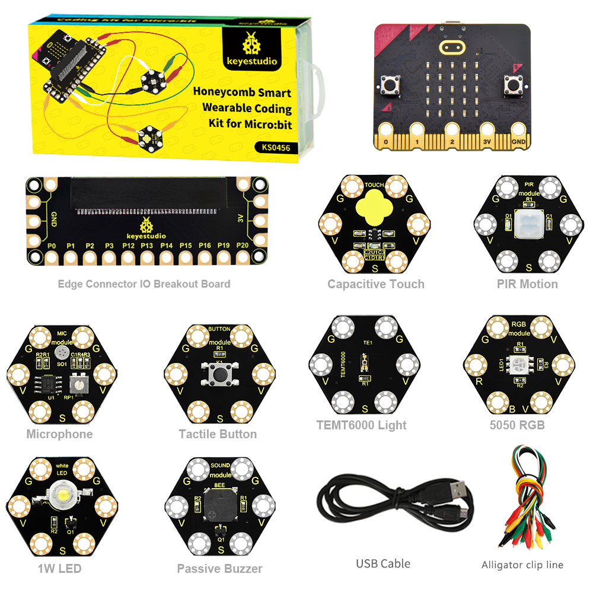

## 1.1 Description

The [BBC micro:bit](https://microbit.org/guide/features/) is a tiny programmable computer designed to make learning and teaching easy and fun! This embedded board has a Bluetooth, a USB interface, an accelerometer, a compass, a 5x5 LED dot matrix, light and temperature sensors, buttons, and edge connectors for accessories.

Keyestudio Honeycomb Smart wearable Kit for Micro:bit is designed for people who is new to the knowledge about electric circuits and programming.

The kit has provided some basic electronic modules like RGB LED, button, buzzer, TEMT6000 light module and others. You can not only learn basic knowledge of these modules, but also use it to design circuits.

With the help of Micro:bit programming technique, your circuits become more animated. Micro:bit Starter kit can help you enter a wonderful world of electronics .

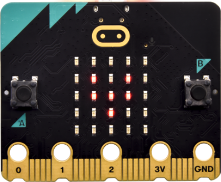

## 1.2 Kit List

| No.  |                         Component                         | QTY  |                           Picture                            |
| :--: | :-------------------------------------------------------: | :--: | :----------------------------------------------------------: |
|  1   |                 BBC micro:bit main board                  |  1   | 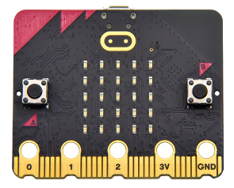 |
|  2   | Keyestudio Edge Connector IO Breakout Board for micro:bit |  1   | 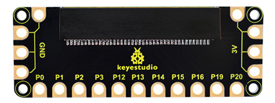 |
|  3   |            Keyestudio micro:bit 1W LED Module             |  1   | 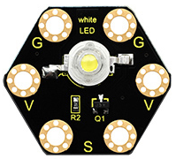 |
|  4   |           Keyestudio micro:bit 5050 RGB Module            |  1   | 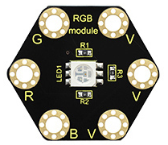 |
|  5   |        Keyestudio micro:bit Tactile Button Module         |  1   | 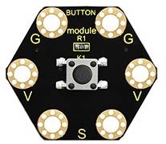 |
|  6   |       Keyestudio micro:bit Capacitive Touch Module        |  1   | 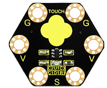 |
|  7   |        Keyestudio micro:bit TEMT6000 Light Module         |  1   | 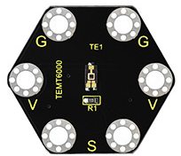 |
|  8   |          Keyestudio micro:bit PIR Motion Module           |  1   | 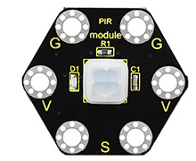 |
|  9   |          Keyestudio micro:bit Microphone Module           |  1   | 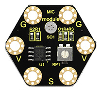 |
|  10  |        Keyestudio micro:bit Passive Buzzer Module         |  1   | 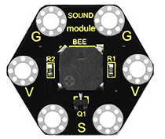 |
|  11  |                    Black USB cable 1m                     |  1   |            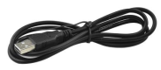            |
|  12  |                   Alligator clip cable                    |  10  |           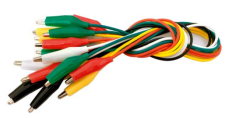            |

## 1.3 Introduction

( 1 ) What is Micro:bit?

Designed by BBC, Micro:bit main board aims to help children aged above 10 years old to have a better learning of programming.

It is equipped with loads of components,including a 5\*5 LED dot matrix, 2 programmable buttons, a compass, a Micro USB interface and a Bluetooth module and others. Though it is just the size of a credit card, it boasts multiple functions. To name just a few, it can be applied in programming video games, making interactions between light and sound, controlling a robot, conducting scientific experiments, developing wearable devices and make some cool inventions like robots and musical instruments, basically everything imaginable.

This new version, that’s version 2.0, of Micro:bit main board has a touch-sensitive logo and a MEMS microphone. And there is a buzzer built in the other side of the board which makes playing all kinds of sound possible without any external equipment. The golden fingers and gears added provide a better fixing of crocodile clips. Moreover, this board has a sleeping mode to lower the power consumption of battery and it can be entered if users long press the Reset & Power button on the back of it. More importantly, the CPU capacity of this version is much better than that of the V1.5 and the V2 has more RMA.

In final analysis, the Micro:bit main board V2 can allow customers to explore more functions so as to make more innovative products.

Serving as a better device for learning some basic knowledge about microcontroller and electronics, this sensor kit is designed by Keyestudio to help programming enthusiasts enter this wonderful world. This kit consists of a micro:bit control board and some common sensors and modules. In application, we can plug a shield in with DC7-9V to power not only the Micro bit board but also the sensors/ modules. And the shield can be connected by jumper cap to control the voltage of ports V1 and V2 used to supply power for sensors. We plan to provide instructions for using this board and sensors/ modules, including offering connection diagrams and test code.

( 2 ) Comparison between V2.0 & V1.5

**Micro:bit main Board V2.0**：

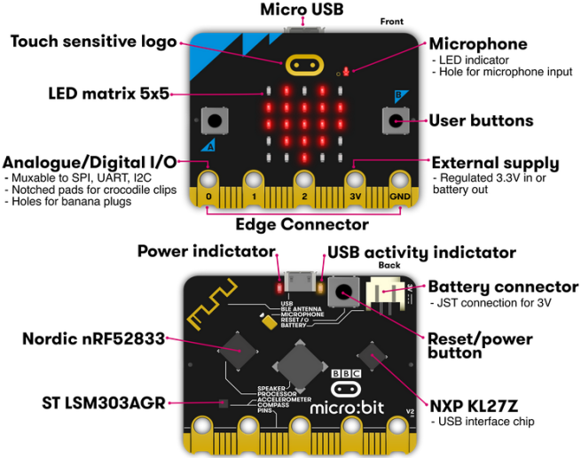

**Micro:bit main Board V1.5**：

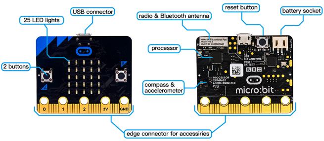

**More details:**

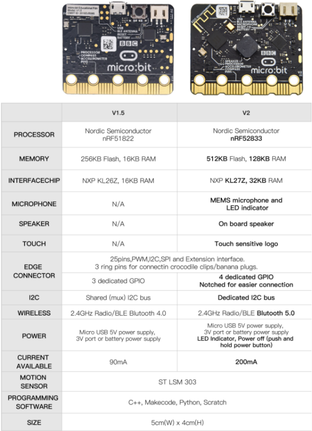

For the Micro: Bit main board V2, pressing the Reset & Power button , it will reset the Micro: Bit and rerun the program. If you hold it tight, the red LED will slowly get darker. When the power indicator flickers into darkness, releasing the button and your Micro: Bit board will enter sleep mode for power saving .This will make your battery more durable. And you could press this button again to ‘wake up’ your Micro:bit.

For more information,please resort to following links：

[https://tech.microbit.org/Components/](https://tech.microbit.org/hardware/)

[https://microbit.org/new-microbit/](https://microbit.org/new-microbit/)

[https://www.microbit.org/get-started/user-guide/overview/](https://www.microbit.org/get-started/user-guide/overview/)

[https://microbit.org/get-started/user-guide/features-in-depth/](https://microbit.org/get-started/user-guide/features-in-depth/)

( 3 ) Pinout

Micro:bit main board V2.0 VS V1.5

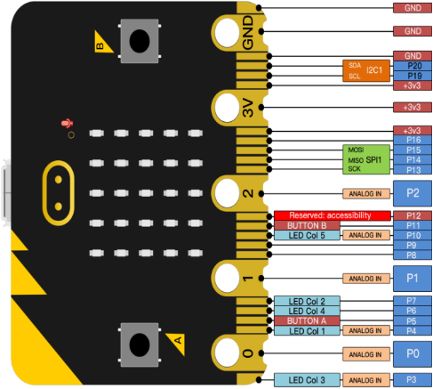

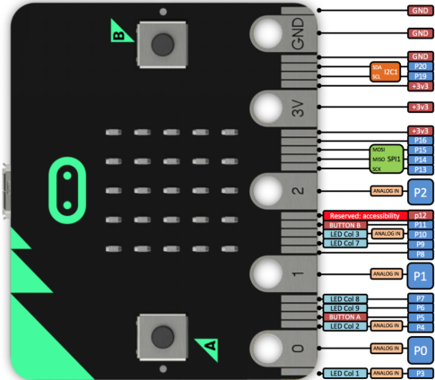

Browse the official website for more details:

[https://tech.microbit.org/Components/edgeconnector/](https://tech.microbit.org/hardware/edgeconnector/)

[https://microbit.org/guide/Components/pins/](https://microbit.org/guide/hardware/pins/)

( 4 )Notes for the application of Micro:bit main board V2.0

a. It is recommended to cover it with a silicone protector to prevent short circuit for it has a lot of sophisticated electronic components.

b. Its IO port is very weak in driving since it can merely handle current less than 300mA. Therefore, do not connect it with devices operating in large current,such as servo MG995 and DC motor or it will get burnt. Furthermore, you must figure out the current requirements of the devices before you use them and it is generally recommended to use the board together with a Micro:bit shield.

c. It is recommended to power the main board via the USB interface or via the battery of 3V. The IO port of this board is 3V, so it does not support sensors of 5V. If you need to connect sensors of 5 V, a Micro: Bit expansion board is required.

d. When using pins(P3、P4、P6、P7、P10)shared with the LED dot matrix, blocking them from the matrix or the LEDs may display randomly and the data about sensors maybe wrong.

e. The battery port of 3V cannot be connected with battery more than 3.3V or the main board will be damaged.

f. Forbid to use it on metal products to avoid short circuit.

To put it simple, Micro:bit V2 main board is like a micro computer which has made programming at our fingertips and enhanced digital innovation. And about programming environment, BBC provides a website: <https://microbit.org/code/> which has a graphical MakeCode program easy for use.