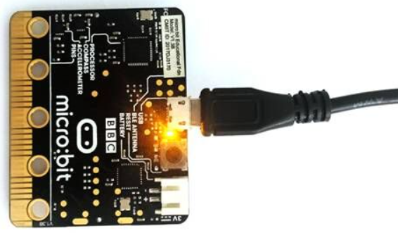
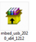
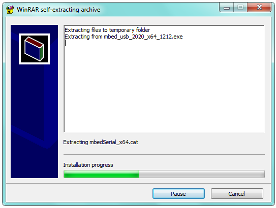
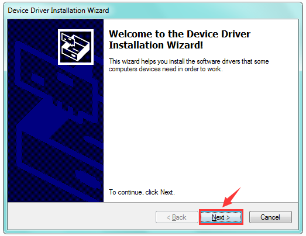
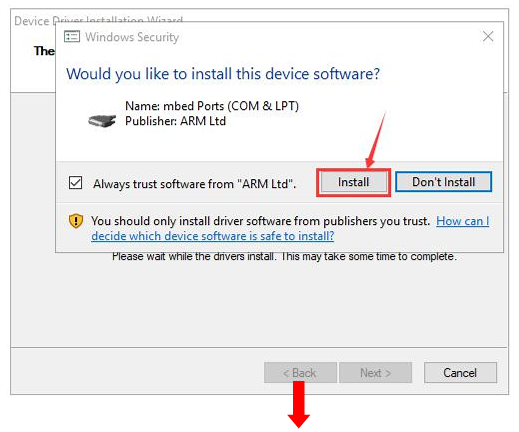
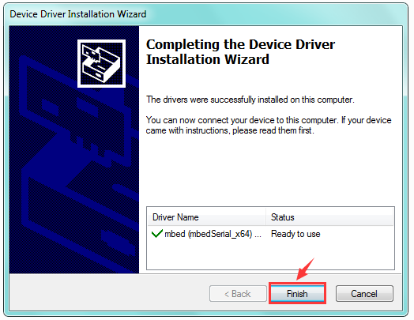
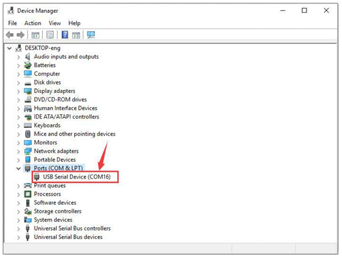

# 2. Install Microbit Driver

Download driver :  [Driver](./Driver.7z)

1.First of all, connect the micro:bit to your computer using a USB cable.

2.Then, double click the driver software to install it. Here you can click the icon below to download it.

3.After that, click Next to continue the installation.

4.The following page pops up and click“install”.

5.Tap“Finish”. Then click“Computer” —>“Properties”—> “Device manager”, as shown below.

