# 3. Getting Started with Micro:bit

## 3.1 Resource download

**Download resource  :  [Microbit](./Microbit.7z)**

**The resource includes code and Cool Term, please obtain it first before continuing to study.**

The following instructions are applied for Windows system but can also serve as a reference if you are using a different system.

## 3.2 Write code and program

This chapter describes how to write program with the App Micro: Bit and load the program to the Micro: Bit main board V2.

You are recommended to browse the official website of Micro:bit for more details, and the link is attached below:

[https://microbit.org/guide/quick/](Https://microbit.org/guide/quick/)

**Step 1: connect the Micro: Bit main board V2 with your computer**

Firstly, link the Micro: Bit main board V2 with your computer via the USB cable. Macs、PCs、 Chromebooks and Linux （including Raspberry Pi）systems are all compatible with the Micro: Bit main board V2.

Note that if you are about to pair the board with your phone or tablet, please refer to this link:

[https://microbit.org/get-started/user-guide/mobile/](./https://microbit.org/get-started/user-guide/mobile/)

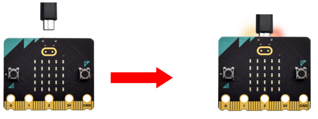

Secondly, if the red LED on the back of the board is on, that means the board is powered. Then Micro: Bit main board V2 will appear on your computer as a driver named 'MICROBIT'. Please note that it is not an ordinary USB disk as shown below.

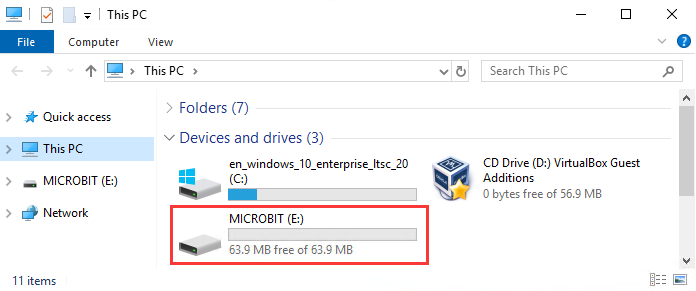

**Step 2: writing programs**

View the link https://makecode.microbit.org/ in your browser.

Click "New Project".

The dialog box "Create a Project" appears, fill it with "heartbeat" and click ‘Create "√" to edit.

(If you are running Windows 10 system, it is also viable to edit on the APP MakeCode for micro:bit , which is exactly like editing in the website. And the link to the APP is https://www.microsoft.com/zh-cn/p/makecode-for-micro-bit/9pjc7sv48lcx?ocid=badgep&rtc=1&activetab=pivot:overviewtab)

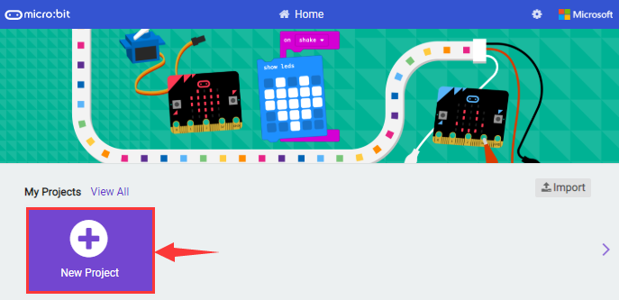

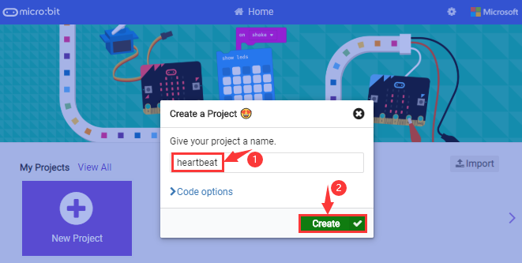

Write a set of micro:bit code. You can drag some modules in the Blocks to the editing area and then run your program in Simulator of MakeCode editor as shown in the picture below which demonstrates how to edit ‘heartbeat’ program .

As for loading test code , please turn to Chapter 5.5.

And introduction of Makecode is on the next chapter 5.2.

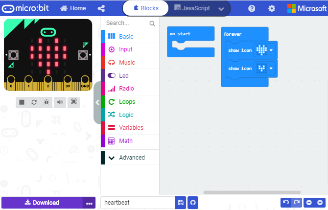

**Step 3: download test code**

If your computer is Windows 10 and you have downloaded the APP MakeCode for micro:bit to write program, what you will have to do to download the program to your Micro: Bit main board V2 is merely clicking the ‘Download’ button, then all is done.

If you are writing programs through the website, following these steps:

Click the ‘Download’ in the editor to download a "hex" file, which is a compact program format that the Micro: Bit main board can read.Once the hexadecimal file is downloaded, copy it to your board V2 just like the process that you copy the file to the USB drive. If you are running Windows system, you can also right-click and select ‘Send to → Microbit (E) ‘to copy the hex file to the Micro: Bit main board V2.

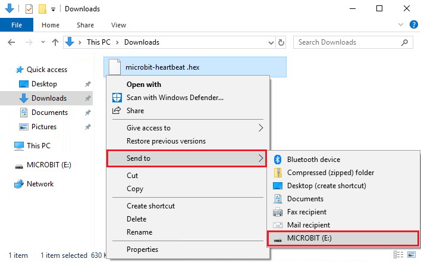

You can also directly drag the "hex" file onto the MICROBIT (E) disk.

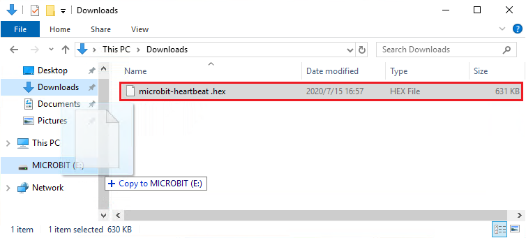

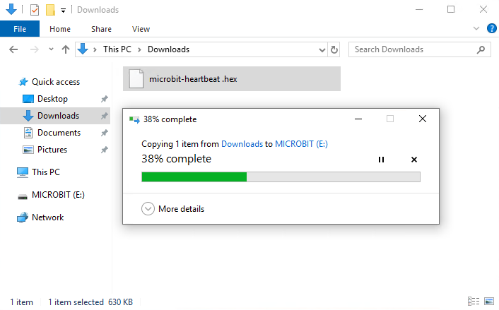

During the process of copying the downloaded hex file to the Micro: Bit main board V2, the yellow signal light on the back side of the board flashes. When the copy is completed, the yellow signal light will stop flashing and remain on.

**Step 4: run the program**

After the program is uploaded to the Micro: Bit main board V2, you could still power it via the USB cable or change to via an external power. The 5 x 5 LED dot matrix on the board displays the heartbeat pattern.

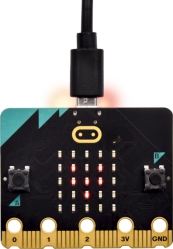

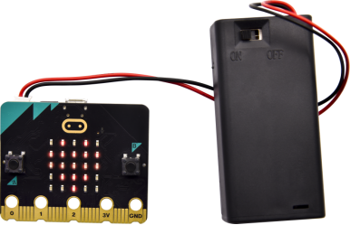

**Step 5：other programming languages**

This chapter has described how to use the Micro: Bit main board V2.

But except for the Makecode graphical programming introduced you can also write Micro: Bit programs in other languages. Go to the link: <https://microbit.org/code/> to know about other programming languages , or view the link: <https://microbit.org/projects/>, to find something you want to have a go.

## 3.3 Makecode

Browse <https://makecode.microbit.org/> and enter Makecode online editor or open the APP MakeCode for micro:bit of Windows 10.

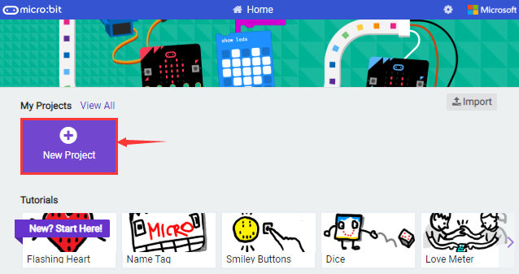

Click“New Project”, and input“heartbeat”，then enter Makecode editor, as shown below:

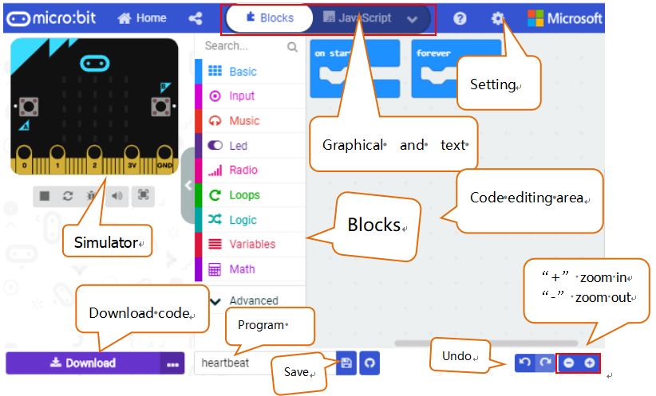

There are blocks“on start”and“forever”in the code editing area.

When the power is plugged or reset,“on start”means that the code in the block only executes once, while“forever”implies that the code runs cyclically.

## 3.4 Quick Download

As mentioned before, if your computer is Windows 10 and you have downloaded the APP MakeCode for micro:bit to write programs, the program written can be quickly downloaded to the Micro: Bit main board V2 by selecting ‘Download’.

While it is a little more trickier if you are using a browser to enter makecode. However, if you use Google Chrome, suitable for Linux，macOS and Windows 10, the process can be quicker too.

We use the webUSB function of Chrome to allow the internet page to access the Components device connected USB. You could refer to the following steps to connect and pair devices.

**Device pairing :**

Connect micro:bit to your computer by USB cable. Click“...”beside“Download”and click“Pair device”.

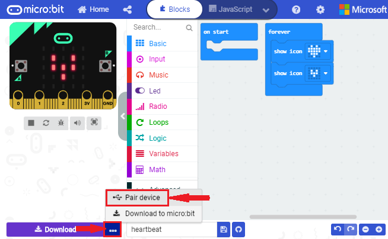

Then click another“Pair device”as shown below.

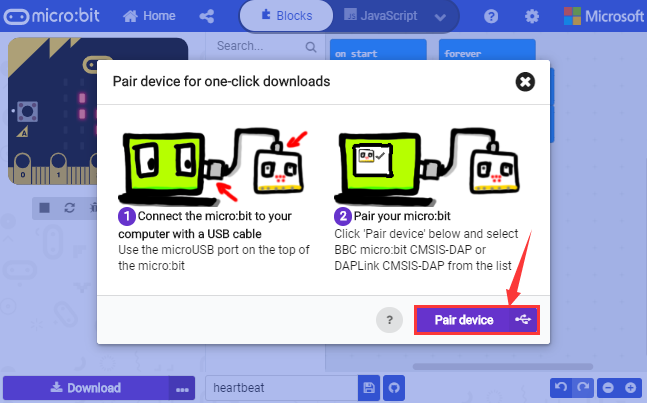

Then select ‘’BBC micro:bit CMSIS-DPA” and click “Connect”. If ‘’BBC micro:bit CMSIS-DPA”does not show up for selection, please refer to [https://makecode.microbit.org/device/usb/webusb/troubleshoot](https://makecode.microbit.org/device/usb/webusb/troubleshoot%20)

We also provide in the resource link.

What’s more, if you don’t know how to update the firmware of micro:bit, refer to the link: [https://microbit.org/guide/firmware/](https://microbit.org/guide/firmware/%20) or browse folderwe provide.

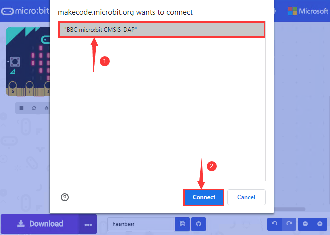

Then click ”Download”. The program is directly downloaded to Micro: Bit main board V2 and the sentence “Download completed!” appears.

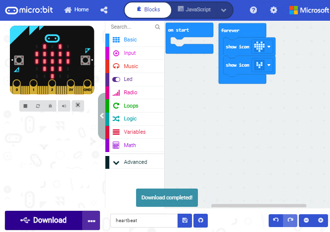

## 3.5 Input test code

We provide hexadecimal code files (project files) for each project. The file contains all the contents of the project and can be imported directly, or you can manually drag the code blocks to complete the program for each project. For simple projects, dragging a block of code to complete the program is recommended. For complex projects, it is recommended to conduct the program by importing the hexadecimal code file we provide.

Let's take the "Heatbeat" project as an example to show how to load the code.

Open the Web version of Makecode or the Windows 10 App version of Makecode.

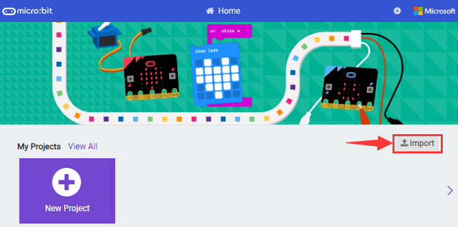

Click “Import File”;

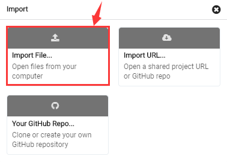

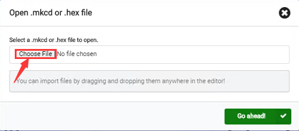

Select“ ../Makecode Code/Project 1\_ Heart beat/Project 1\_ Heart beat.hex” ;

Then click “Go ahead”.

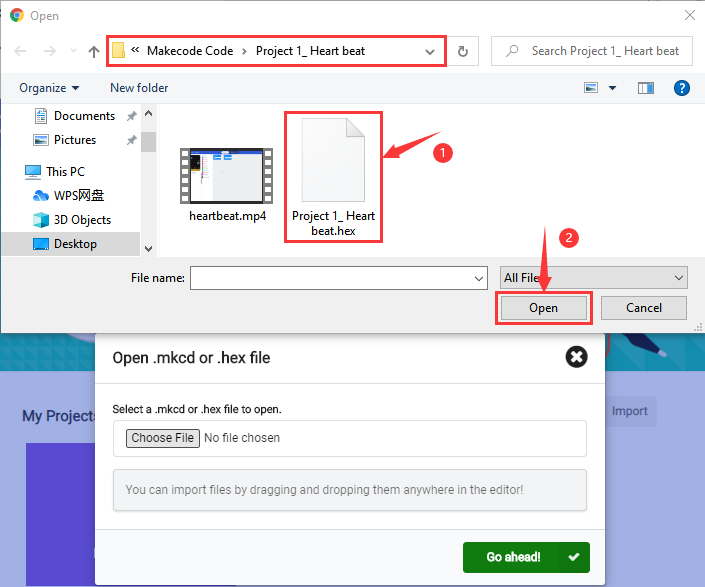

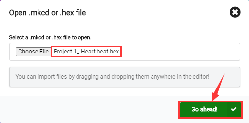

In addition to importing the test code file provided into the Makecode compiler above, you can also drag the the test code file provided into the code editing area of the Makecode compiler, as shown in the figure below:

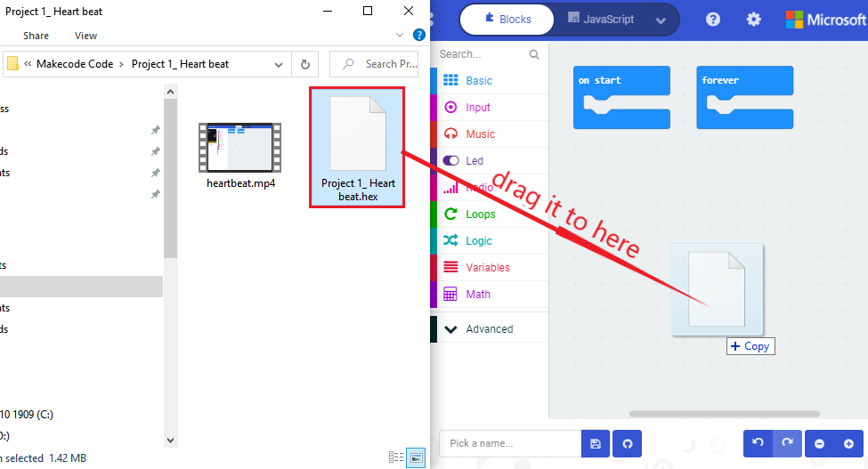

After a few seconds, it is done.

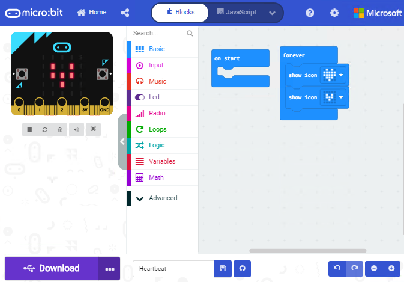

Note: if your computer system is Windows7 or 8 instead of Windows 10, the pairing cannot be done via Google Chrome. 

Therefore, digital signal or analog signal of sensors and modules cannot be shown on the serial port simulator. However, you need to read the corresponding digital signal or analog signal.So what can we do? You can use the CoolTerm software to read the serial port data of the micro:bit. 

## 3.6 CoolTerm Installation

CoolTerm program is used to read the data on serial port.

Please Download CoolTerm program here: 

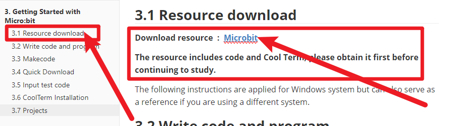

1. After the download, we need to install CoolTerm program file, below is Window system taken as an example.

2. Choose“win”to download the zip file of CoolTerm
3. Unzip file and open it. (also suitable for Mac and Linux system)

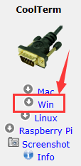

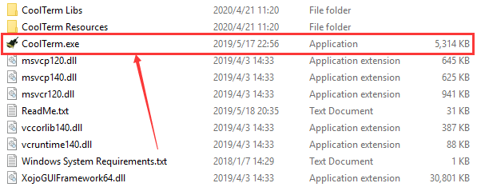

Double-click 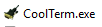.

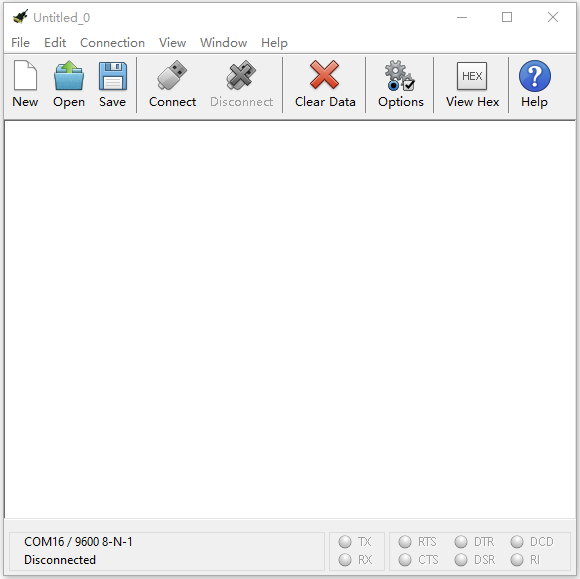

The functions of each button on the Toolbar are listed below: <http://wiki.keyestudio.com/index.php/File:IDE.png>

|                  ICON                  |                     FUCTION                      |
| :------------------------------------: | :----------------------------------------------: |
|  |             Opens up a new Terminal              |
| 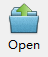 |             Opens a saved Connection             |
| 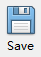 |       Saves the current Connection to disk       |
| 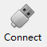 |           Opens the Serial Connection            |
|  |           Closes the Serial Connection           |
|  |             Clears the Received Data             |
| 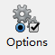 |       Opens the Connection Options Dialog        |
| 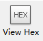 | Displays the Terminal Data in Hexadecimal Format |
|  |             Displays the Help Window             |

## 3.7 Projects

(Note: project 1 to 12 will be conducted with the built-in sensors and LED dot matrix of the Micro:bit main board V2)