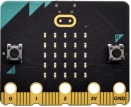
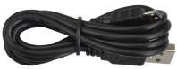
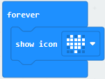
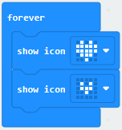
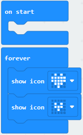
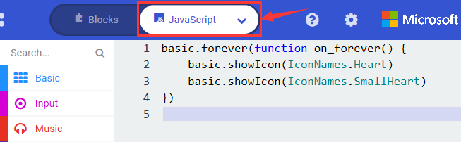
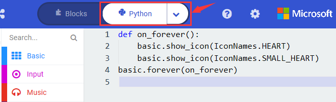

### Project 1 Heartbeat

**1.Project Description**

This project is easy to conduct with a micro:bit V2 main board, a Micro USB cable and a computer. The micro:bit LED dot matrix will display a relatively big heart-shaped pattern and then a smaller one. This alternative change of this pattern is like heart beating. This experiment serves as a starter for your entry to the programming world.

**2.Components Needed**

| Micro:bit Main Board V2 * 1            | Micro USB Cable *1                     |
| -------------------------------------- | -------------------------------------- |
|  |  |

 **3.Test Code**

Attach the Micro:bit main board V2 to your computer via the Micro USB cable and begin editing.

Firstly, click”basic”module and find and drag the block “show icon“ to module “forever”;

Secondly, click”basic”module again and find and drag the block “show icon“ to module “forever”and click the little triangle to select “show icon";

Thirdly, click”basic”module and find and drag the block ""to the code block and click the littler triangle to select 500;

Complete Program：

Note: the “on start”means that code in the block only executes once, while“forever”implies that the code runs cyclically.

Click”JS JavaScript”, you will find the corresponding programming languages.

Click the little triangle”of JS JavaScript”to choose “Python”, you will find the corresponding Python programming languages.

**4.Test Results**

After uploading test code to micro:bit main board V2 and keeping the connection with the computer to power the main board, the LED dot matrix shows pattern ""and then ""alternatively.

(Please refer to chapter 5.3 to know how to download test code quickly.)

If the downloading is not smooth, please remove the micro USB from the main board and then reconnect them and reopen Makecode to try again.