## Project 10: Touch-sensitive Logo

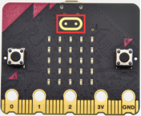

**1.Project Description**

The Micro: Bit main board V2 is equipped with a golden touch-sensitive logo, which can act as an input component and function like an extra button.

It contains a capacitive touch sensor that senses small changes in the electric field when pressed (or touched), just like your phone or tablet screen do.When you press it , you can activate the program.

**2.Components Needed**

-   Micro:bit main board V2 \*1

-   Micro USB cable\*1

**3.Test Code**

Link computer with micro:bit board by micro USB cable, and program in MakeCode editor.

( 1 ) Delete block“on start”and“forever”;

( 2 )Enter“Input”module to find and drag“on logo pressed” ;

Click the little triangle to find “touched”’;

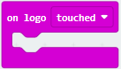

( 3 ) Enter module “Variables”→choose“Make a Variable”→input “start”→click “OK”.

The variable“start”is established;

Enter“Variables”module to find and drag “set start to 0” into “on logo touched”block;

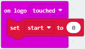

( 4 )Enter“Input”module →click “more”→ find and drag“running time(ms)” into the “0” of “set start to 0” block;

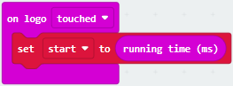

( 5 )Enter“Basic”module to find and drag“show icon” into “on logo touched”block;

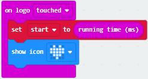

( 6 )Enter“Input”module to find and drag“on logo pressed”→choose “released”→ establish variable “time”; Enter“Variables”module to find and drag “set time to 0”into “on logo pressed”block; Enter“Math”module to find and drag “0-0”into the “0”of“set start to 0”block;

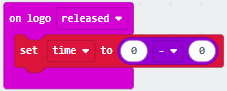

( 7 )Enter“Input”module→ “more” → find and drag “running time(ms)” into “0”on the left side of “0-0”;

Enter“Variables”module to find and drag“start” into “0”on the right side of “0-0”;

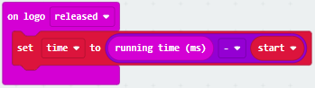

( 8 )Enter“Basic”module to find and drag“show number” into “on logo released”block;

Enter“Math”module to find and drag“square root 0” into “0”; Click the little triangle to find”integer÷”;

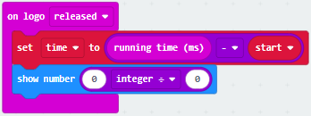

( 9 ) Enter“Variables”module to find and drag“time” into “0”on the left side of “0-0”and change the “0”on the right side to”1000”;

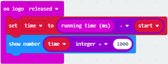

Complete Program：

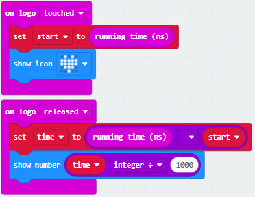

Select “JavaScript" and “Python” to switch into JavaScript and Python language code:

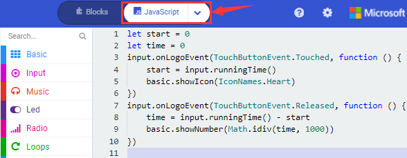

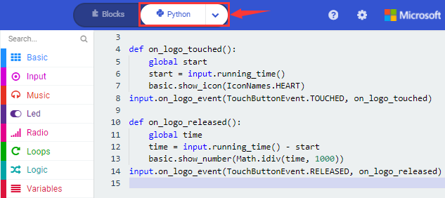

**4.Test Results**

After uploading the test code to micro:bit main board V2 and powering the board via the USB cable, the LED dot matrix exhibits the heart pattern when the touch-sensitive logo is pressed or touched while displays digit when the logo is released.