### Project 11 Microphone

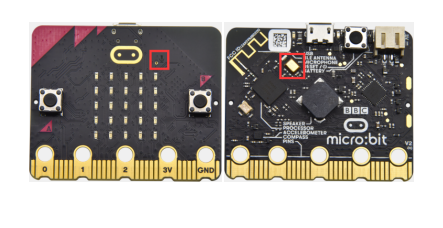

**1.Project Description**

The Micro: Bit main board V2 is built with a microphone which can test the volume of ambient environment. When you clap, the microphone LED indicator will turn on. Since it can measure the intensity of sound, you can make a noise scale or disco lighting changing with music. The microphone is placed on the opposite side of the microphone LED indicator and in proximity with holes that lets sound  pass.When the board detects sound, the LED indicator lights up.

**2.Components Needed**

-   Micro:bit main board V2 \*1

-   Micro USB cable\*1

**3.Test Code 1**

Link computer with micro:bit board by micro USB cable, and program in MakeCode editor.

( 1 ) Delete block“on start”and“forever”;

( 2 ) Enter“Input”module to find and drag“on loud sound”;

Enter“Basic”module to find and drag “show number”into “on loud sound”block ;

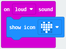

( 3 )Copy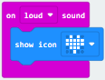once; Click the little triangle of “lond” to choose”quiet”; Click the little triangle of “” to choose”";

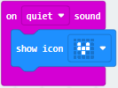

Complete Program：

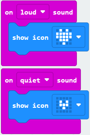

Select“JavaScript" and“Python”to switch into JavaScript and Python language code:

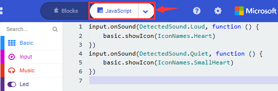

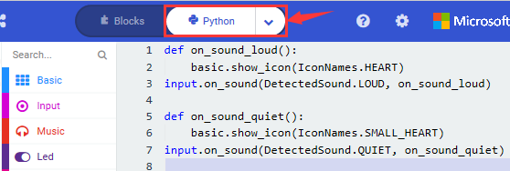

**4.Test Results 1**

Uploading test code to micro:bit main board V2 and powering the board via the USB cable, the LED dot matrix displays patternwhen you claps and patternwhen it is quiet around.

**5.Test Code 2**

Link computer with micro:bit board by micro USB cable, and program in MakeCode editor.

( 1 )Enter“Advanced”module→ choose“Serial”to find and drag“serial redirect to USB”into “on start”block ;

( 2 )Enter“Variables”module→ choose“Make a Variable”→ input “maxSound”→click “OK”,variable ”maxSound”is established;

Enter“Variables”module to find and drag“set maxSound to 0”into “on start”block ;

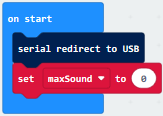

( 3 )Enter“Logic”module to find and drag“if true then...else”into “forever” block ; Enter“Input”module to find and dragbutton A is pressed”into “then” ;

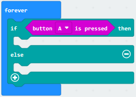

( 4 )Enter“Basic”module to find and drag“show number”into “then” ; Enter“Variables”module to find and drag“maxSound”into “0” ;

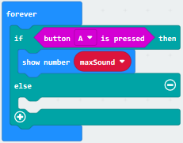

( 5 )Establish variable“soundLevel”;

Enter“Variables”module to find and drag“set soundLevel to 0”into “else”;

Enter“Input”module to find and drag“sound level” into “0”;

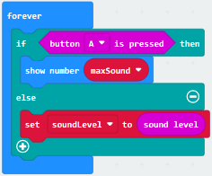

( 6 )Enter“Led”module to find and drag“plot bar graph of 0 up to 0” into “else”;

Enter“Variables”module to find and drag“soundLevel”into the “0”behind “of”;

Change the “0”behind “up” to “255”;

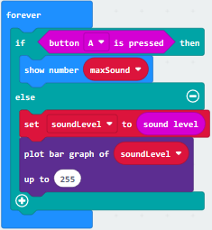

( 7 )Enter“Logic”module to find and drag“if true then”into “else”block ;

Enter“Logic”module to find and drag“0 \> 0”into “then” ;

Enter“Variables”module to find and drag“soundLevel”into “0”on the left side of “0-0” ;

Enter“Variables”module to find and drag“maxSound” into “0” on the right side;

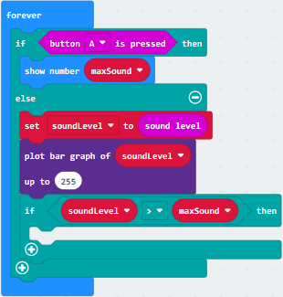

( 8 )Enter“Variables”module to find and drag“set maxSound to 0”into the second “then” ;

Enter“Variables”module to find and drag“soundLevel”into the “0” ;

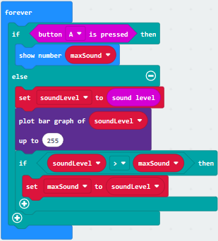

Complete Program：

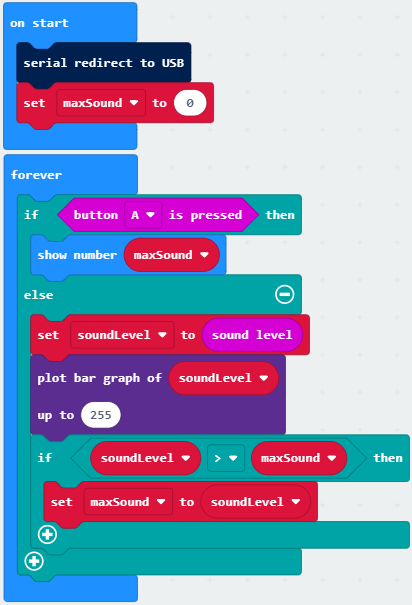

Select “JavaScript" and“Python”to switch into JavaScript and Python language code:

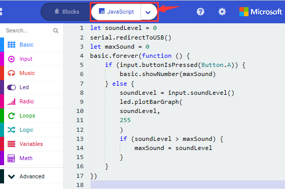

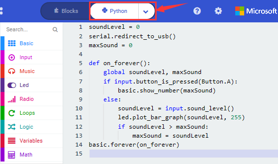

**6.Test Results 2**

Upload test code to micro:bit main board V2, power the board via the USB cable and click “Show console Device”as shown below.

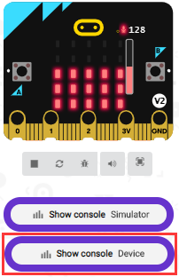

When the sound is louder around, the sound value shows in the serial port is bigger as shown below.

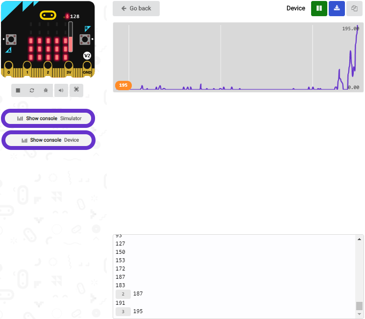

What’s more, when pressing the button A, the LED dot matrix displays the value of the biggest volume( please note that the biggest volume can be reset via the Reset button on the other side of the board ) while when clapping, the LED dot matrix shows the pattern of the sound.