### Project 12 Bluetooth Wireless Communication

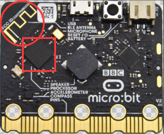

**1.Project Description**

The Micro: Bit main board V2 comes with a nRF52833 processor (with built-in Bluetooth 5.1 BLE(Bluetooth Low Energy) device) and a 2.4GHz antenna for Bluetooth wireless communication and 2.4GHz wireless communication. With the help of them, the board is able to communicate with a variety of Bluetooth devices, including smart phones and tablets.

In this project, we mainly concentrate on the Bluetooth wireless communication function of this main board. Linked with Bluetooth, it can transmit code or signals. To this end, we should connect an Apple device (a phone or an iPad) to the board.

Since setting up Android phones to achieve wireless transmission is similar to that of Apple devices, no need to illustrate again.

**2.Preparation**

Attachment of the Micro:bit main board V2 to your computer via the Micro USB cable.

An Apple device (a phone or an iPad) or an Android device;

**3.Procedures**

For Apple devices, enter this link <https://www.microbit.org/get-started/user-guide/ble-ios/> with your computer first, and then click “Download pairing HEX file” to download the Micro: Bit firmware to a folder or desk, and upload the downloaded firmware to the Micro: Bit main board V2.

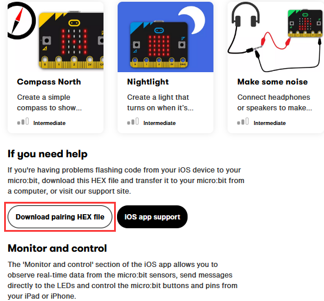

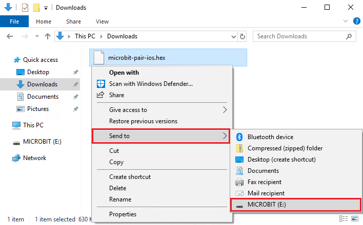

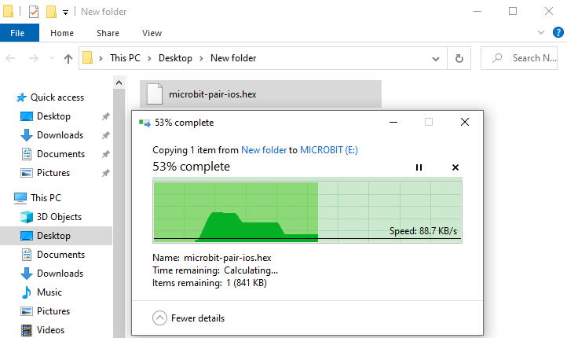

Search “micro bit”in your App Store to download the APP micro:bit.

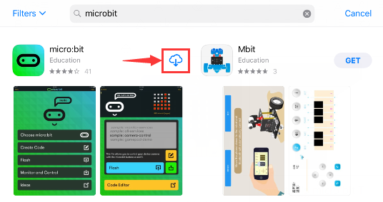

Connect your Apple device with Micro: Bit main board V2:

Firstly, turn on the Bluetooth of your Apple device and open the APP micro:bit to select item “Choose micro:bit”to start pairing Bluetooth.

Please make sure that the Micro: Bit main board V2 and your computer are still linked via the USB cable.

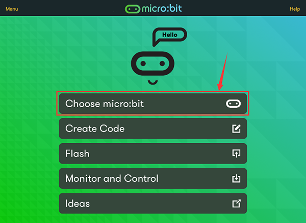

Secondly, click“Pair a new micro:bit”;

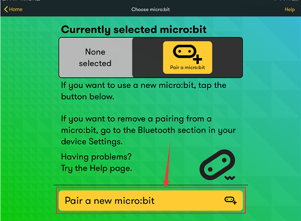

Following the instructions to press button A and B at the same time(do not release them until you are told to) and press Reset & Power button for a few seconds.

Release the Reset & Power button, and a password-like pattern shows on the LED dot matrix. Now , release buttons A and B and click Next.

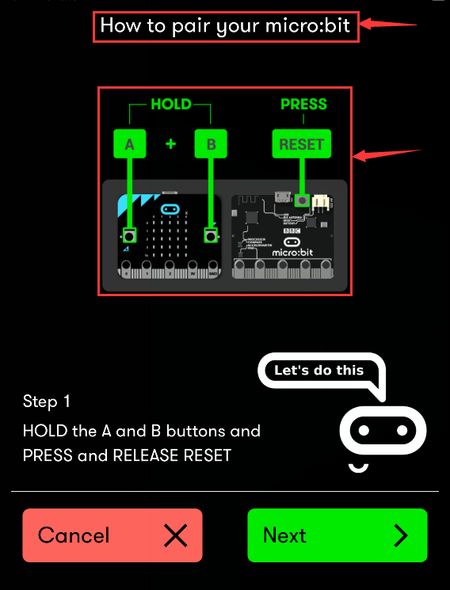

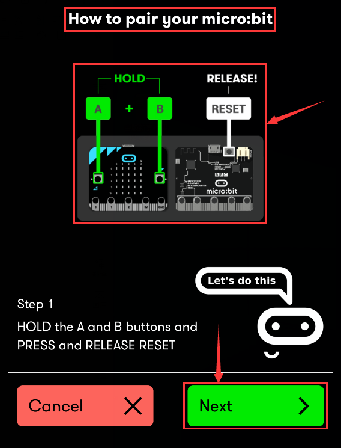

Set the password pattern on your Apple device as the same pattern showed on the matrix and click Next.

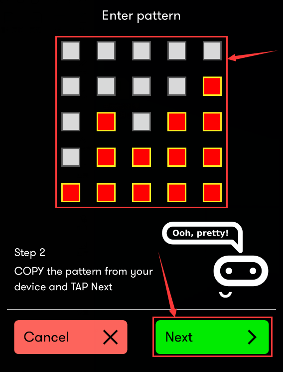

Still click Next and a dialog box props up as shown below. Then click "Pair". A few seconds later, the match is done and the LED dot matrix displays the "√" pattern.

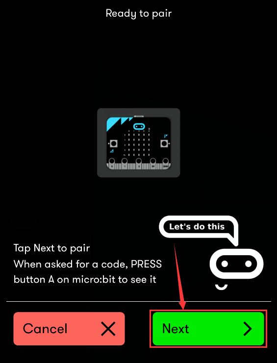

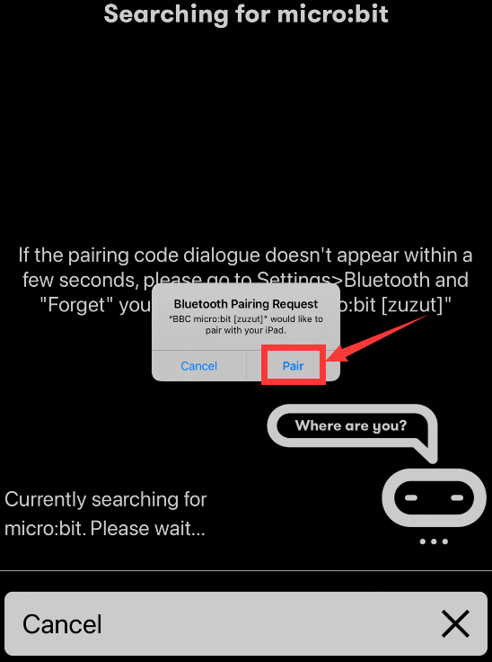

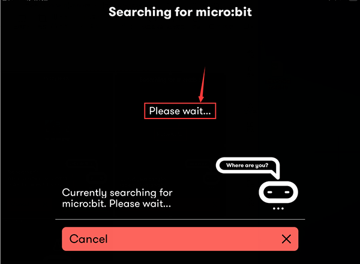

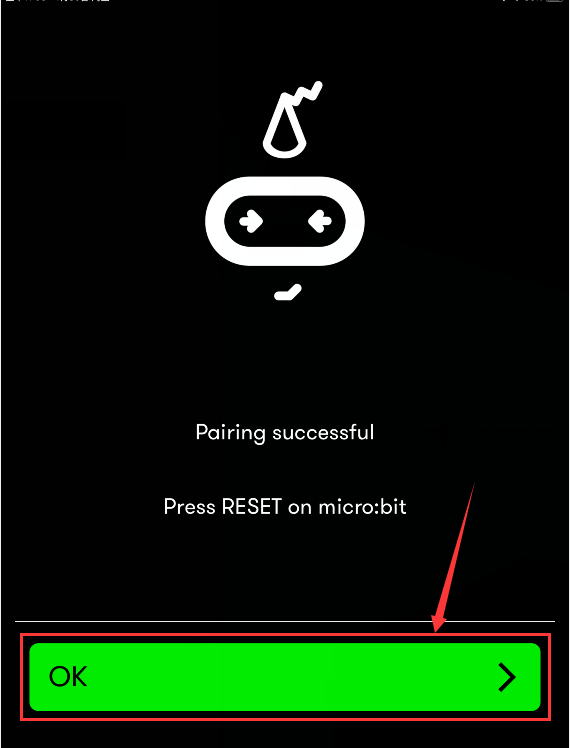

After the match with Bluetooth, write and upload code with the App.

Click “Create Code” to enter the programming page and write code.

Click and the box 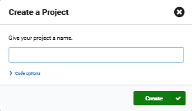appears, and then select “Create √”.

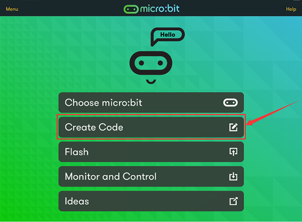

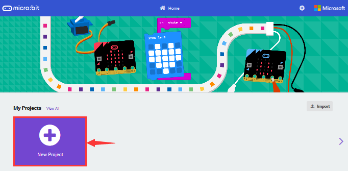

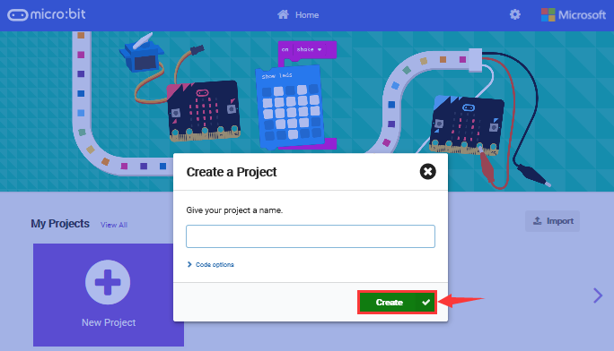

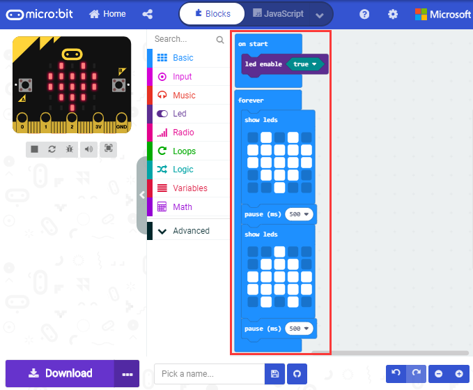

Name the code as “1 “and click to save it.

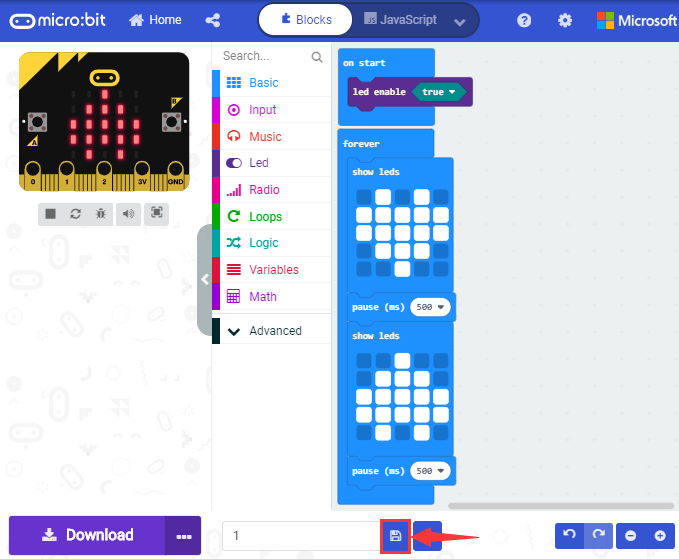

Click the third item“Flash”to enter the uploading page. The default code program for uploading is the one saved just now and named "1" and then click the other "Flash" to upload the code program "1".

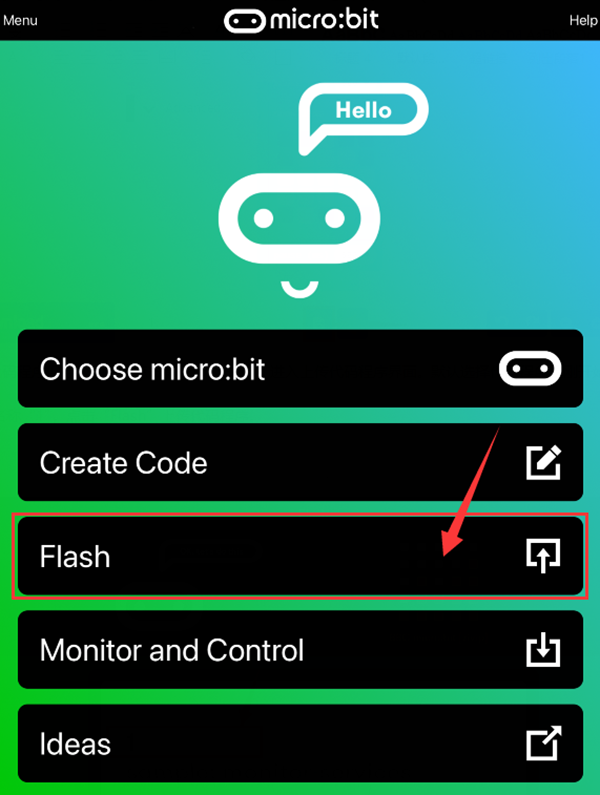

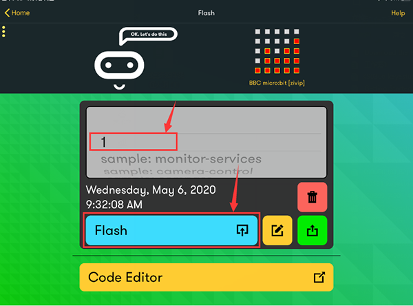

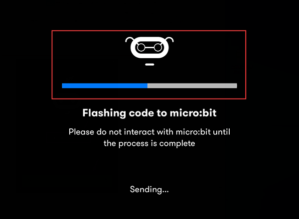

If the code is uploaded successfully a few seconds later, the App will emerge as below and the LED dot matrix of the Micro: Bit main board V2 will exhibit a heart pattern.

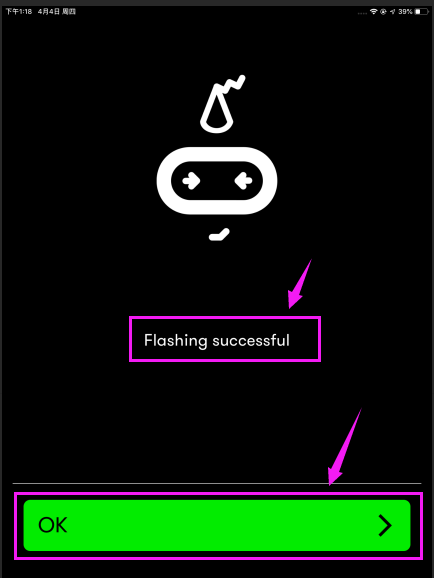

Projects below all conduct with the built-in sensors and the LED dot matrix while the following ones will carry out with the help of external sensors.

**（Attention： to avoid burning the the Micro:bit main board V2, please remove the USB cable and the external power from the board before fix it with a T-shaped shield; likewise, the USB cable and the external power should be cut from the main board before disconnect the shield from the board.)**