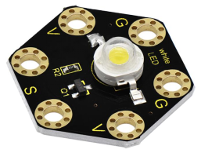
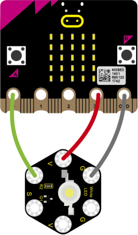
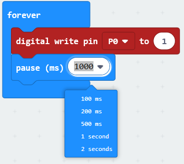
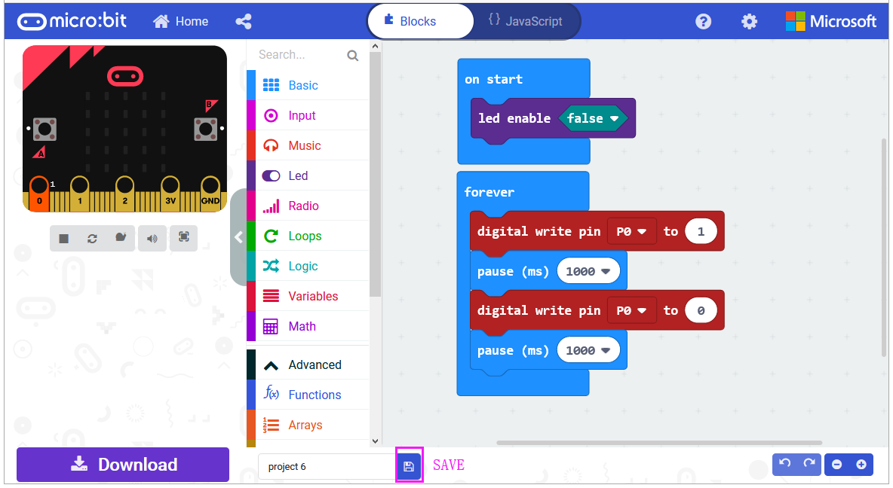
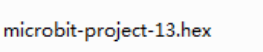
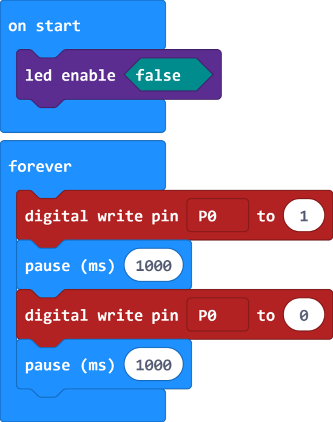
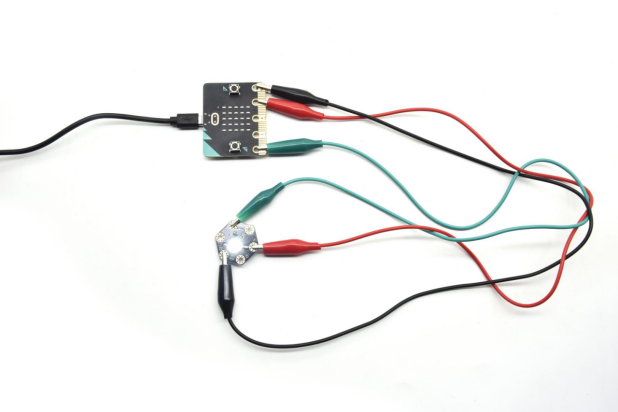

### Project 13 LED Flashes

**1.Overview**

**keyestudio 1W LED Module For BBC micro:bit (Black and Eco-friendly)**

This LED module is fully compatible with micro:bit control board. It can emit white light. Its maximum operating current is 400mA, and the maximum power is 1W. When using, connect the LED module to micro:bit control board using Crocodile clip line.

There are total 6 rings on the module, namely two G rings, two V rings and two S rings which are separately connected.

When using, G ring is for ground; V for 3V; S for signal pin (0 1 2). When the signal end is HIGH, LED lights.

**2.Technical Parameters**

-   Working voltage: DC 3.0-3.3V

-   Working current: 400mA

-   Power: 1W

-   Light Color: white

-   Dimensions: 31mm\*27mm\*8mm

-   Weight: 2.4g

-   Environmental attributes: ROHS

**3.Components Required**

-   Micro:bit main board \*1

-   keyestudio 1W LED Module for micro:bit \*1

-   Alligator clip cable \*3

-   USB cable \*1

**4.Connection Diagram**

Connect the keyestudio 1W LED Module to micro:bit main board with 3 Alligator clip cables. Ring S to P0, V to 3V, G to GND. 

Connect the micro:bit to your computer with a micro USB cable.

**5.Coding**

So now let's move to coding. Let us see how to code the LED to flash. Below are some steps to follow.

Open the [https://makecode.micro:bit.org/\#editor](https://makecode.microbit.org/#editor) to write your code.

Microsoft MakeCode is actually a platform that allows us to code with a micro:bit, and also provides an interactive simulator where we can debug and run our code, and will be able to see what to expect out right there on the site.

Go to MakeCode and choose **My Projects** and click on **New Projects**.

If you want to see the codes behind, then you can click on JavaScript and it will display JavaScript code there in IDE.

**6.LED Flashes**

Let's get started and code the LED to flash. To do so, you just need to go to **Basic** and scroll down to see an **on start** block.

Now drag and drop, and go to **Led** and click **more** to drag out the block **led enable(false)** into **on start** block.

And again go to **Basic** and drag the **forever** block beneath the on start block you just made.

Go to the **Pins**, drag and drop the **digital write pin(P0) to (0)** block into **forever** block.

Look back at the connection diagram, we connect the signal pin to P0. So we select the **P0** in the code; and change the 0 to **1**, which means input a **HIGH** level to the pin so as to **lit** the LED.

Then we can duplicate the block and change the value to **0**, means input a **LOW** level to the pin to **turn off** the LED.

If we want to make the LED keep ON for a few seconds, able to add a **pause (ms)** block. This delay period is in milliseconds, so if you want the LED display as fast, change the value, try 500ms.

After completing the code, let's move on to name and download the program we’vewritten.

**7.Test Code**

**8.Result**

Connect the micro:bit to your computer with a micro USB cable. You can right-click the microbit HEX file to send to your micro:bit main board.

Powered the microbit with batteries, the LED on the module should flash for one second, then off for one second, circularly and alternately.

