## Project 14: RGB Flashes

**1. Overview**

**keyestudio 5050 RGB Module For BBC micro:bit**

This module mainly contains a 5050 RGB LED, fully compatible with micro:bit control board. When using, connect the RGB module to micro:bit control board using Crocodile clip line.

There are total 6 rings on the module. Note that three V rings are connected. V ring for 3V; R G B ring is separately connected to signal pin (0 1 2) of micro:bit main board.

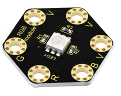

When three signal pins are LOW, this module gradually shows red, green and blue light.

**2.Technical Parameters**

-   Working voltage: DC 3.0-3.3V

-   Control mode: active LOW(common anode)

-   Dimensions: 31mm\*27mm\*3mm

-   Weight: 1.8g

-   Environmental attributes: ROHS

**3.Components Required:**

-   Micro:bit main board \*1

-   keyestudio 5050 RGB Module for micro:bit \*1

-   Alligator clip cable \*4

-   USB cable \*1

**4.Connection Diagram**

Connect the keyestudio 5050 RGB Module to micro:bit main board with 4 Alligator clip cables. Ring B to P0, R to P1, G to GND, V to 3V.

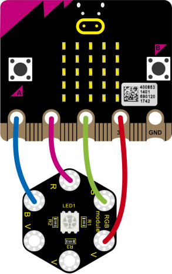

**5.Coding**

So now let's move to coding. Let us see how to code the RGB LED to flash. Below are some steps to follow.

Open the [https://makecode.micro:bit.org/\#editor](https://makecode.microbit.org/#editor) to write your code.

Microsoft MakeCode is actually a platform that allows us to code for a micro:bit, and also provides an interactive simulator where we can debug and run our code, and will be able to see what to expect out right there on the site.

Go to MakeCode and choose **My Projects** and click on **New Projects**.

If you want to see the codes behind, then you can click on JavaScript and it will display JavaScript code there in IDE.

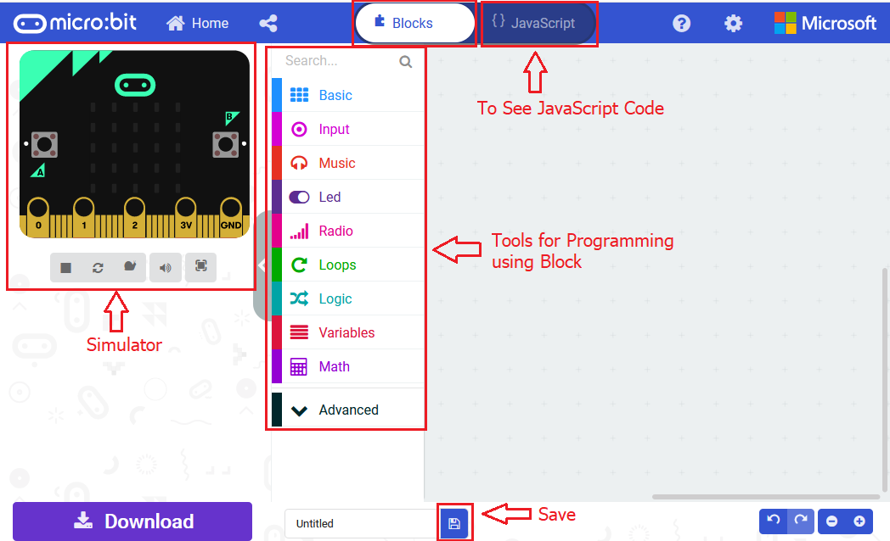

**6.RGB LED Flashes**

Let's get started and code RGB LED to shine three colors. To do so, you just need to go to **Basic** and scroll down to see an **on start** block.

Now drag and drop, and go to **Led** and click **more** to drag out the block **led enable(false)** into **on start** block.

Go to the **Pins**, drag and drop the **analog write pin(P0) to (1023)** block into **forever** block. Duplicate this block twice, and change the pin to **P1**, **P2**.

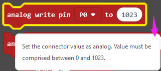

Look at the connection diagram, **we separately connect the Red,Green, Blue pin to P1, P2, P0. Connect the V pin to 3.3V.**

So we first set all the pin value to 1023, which means input a **HIGH** level 3.3V (no voltage difference) to **turn off** all the LEDs;

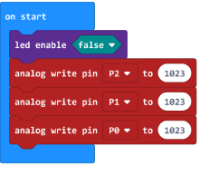

And again go to **Basic** and drag the **forever** block beneath the on start block you just made.

We duplicate and drag the **analog write pin(P0) to (1023)** block into the **forever** block. Change the P0 value to **0**, which means input a **LOW** level (0V)(with voltage difference) so as to **lit** the Blue LED.

Add a **pause** block in millisecond; and then duplicate the **analog write pin(P0) to (1023)** block several times.

We first turn on the Blue LED (P0) for 1 second then off, followed by turn Red LED (P1) on for 1 second then off; and turn Green LED (P2) on for 1 second then off.

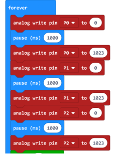

Now let's move on code the program we’ve written. Go to make the RGB led change in different brightness.

Go to **Loops**, drag and drop the **repeat()times do()** block into the block just made. Repeat 1 times.

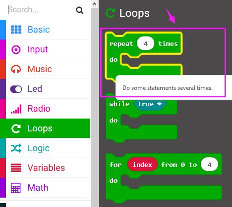

Then we drag the block **for (index) from 0 to (4) do** into the **repeat()times do()** block; and set to the variable **val** from 0 to **512**.

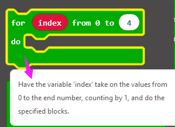

After that, duplicate the **analog write pin** block three times; then call the **Variables** and **Math** block.

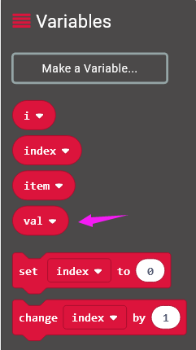

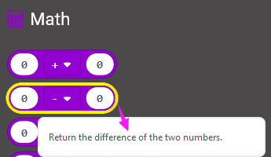

Using the variables adjust the RGB color-ratio to make the color change.

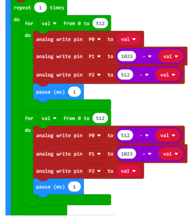

Finally we duplicate and set the **analog write pin** **2, 1, 0** value to 1023, which means input a **HIGH** level (no voltage difference) to **turn off** all the LEDs.

You can click on **JavaScript** and it will display JavaScript code there in IDE.

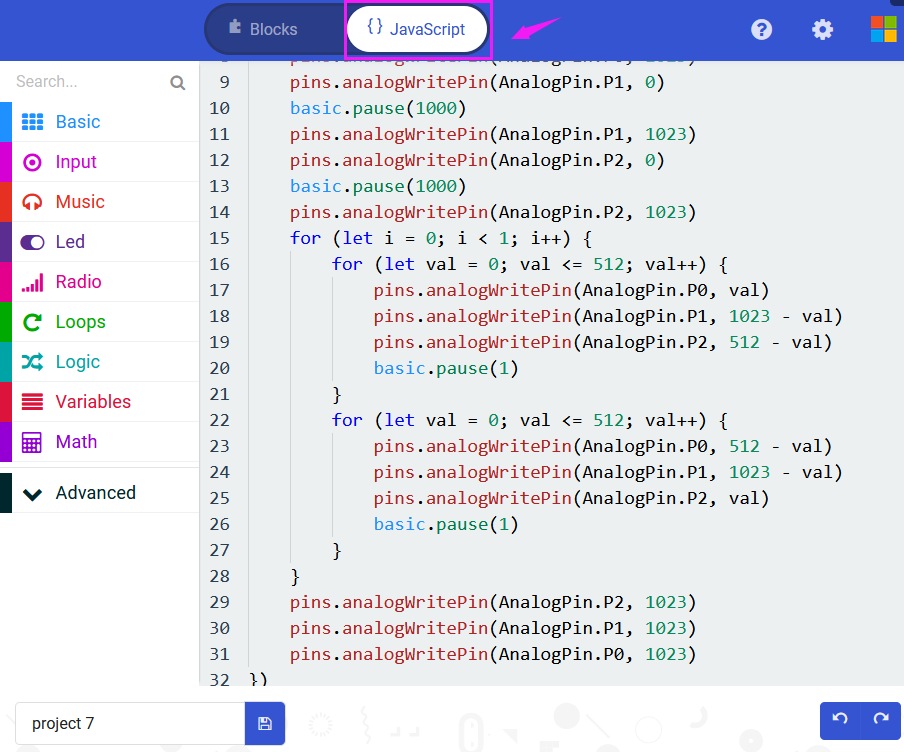

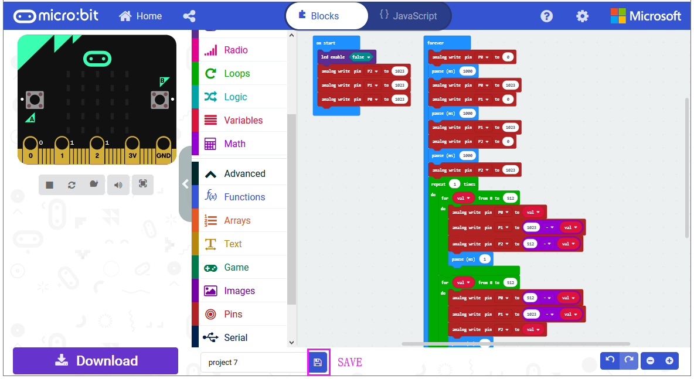

After completing the code, let's move on to name and download the program we’ve written.

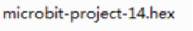

**7.Test Code:**

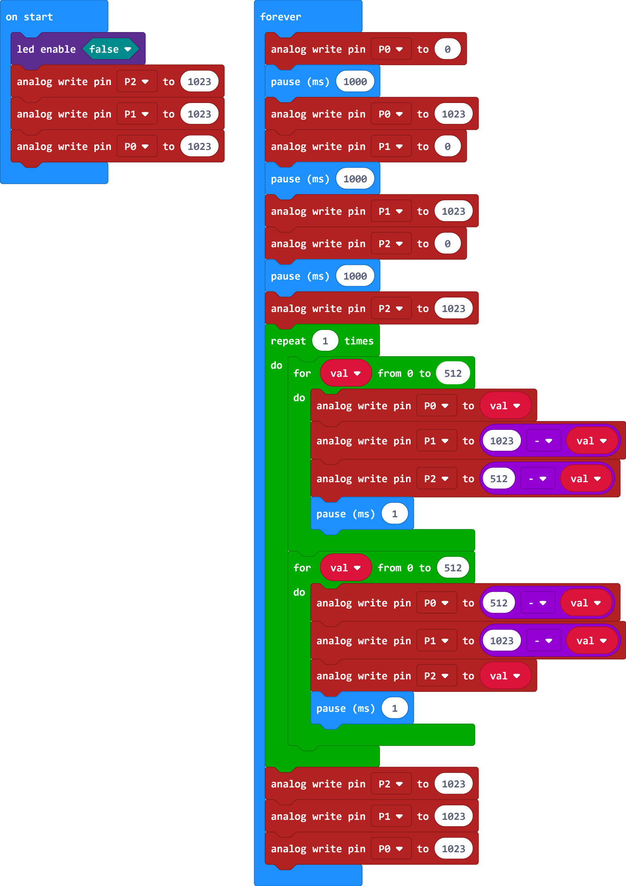

**8.Result**

Connect the micro:bit to your computer with a micro USB cable. You can right-click the micro:bit HEX file to send to your micro:bit main board.

Powered on, the RGB LED on the module will alternately flash red, blue and green light and make a slight change of brightness .

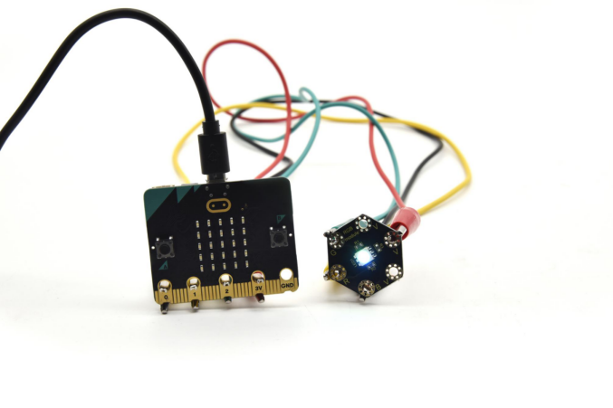

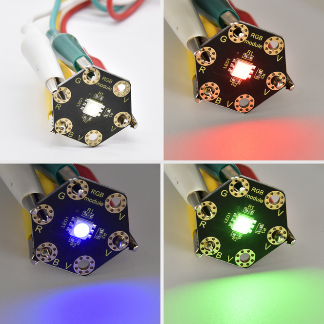