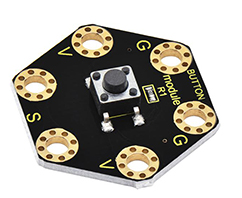
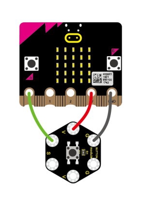
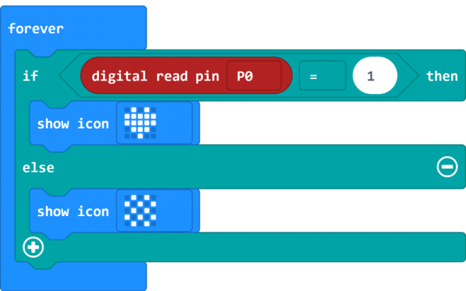
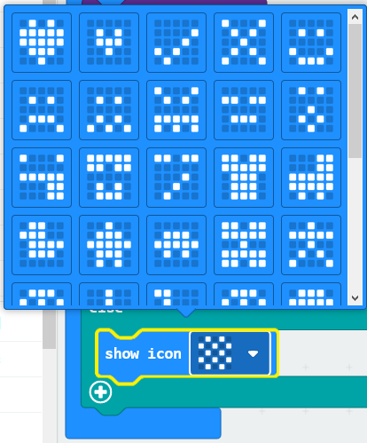
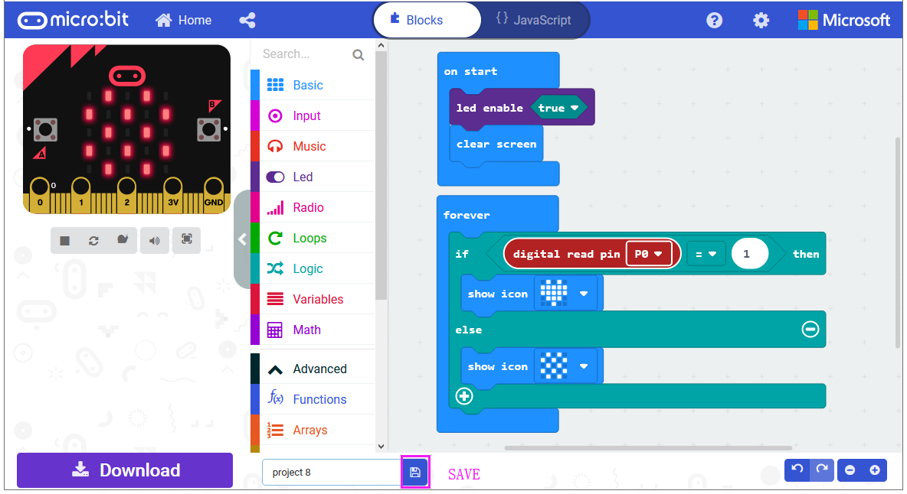
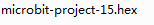
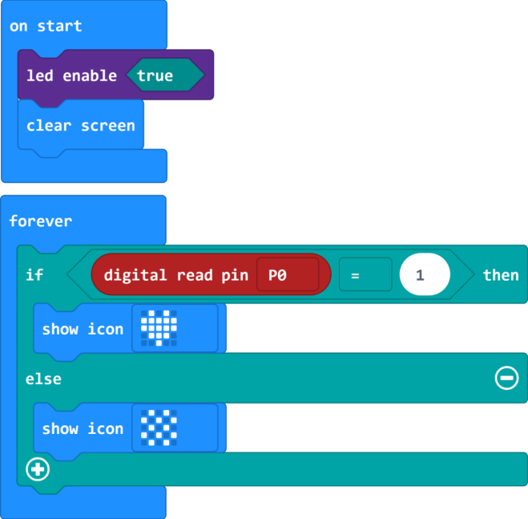
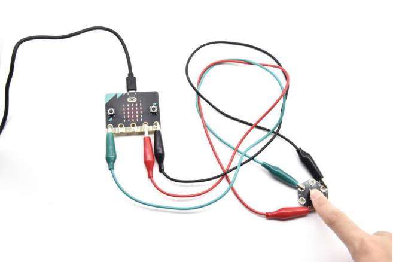

### Project 15: Tactile Button

**1.Overview**

**keyestudio Tactile Button Module For BBC micro:bit**

This keyestudio tactile button module is fully compatible with micro:bit control board. It mainly uses a button element, which is a digital signal output device. When using, connect the module to micro:bit control board using Crocodile clip line.

There are total 6 rings on the module. Note that two G rings, two V rings and two S rings are connected. G for ground; V for 3V; S for signal pin(0 1 2).When press the button, the signal end of micro:bit main board will input HIGH level signal.

**2.Technical Parameters**

-   Working voltage: DC 3.0-3.3V

-   Output Signal: Digital

-   Dimensions: 31mm\*27mm\*6.5mm

-   Weight: 1.8g

-   Environmental attributes: ROHS

**3.Components Required**

-   Micro:bit main board \*1

-   Keyestudio Tactile Button Module for micro:bit \*1

-   Alligator clip cable \*3

-   USB cable \*1

**4.Connection Diagram**

Connect the keyestudio Tactile Button Module to micro:bit main board with 4 Alligator clip cables. Ring S to P0, V to 3V, G to GND.

Connect the micro:bit to your computer with a micro USB cable.

**5.Coding**

So now let's move to coding. Let us see how to code the microbit LED matrix to show icons with button module. Below are some steps to follow.

Open the [https://makecode.micro:bit.org/\#editor](https://makecode.microbit.org/#editor) to write your code.

Microsoft MakeCode is actually a platform that allows us to code for a micro:bit, and also provides an interactive simulator where we can debug and run our code, and will be able to see what to expect out right there on the site.

Go to MakeCode and choose **My Projects** and click on **New Projects**.

If you want to see the codes behind, then you can click on JavaScript and it will display JavaScript code there in IDE.

**6.Use Button to Control LED Display**

Let's get started and show icons on micro:bit using button control. To do so, you just need to go to **Basic** and scroll down to see an **on start** and **clear screen** block.

Now drag and drop, and go to **Led** and click **more** to drag out the block **led enable(true)** into **on start** block.

And again go to **Basic** and drag the **forever** block beneath the on start block you just made.

Now drag and drop, and go to **Logic** and search for **if (true) then...else...**block.

Drag this logic conditional block into **forever** block.

And add a comparison block to the logic conditional block.

Go to the **Pins**, drag and drop the **digital read pin(P0)** block into **if (0)=(1) then...else...**block, replacing the “**0**” field.

Look back at the connection diagram, we connect the signal pin to P0. So we select the **P0** in the code; and input **1**, which means input a **HIGH** level to the pin so as to **lit** the LED.

And then again go to **Basic** and drag the **show icon** block beneath the logic block you just made. Otherwise show another icon.

You can click the drop-down triangle to scroll down to choose the icon you want.

After completing the code, let's move on to name and download the program we’ve written.

**6.Test Code**

**7.Result**

Connect the micro:bit to your computer with a micro USB cable. You can right-click the microbit HEX file to send to your micro:bit main board.

Powered the microbit with batteries, press the button, the micro:bit main board will show a heart shape icon; release the button, show another icon.

