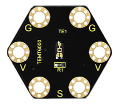
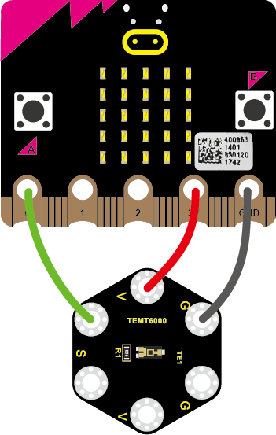
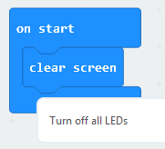
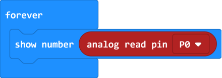
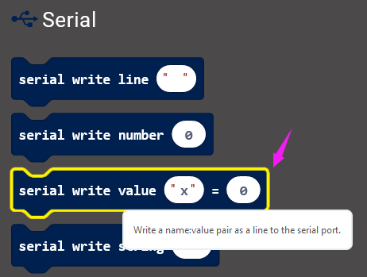
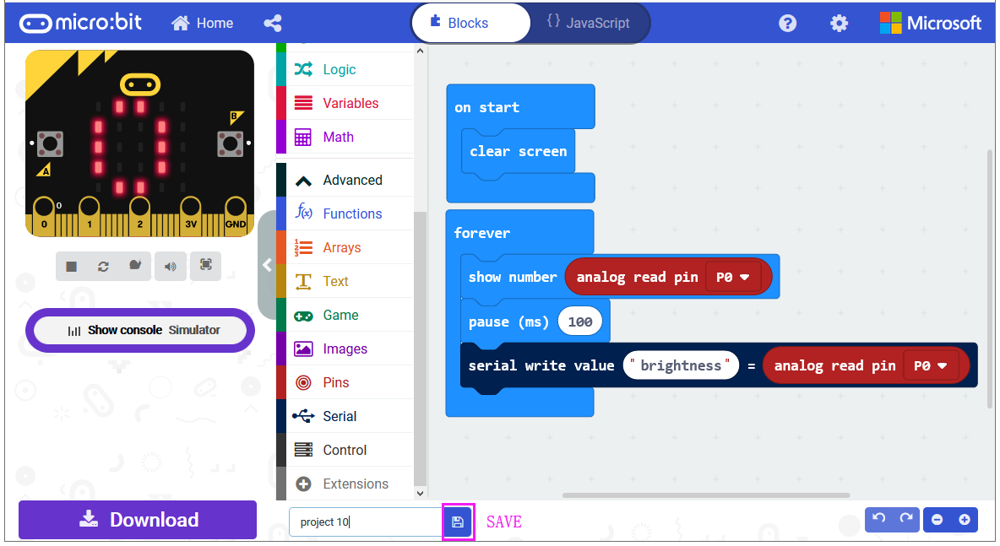
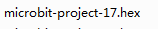
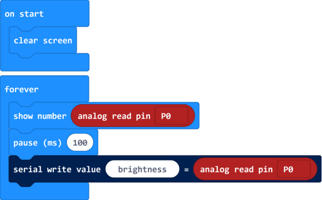
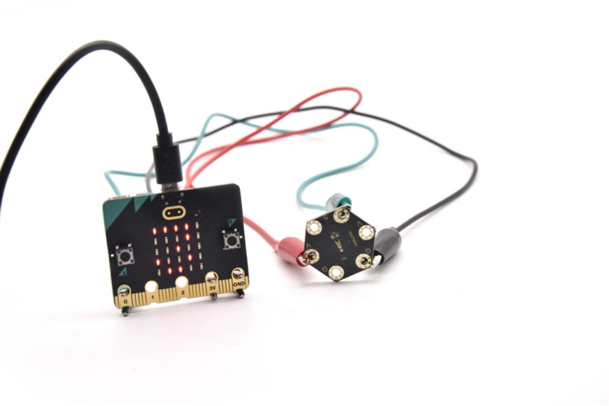
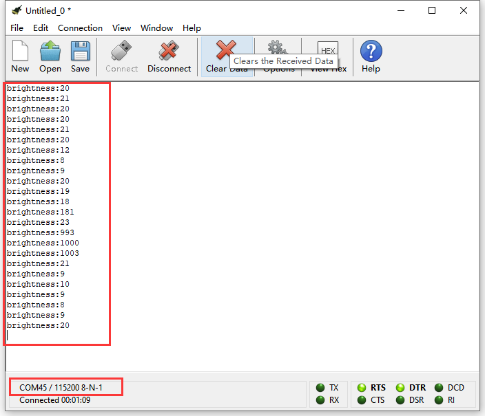

### Project 17 Ambient Light

**1.Overview**

**keyestudio TEMT6000 Light Module For BBC micro:bit**

This keyestudio TEMT6000 light module is fully compatible with micro:bit control board.

This module is mainly composed of a highly sensitive visible photocell (NPN type) triode, which can magnify the captured tiny light illumination changes by about 100 times, and is easily recognized by the microcontroller for AD conversion.

Its response to visible light illumination is similar to that of the human eye, so that can detect the intensity of ambient light.

There are total 6 rings on the module. Note that two G rings, two V rings and two S rings are connected. G for ground; V for 3V; S for signal pin(0 1 2).

It is an analog signal output device.

When using, connect the module to micro:bit control board using Crocodile clip line.

You can use it to detect the ambient light intensity by reading the analog value of signal pin.

**2.Technical Parameters**

-   Working voltage: DC 3.0-3.3V

-   Output Signal: Analog signal

-   Dimensions: 31mm\*27mm\*2.5mm

-   Weight: 1.7g

-   Environmental attributes: ROHS

**3.Components Required**

-   Micro:bit main board \*1

-   Keyestudio TEMT6000 Light Module for micro:bit \*1

-   Alligator clip cable \*3

-   USB cable \*1

**4.Connection Diagram**

Connect the keyestudio TEMT6000 Light Module to micro:bit main board with 3 Alligator clip cables. Ring S to P0, V to 3V, G to GND.

Connect the micro:bit to your computer with a micro USB cable.

**5.Coding**

So now let's move to coding. Let us see how to code and display the analog value of ambient light. Below are some steps to follow.

Open the [https://makecode.micro:bit.org/\#editor](https://makecode.microbit.org/#editor) to write your code.

Microsoft MakeCode is actually a platform that allows us to code for a micro:bit, and also provides an interactive simulator where we can debug and run our code, and will be able to see what to expect out right there on the site.

Go to MakeCode and choose **My Projects** and click on **New Projects**.

If you want to see the codes behind, then you can click on JavaScript and it will display JavaScript code there in IDE.

**6.Analog Value Display**

Let's get started and display the analog value of ambient light on our micro:bit. To do so, you just need to go to **Basic** and scroll down to see an **on start** block.

Now drag and drop, and again go to **Basic** and click **more** to drag the block **clear screen** out; means turn off all LEDs.

Now go to the **Basic** and scroll down to see a **forever** and **show number(0)** block. Drag the **forever** block beneath the **on start** block. And drag the **show number(0)** block into the **forever** block.

Go to **Pins**, drag and drop the block **analog read pin(P0)** into **show number(0)** block, replacing the “**0**” field.

At this moment, we can add a **pause (ms)** block into the block just made. This delay period is in milliseconds, so if you want the value display as fast, change the value, try 100ms.

Next, we go to **Serial**, drag and drop the block **serial write value(x)=(0)** In this way it can write the brightness value to the serial port and show it on monitor.

Change the “**x**” to **brightness** and duplicate the block **analog read pin(P0)** to replace the the “**0**” field.

After completing the code, let's move on to name and download the program we’ve written.

**7.Test Code**

**8.Result**

Connect the micro:bit to your computer with a micro USB cable. You can right-click the microbit HEX file to send to your micro:bit main board.

You should see the LED matrix show the scrolling number. You could read the analog value of ambient light intensity via software.

The stronger the ambient light intensity, the greater the analog value is.

Note: the baud rate of micro:bit is defaulted by 115200.