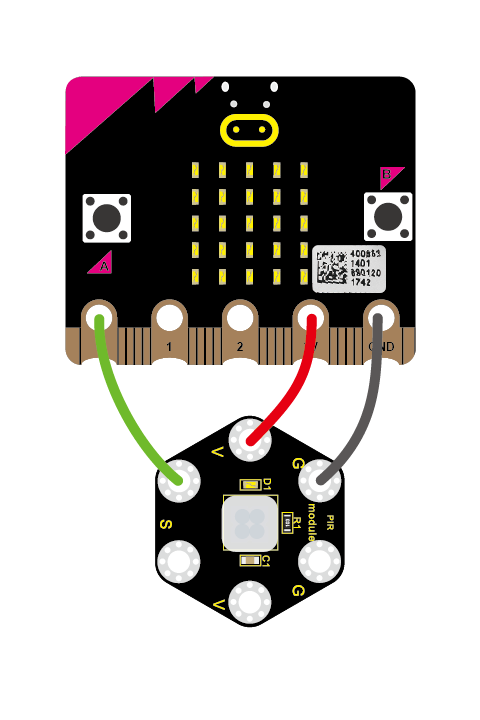
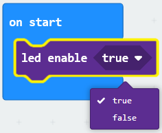
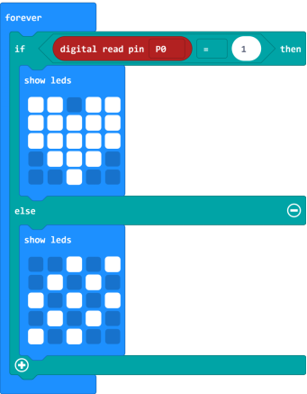
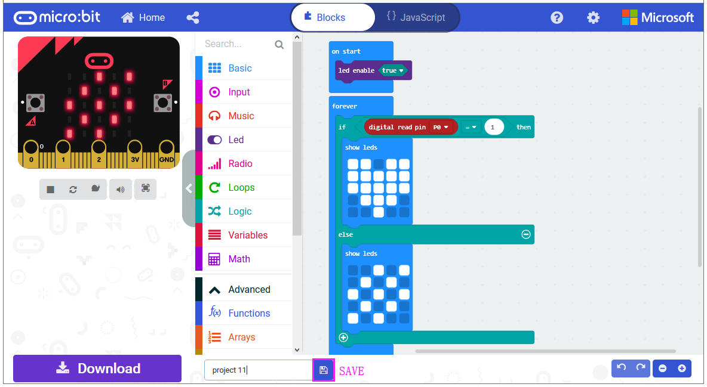
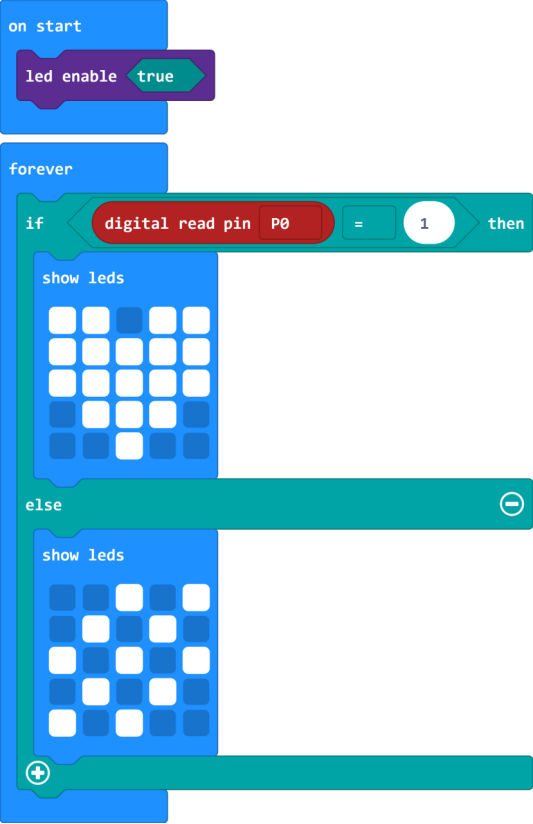
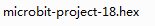
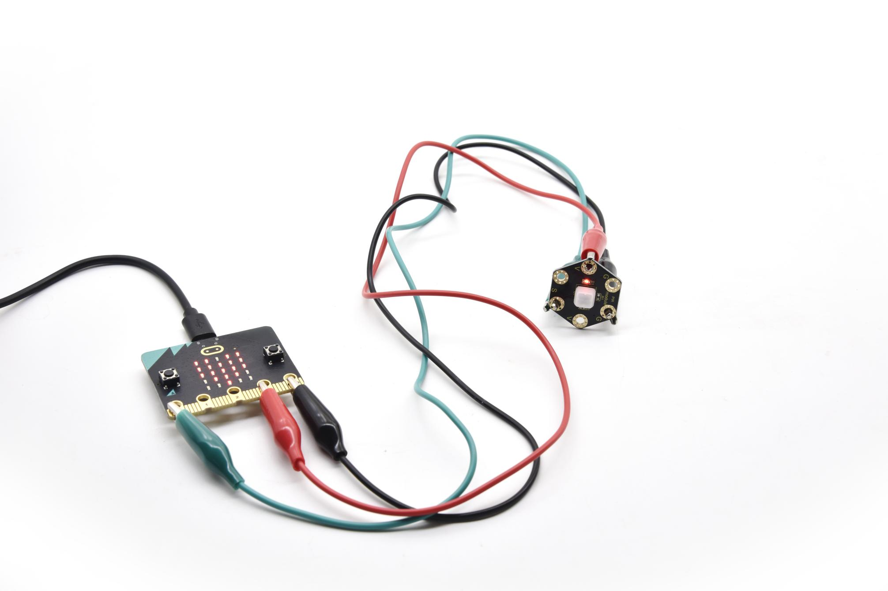

### Project 18 PIR Motion

**1.Overview**

**keyestudio PIR Motion Module For BBC micro:bit**

This keyestudio PIR motion module is fully compatible with micro:bit control board.It is mainly composed of a digital pyroelectric infrared sensor, which is a digital signal output device.

This sensor has built-in filters, strong anti-interference, low voltage and micro power consumption. The detection distance of the module is 3-5 meters.

The detection angle in the horizontal direction is less than 80°; the detection angle in the vertical direction is less than 55°.

There are total 6 rings on the module. Note that two G rings, two V rings and two S rings are separately connected. G for ground; V for 3V; S for signal pin(0 1 2).

When using, connect the module to micro:bit control board using Crocodile clip line.

Once detecting someone moving nearby, the signal pin of micro:bit main board will input HIGH level; LED on the module lights.

**2.Technical Parameters**

-   Working voltage: DC 3.0-3.3V

-   Working current: 100mA

-   Maximum power: 0.5W

-   Output signal: digital signal

-   Detection distance: 3-5 meters

-   Operating temperature range: -30℃\~ +80℃

-   Detection angle: less than 80°in the horizontal direction and less than 55° in the vertical direction

-   Dimensions: 31mm\*27mm\*6mm

-   Weight: 2g

-   Environmental attributes: ROHS

**3.Components Required**

-   Micro:bit main board \*1

-   Keyestudio PIR Motion Module for micro:bit \*1

-   Alligator clip cable \*3

-   USB cable \*1

**4.Connection Diagram**

Connect the keyestudio PIR Motion Module to micro:bit main board with 3 Alligator clip cables. Ring S to P0, V to 3V, G to GND.

Connect the micro:bit to your computer with a micro USB cable.

**5.Coding**

So now let's move to coding. Let us see how we can code the micro:bit and PIR motion sensor to detect whether there is someone moving nearby.

Below are some steps to follow:

Open the [https://makecode.micro:bit.org/\#editor](https://makecode.microbit.org/#editor) to write your code.

Microsoft MakeCode is actually a platform that allows us to code for a micro:bit, and also provides an interactive simulator where we can debug and run our code, and will be able to see what to expect out right there on the site.

Go to MakeCode and choose **My Projects** and click on **New Projects**.

If you want to see the codes behind, then you can click on JavaScript and it will display JavaScript code there in IDE.

**6.PIR Motion Sensing**

Let's get started and show icons on micro:bit when detects someone moving nearby. To do so, you just need to go to **Basic** and scroll down to see an **on start** block.

Now drag and drop, and go to **Led** and click **more** to drag out the block **led enable(true)** into **on start** block.

And again go to **Basic** and drag the **forever** block beneath the on start block you just made.

Now drag and drop, and go to **Logic** and search for **if (true) then...else...**block.

Drag this logic conditional block into **forever** block.

And add a comparison block to the logic conditional block.

Go to the **Pins**, drag and drop the **digital read pin(P0)** block into **if (0)=(1) then...else...**block, replacing the “**0**” field.

Look back at the connection diagram, we connect the signal pin to P0. So we select the **P0** in the code; and input **1**, which means input a **HIGH** level to the pin so as to **lit** the LED.

And then again go to **Basic** and drag the **show leds** block beneath the logic block you just made. Otherwise show another icon.

You can draw an image on the LED screen as you wish.

After completing this step micro:bit will restart itself and run the code. It will display icons on the simulator. Quite easy? Yeah, quite easy. So let's move on and name and download the program we’ve written.

**7.Test Code**

**8.Result**

Connect the micro:bit to your computer with a micro USB cable. You can right-click the microbit HEX file to send to your micro:bit main board.

When detecting someone moving nearby, the LED matrix on the micro:bit main board will show a heart shape icon, and led on the PIR module lights.

Or else, it will show another image and led turns off.

