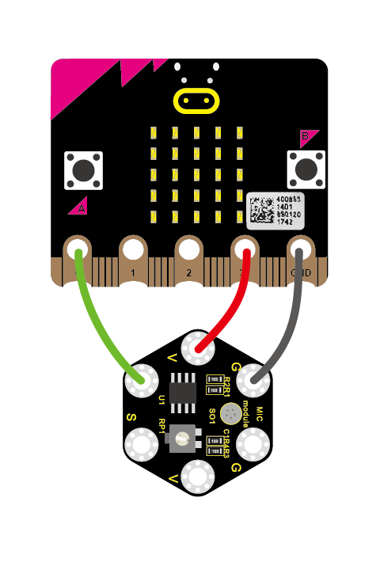
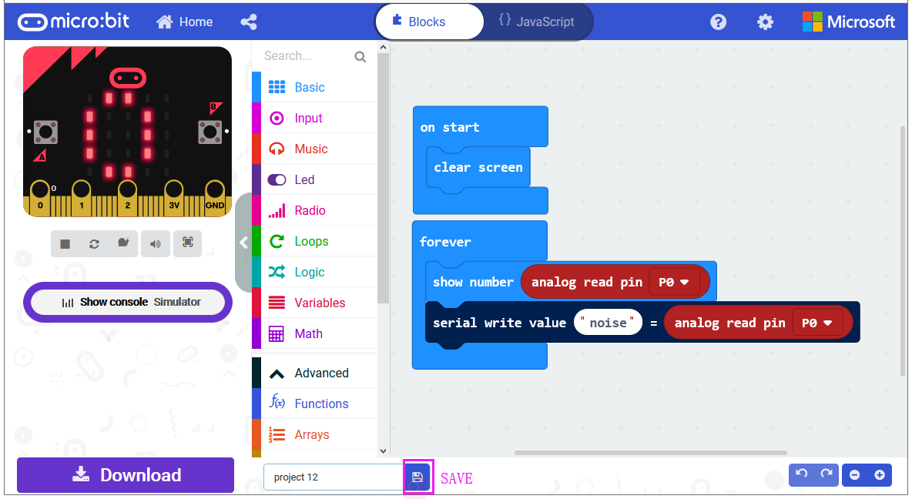
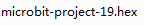
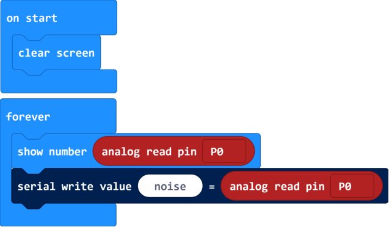
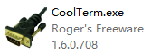
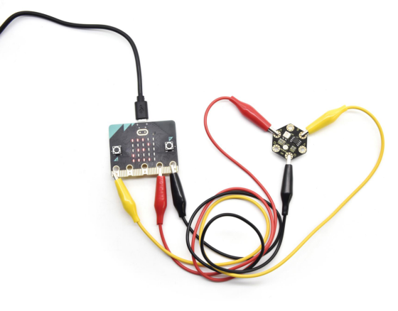
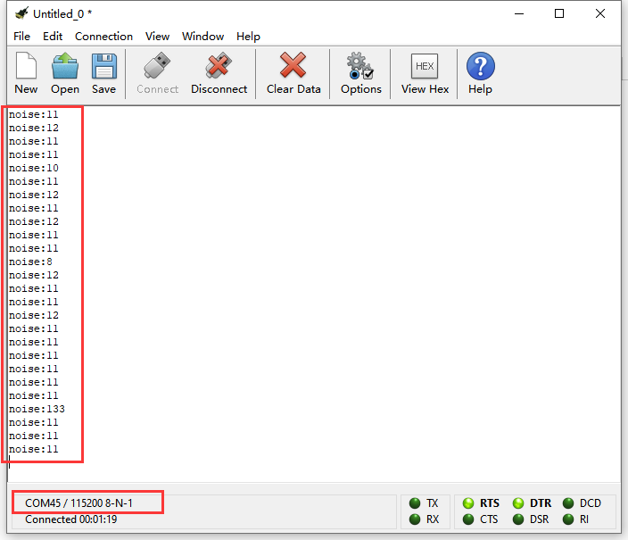
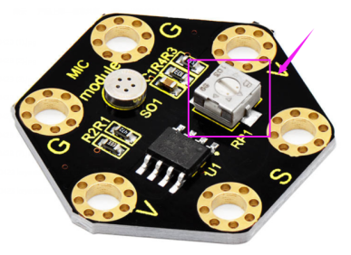

### Project 19 Microphone

**1.Overview**

**keyestudio Microphone Module For BBC micro:bit**

This keyestudio microphone module is fully compatible with micro:bit control board. It is a sound detection device, an analog signal output device.

It is mainly composed of a MIC head, a LM358D chip and a potentiometer.

When the microphone detects sound, and converts it into a voltage signal; then amplifies it through the LM358D chip.

The potentiometer is used to adjust the signal amplification.

There are total 6 rings on the module. Note that two G rings, two V rings and two S rings are separately connected. G for ground; V for 3V; S for signal pin(0 1 2).

We can work out the sound volume by reading the analog value of signal end.

When using, connect the module to micro:bit control board using Crocodile clip line.

**2.Technical Parameters**

-   Working voltage: DC 3.0-3.3V

-   Output signal: Analog signal

-   Dimensions: 31mm\*27mm\*4mm

-   Weight: 2g

-   Environmental attributes: ROHS

**3.Components Required**

-   Micro:bit main board \*1

-   Keyestudio Microphone Module for micro:bit \*1

-   Alligator clip cable \*3

-   USB cable \*1

**4.Connection Diagram**

Connect the keyestudio Microphone Module to micro:bit main board with 3 Alligator clip cables. Ring S to P0, V to 3V, G to GND.

Connect the micro:bit to your computer with a micro USB cable.

**5.Coding**

So now let's move to coding. Let us see how to code and display the analog value of microphone sound. Below are some steps to follow.

Open the [https://makecode.micro:bit.org/\#editor](https://makecode.microbit.org/#editor) to write your code.

Microsoft MakeCode is actually a platform that allows us to code for a micro:bit, and also provides an interactive simulator where we can debug and run our code, and will be able to see what to expect out right there on the site.

Go to MakeCode and choose **My Projects** and click on **New Projects**.

If you want to see the codes behind, then you can click on JavaScript and it will display JavaScript code there in IDE.

**6.Analog Value Display**

Let's get started and display the analog value of microphone sound on micro:bit. To do so, you just need to go to **Basic** and scroll down to see an **on start** block.

Now drag and drop, and again go to **Basic** and click **more** to drag the block **clear screen** out; means turn off all LEDs.

Now go to the **Basic** and scroll down to see a **forever** and **show number(0)** block. Drag the **forever** block beneath the **on start** block.

And drag the **show number(0)** block into the **forever** block.

Go to **Pins**, drag and drop the block **analog read pin(P0)** into  **shownumber(0)** block, replacing the “**0**” field.

Next, we go to **Serial**, drag and drop the block **serial write value(x)=(0)** In this way it can write the sound value to the serial port and show it on monitor.

Change the “**x**” to **noise** and duplicate the block **analog read pin(P0)** to replace the “**0**” field.

After completing the code, let's move on to name and download the program we’ve written.

**7.Test Code**

**8.Result**

Connect the micro:bit to your computer with a micro USB cable. You can right-click the microbit HEX file to send to your micro:bit main board.

You should see the LED matrix show the scrolling digit. Read the analog value of sound through the software.

The louder the sound, the greater the analog value is.

Note: the baud rate of micro:bit is defaulted by 115200.

Pay close attention that you can turn the potentiometer on the module to adjust the sound magnification, which also will enlarge the analog value.

