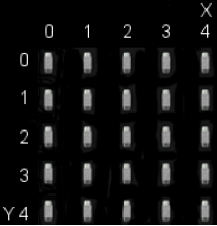
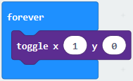
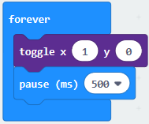
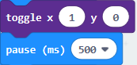
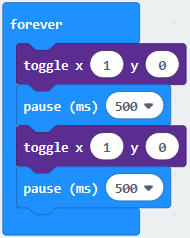
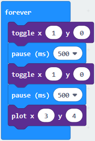
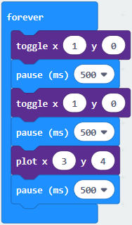
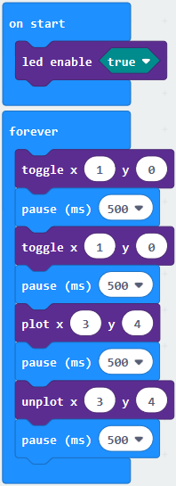
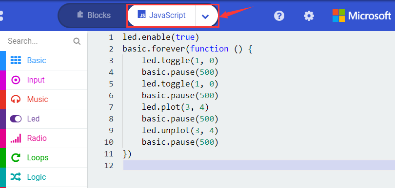
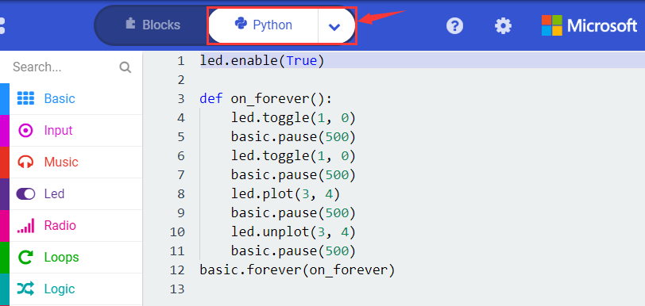

## Project 2 Light A Single LED

**1.Project Description**

The LED dot matrix consists of 25 LEDs arranged in a 5 by 5 square. In order to locate these LEDs quickly, as the figure shown below, we can regarded this matrix as a coordinate system and create two aces by marking those in rows from 0 to 4 from top to bottom, and the ones in columns from 0 to 4 from the left to the right. Therefore, the LED sat in the second of the first line is (1,0）and the LED positioned in the fifth of the fourth column is (3,4）and others likewise.

**2.Components Needed**

-   Micro:bit main board V2 \*1

-   Micro USB cable\*1

**3.Test Code**

Attach the Micro:bit main board V2 to your computer via the Micro USB cable and begin editing.

Firstly, click”Led”module and then the”more”module to find and drag the block “led enable false “ to block“on start”; click the little triangle of “led enable false “ to select”true”;

Secondly, click”Led”module and to find and drag the block “toggle x 0 y 0“ to block“forever”and alter “x0” to”x1”;

Thirdly, click”Basic”module to find and drag the block”pause(ms)100”to “forever” block and set pause to 500;

Fourthly, copy the blockand place it into forever” block;

Fifthly, click”Led”module to find and drag the block”plot x 0 y 0”to “forever” block and change the “x 0 y 0” to “x 3 y 4”;

Sixthly, copy the block “pause(ms)500” and place it into forever” block;

Lastly, click”Led”module to find and drag the block”unplot x 0 y 0”to “forever” block and change “x 0 y 0” to “x 3 y 4”;and copy and place the block“pause(ms)500”to block “forever”;

Complete Program：

Click”JS JavaScript”, you will find the corresponding programming languages.

Click the little triangle”of JS JavaScript”to choose “Python”, you will find the corresponding Python programming languages.

**4.Test Results**

After uploading test code to micro:bit main board V2 and powering the main board via the USB cable, the LED in (1,0) lights up for 0.5s and the one in (3,4) shines for 0.5s and repeat this sequence.