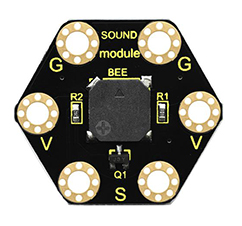
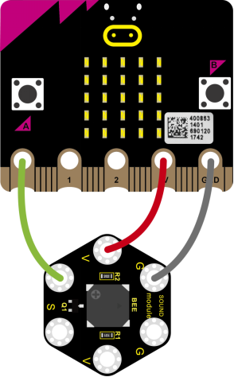
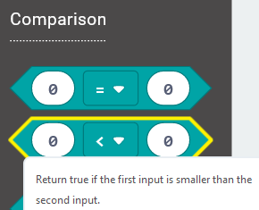
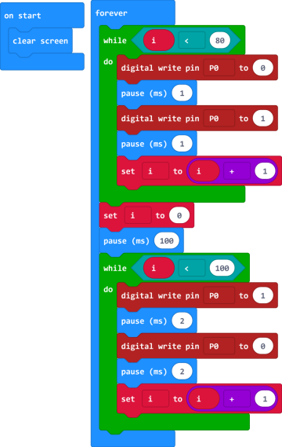
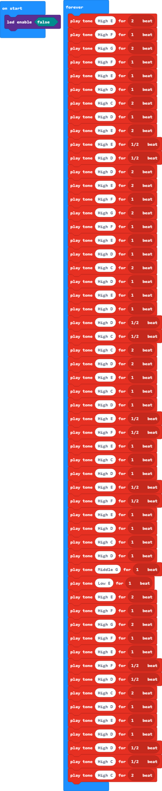
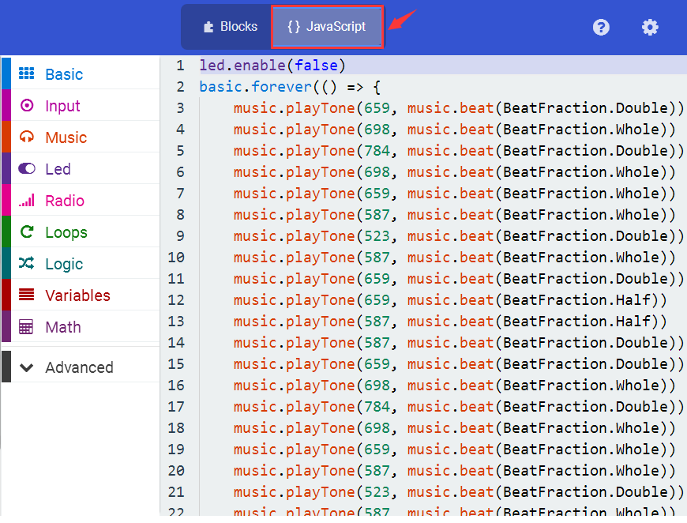
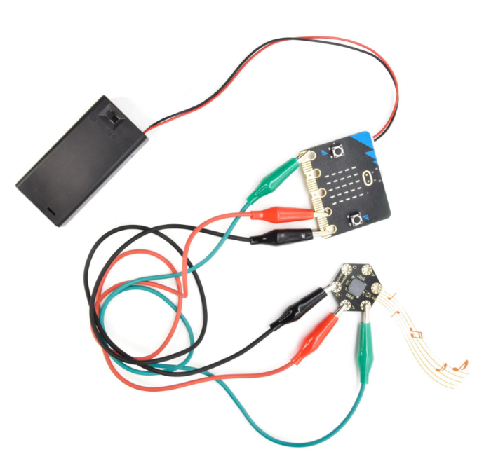

### Project 20 Buzzer

**1.Overview**

**keyestudio Passive Buzzer Module For BBC micro:bit**

This keyestudio passive buzzer is fully compatible with micro:bit control board.

It is mainly composed of a passive buzzer without oscillation circuit. It cannot be actuated by itself, but by external pulse frequencies.

Different frequencies produce different sounds. Even can code the melody of a song.

There are total 6 rings on the module. Note that two G rings, two V rings and two S rings are connected. G for ground; V for 3V; S for signal pin(0 1 2).

When using, connect the module to micro:bit control board using Crocodile clip line.

**2.Technical Parameters**

-   Working voltage: DC 3.0-3.3V

-   Output signal: Digital signal (square wave)

-   Dimensions: 31mm\*27mm\*4.5mm

-   Weight: 2.3g

-   Environmental attributes: ROHS

**3.Components Required**

-   Micro:bit main board*1

-   Keyestudio Passive Buzzer Module for micro:bit \*1

-   Alligator clip cable \*3

-   USB cable \*1

**4.Connection Diagram**

Connect the keyestudio Passive Buzzer Module to micro:bit main board with 3 Alligator clip cables. Ring S to P0, V to 3V, G to GND.

**5.Coding**

So now let's move to coding. Let us see how we can code the buzzer play tune. Below are some steps to follow.

Open the [https://makecode.micro:bit.org/\#editor](https://makecode.microbit.org/#editor) to write your code.

Microsoft MakeCode is actually a platform that allows us to code for a micro:bit, and also provides an interactive simulator where we can debug and run our code, and will be able to see what to expect out right there on the site.

Go to MakeCode and choose **My Projects** and click on **New Projects**.

If you want to see the codes behind, then you can click on JavaScript and it will display JavaScript code there in IDE.

**6.Buzzer**

Let's get started and code the buzzer play a tone. To do so, you just need to go to **Basic** and scroll down to see an **on start** block.

Now drag and drop, and again go to **Basic** and click **more** to drag the block **clear screen** out; means turn off all LEDs.

Now go to the **Basic** and scroll down to see a **forever** block. Drag the **forever** block beneath the **on start** block.

Go to **Loops**, drag and drop the **while(true)...do** block and drag out the Comparison statement from **Logic**.

In the forever block, we set to output 2 kinds of square wave of different frequencies, so as to output a tone of corresponding frequency.

First, set a variable to output 80 pulse square wave, with a period of 2 milliseconds, and the frequency is 500 Hz, so the passive buzzer outputs 500 Hz frequency sound for 160 milliseconds.

Then delay 100 milliseconds.

And set to output 100 pulse square wave, with a period of 4 milliseconds, and the frequency is 250Hz, so the passive buzzer outputs 250Hz frequency sound for 400 milliseconds.

**7.Code 1**

After completing the code, let's move on to name and download the program we’ve written.

**8.Result 1**

Connect the micro:bit to your computer with a micro USB cable. You can right-click the microbit HEX file to send to your micro:bit main board.

Done sending the code 1 to micro:bit, the passive buzzer will alternately make two sounds.

Moreover, we can use the buzzer module to code a melody of a song.

**9.Code 2**

Note:

If you drag the source code we provided to the Microsoft MakeCode Block editor [https://makecode.micro:bit.org/\#editor](https://makecode.microbit.org/#editor)

Click the icon,you can check the frequency of each tone as follows:

**10.Result 2**

Done sending the code 2 to micro:bit, the buzzer plays the song *Ode to Joy.*

