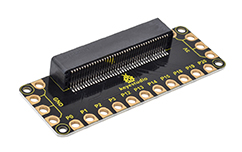
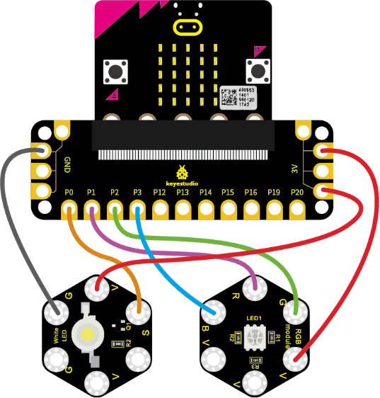
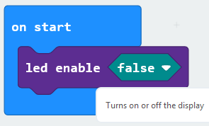
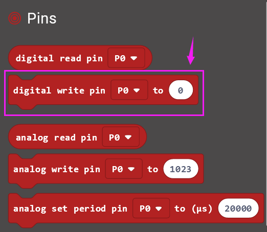
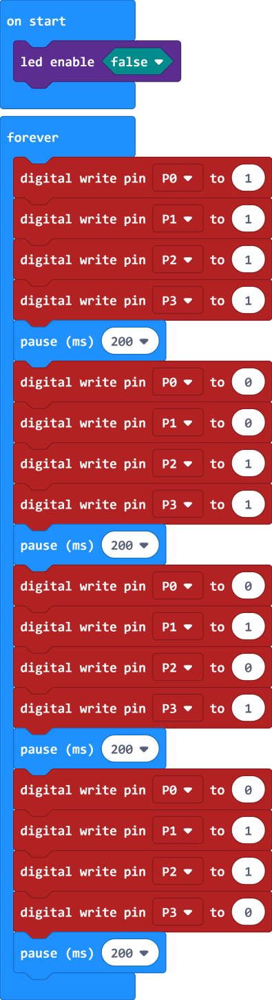
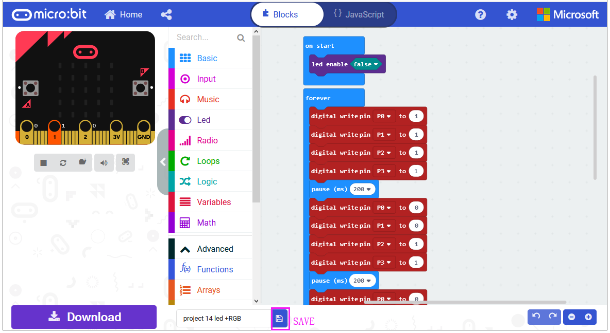
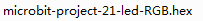
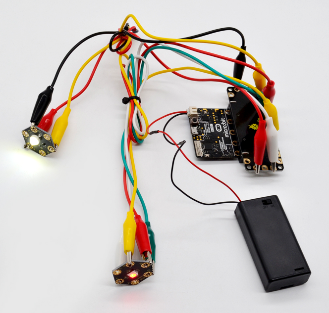

### Project 21 Two Lights

**1. Overview**

**keyestudio Edge Connector IO Breakout Board For BBC micro:bit**

It's what you've been waiting for, the keyestudio Edge Connector IO Breakout Board For BBC micro:bit.

Want to connect a bunch of sensors and modules to micro:bit development board? Try this keyestudio Edge Connector IO Breakout Board.

This breakout board has been designed to offer an easy way to connect additional circuits and Components to the edge connector on the BBC micro:bit.

It provides an easy way of connecting circuits using Alligator clip lines.

This edge connector offers access to a number of the BBC micro:bit processor pins, such as power IO (input/output) interface, connection pins P0, P1, P2, P3, P12, P13, P14, P15, P16, P19, P20.

There are 2 kinds of power supply for the breakout board and micro:bit main board.

-   Direct to connect the battery case carried with batteries to micro:bit main board for powering;

-   Connect the golden rings 3V GND with alligator clip lines for power supply;

The breakout board also comes with 4 fixed holes at the edge, easy to mount on any other devices.

**2.Specification**

-   Operating voltage: DC3.0-3.3V

-   Dimensions: 89mm\*33mm\*12mm

-   Weight:14.8g

**3.Components Required**

-   Micro:bit main board \*1

-   keyestudio Edge Connector IO Breakout Board for micro:bit \*1

-   Alligator clip cable \*7

-   USB cable \*1

**4.Connection Diagram**

Connect the keyestudio Passive Buzzer Module to micro:bit main board with 3 Alligator clip cables. Ring S to P0, V to 3V, G to GND.

Connect the micro:bit to your computer with a micro USB cable.

**5.Coding**

So now let's move to coding. Let us see how to code the 2 LED modules to flash. Below are some steps to follow.

Open the [https://makecode.micro:bit.org/\#editor](https://makecode.microbit.org/#editor)to write your code.

Microsoft MakeCode is actually a platform that allows us to code for a micro:bit, and also provides an interactive simulator where we can debug and run our code, and will be able to see what to expect out right there on the site.

Go to MakeCode and choose **My Projects** and click on **New Projects**.

If you want to see the codes behind, then you can click on JavaScript and it will display JavaScript code there in IDE.

**6.Light Flashes**

Let's get started and code the 2 light modules flash on. To do so, you just need to go to **Basic** and scroll down to see an **on start** block.

Now drag and drop, and go to **Led** and click **more** to drag out the block **led enable(false)** into **on start** block.

And again go to **Basic** and drag the **forever** block beneath the on start block you just made.

Go to the **Pins**, drag and drop the **digital write pin(P0) to(0)** block into **forever** block and duplicate it several times.

Look at the connection diagram, **we separately connect the Red,Green, Blue pin to P1, P2, P3. The white LED’s signal pin to P0.**

So we first set the white LED’s signal pin value to **1**, which means input a **HIGH** level to **turn on** the white LED. Set to 0 to turn it off.

The RGB pins are active at **LOW (record 0)**, which means set to 0 to turn on; so we can set the RGB pins to **HIGH (record 1)** to turn off.

If you want the LED flash as fast, add a **pause** block in millisecond, try 200ms

Now we separately turn the white LED (P0) on for 1 second then off, followed by turn Red LED (P1) on for 1 second then off; turn Green LED (P2) on for 1 second then off; turn the Blue LED (P3) on for 1 second then off.

**7.Test Code:**

After completing the code, let's move on to name and download the program we’ve written.

**8.Result**

Connect the micro:bit to your computer with a micro USB cable. You can right-click the microbit HEX file to send to your micro:bit main board.

The white LED module will turn on then off, followed by RGB turning on red, green and blue, with an interval of 200ms, alternately and circularly.

