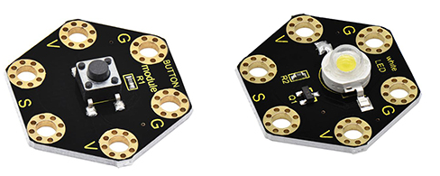
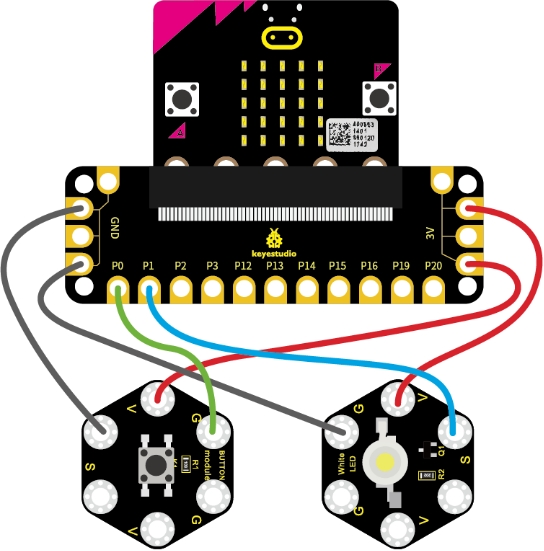
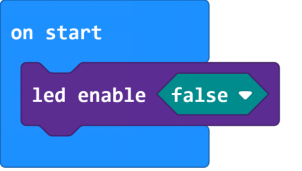
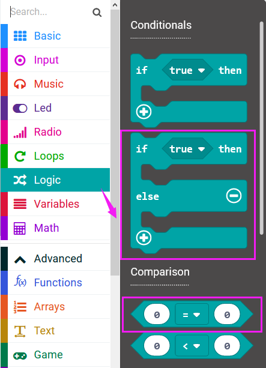
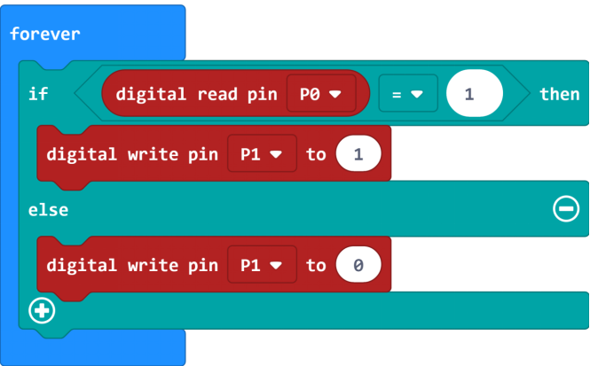
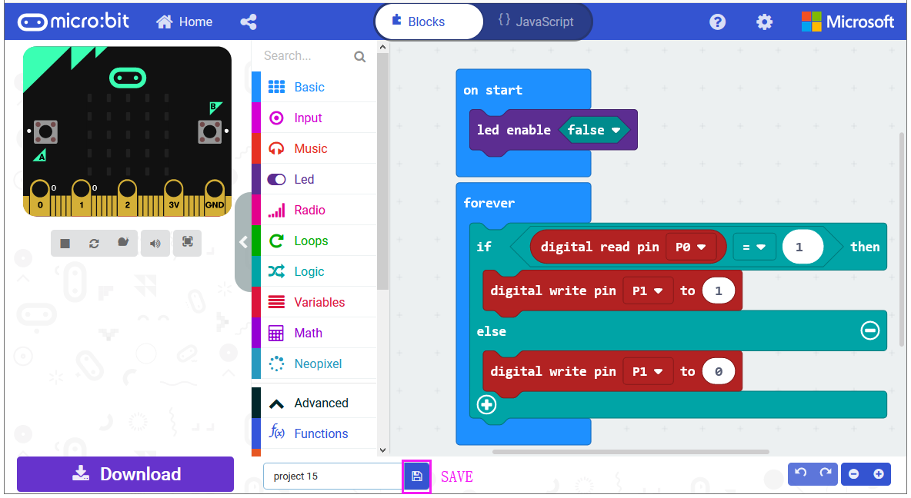
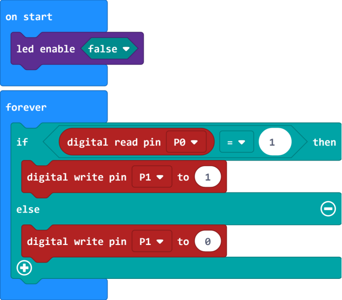
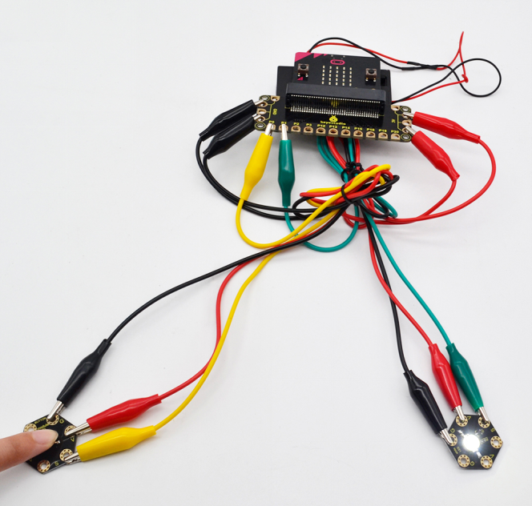

## Project 22 Use Button to Control Light

**1.Overview**

In the above projects, we’ve introduced each sensor module. We now combine those sensor modules to make interactive projects.

In this project, we would like to turn an LED on and off via a tactile button.

**2.Components Required**

-   Micro:bit main board \*1

-   Keyestudio Tactile Button Module for micro:bit \*1

-   keyestudio 1W LED Module for micro:bit \*1

-   Alligator clip cable \*6

-   USB cable \*1

**3.Connection Diagram**

Insert firmly the micro:bit main board into keyestudio Edge Connector IO Breakout Board. Then connect the sensor module to micro:bit main board with alligator clip lines.

For keyestudio Tactile Button Module, connect Ring S to P0, V to 3V, G to GND.

For keyestudio 1W LED Module, connect Ring S to P1, V to 3V, G to GND.

Connect the micro:bit to your computer with a micro USB cable.

**4.Coding**

So now let's move to coding. Let us see how to code the LED module on with tactile button module. Below are some steps to follow.

Open the [https://makecode.micro:bit.org/\#editor](https://makecode.microbit.org/#editor) to write your code.

Microsoft MakeCode is actually a platform that allows us to code for a micro:bit, and also provides an interactive simulator where we can debug and run our code, and will be able to see what to expect out right there on the site.

Go to MakeCode and choose **My Projects** and click on **New Projects**.

If you want to see the codes behind, then you can click on JavaScript and it will display JavaScript code there in IDE.

**5.Use Button to Control LED**

Let's get started and turn on LED via button control. To do so, you just need to go to **Basic** and scroll down to see an **on start** block.

Now drag and drop, and go to **Led** and click **more** to drag out the block **led enable(false)** into **on start** block.

And again go to **Basic** and drag the **forever** block beneath the on start block you just made.

Now drag and drop, and go to **Logic** and search for **if (true) then...else...**block.

Drag this logic conditional block into **forever** block. And add a comparison block to the logic conditional block.

Go to the **Pins**, drag and drop the **digital read pin(P0)** block into **if (0)=(1) then...else...**block, replacing the “**0**” field.

Look back at the connection diagram, we connect the button’s signal pin to P0, LED’s signal pin to P1. So if set the **P0** to **1**, means the button is pressed, then set the **P1** to **1**, means input a **HIGH** level to **lit** the LED. Or else, do the contrary action, release the button to turn the led off.

After completing the code, let's move on to name and download the program we’ve written.

**6.Test Code**

**7.Result**

Connect the micro:bit to your computer with a micro USB cable. You can right-click the microbit HEX file to send to your micro:bit main board.

Powered on, press the button, the LED on the module should turn on; release the button, the LED turns off.

