### Project 23 RGB Colors

In the above projects, we’ve introduced each sensor module. We now combine those sensor modules to make interactive projects.

In this project, we are going to turn RGB LED alternately on red, green and blue via capacitive touch control.

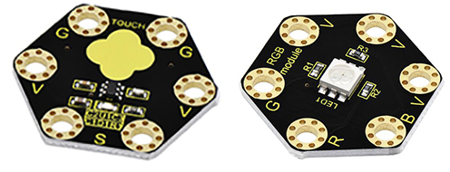

**2.Components Required**

-   Micro:bit main board \*1

-   Keyestudio Capacitive Touch Module for micro:bit \*1

-   keyestudio 5050 RGB Module for micro:bit \*1

-   Alligator clip cable \*7

-   USB cable \*1

**3.Connection Diagram**

Insert firmly the micro:bit main board into keyestudio Edge Connector IO Breakout Board. Then connect the sensor module to micro:bit main board with alligator clip lines.

For keyestudio Capacitive Touch Module, connect Ring S to P0, V to 3V, G to GND.

For keyestudio RGB LED Module, connect Ring R to P1, G to P2, B to P3, V to 3V.

Connect the micro:bit to your computer with a micro USB cable.

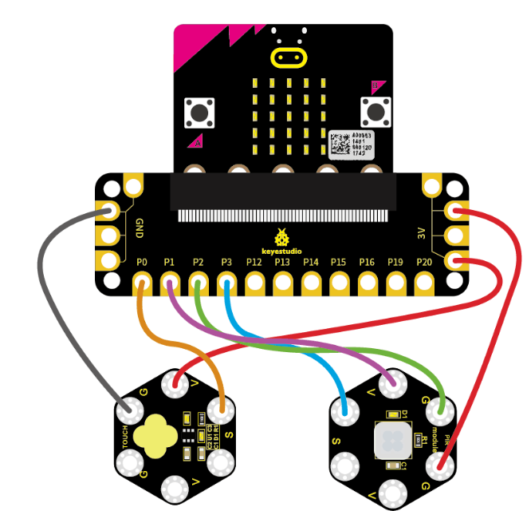

**4.Test Code**

Open the [https://makecode.micro:bit.org/\#editor](https://makecode.microbit.org/#editor) to write your code. Or can direct download and send the micro:bit.hex file to your micro:bit.

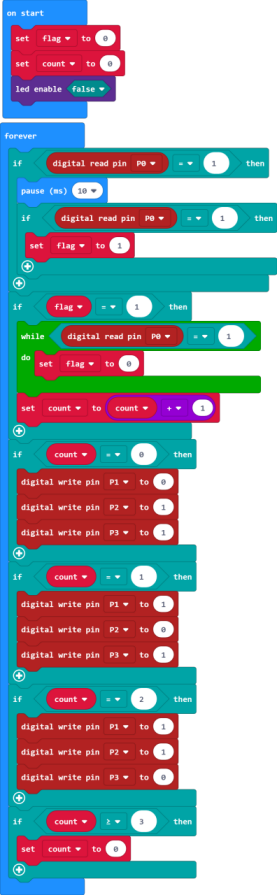

**5.Code Explanation**

Look back at the connection diagram, we have connected the touch module to **P0**; **Red, Green, Blue LED to P1, P2, P3**.

The RGB pins are active at **LOW (record 0)**, which means set to 0 to turn on; so we can set the RGB pins to **HIGH (record 1)** to turn off.

On start block, we initially set the variables **flag** and **count** block to 0;

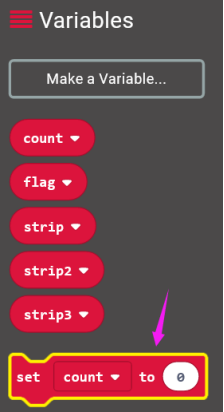

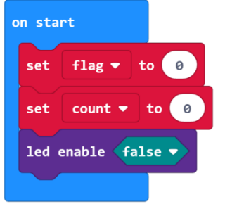

For the forever block, when detects the touch signal, we set the **flag** to 1, and add 10ms block for delay;

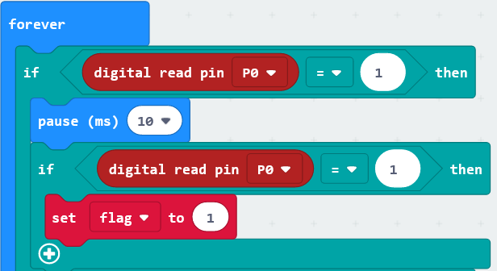

If **flag** equals to 1, run the **flag** to 0, set **count** plus 1;

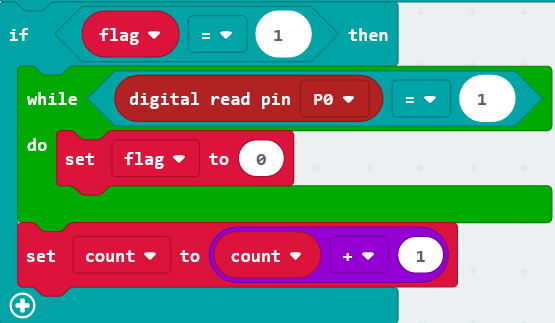

If **count** equals to 0, run the action that RGB light turns on red;

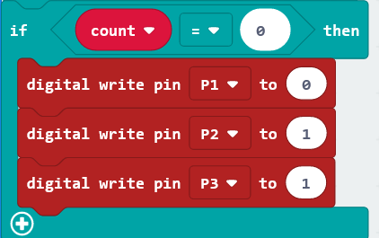

If **count** equals to 1, run the action that RGB light turns on green;

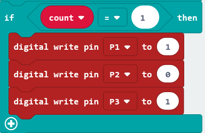

If **count** equals to 2, run the action that RGB light turns on blue;

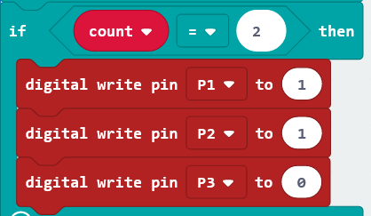

If **count** is greater than and equals to 3, then set the count to 0, run the action that RGB light turns on red;

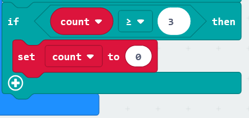

**6.Result**

Connect the micro:bit to your computer with a micro USB cable. You can right-click the microbit HEX file to send to your micro:bit main board.

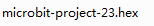

Done uploading the code, the RGB module will turn on red;

Tap the capacitive touch module with your finger, RGB will turn green; tap the touch area, turn on blue; tap again, turn on red. It will form a loop.

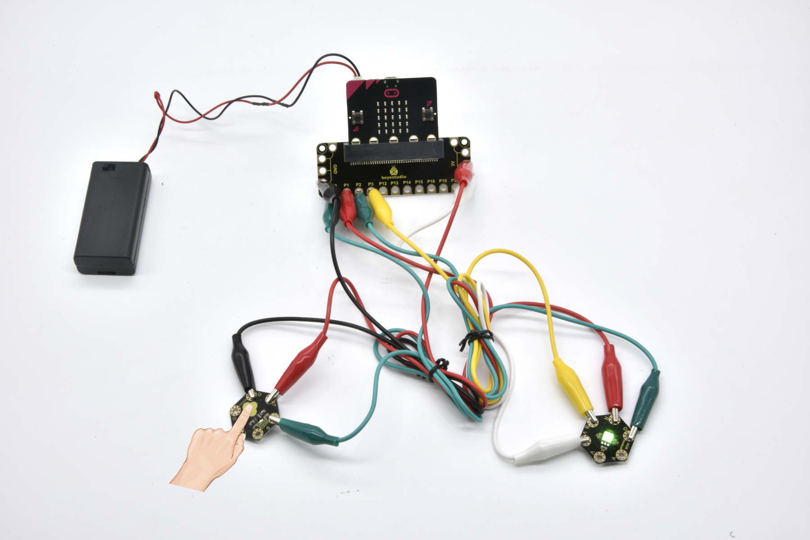