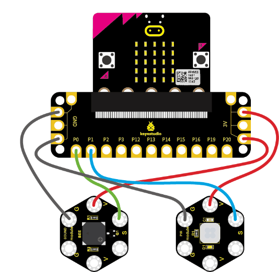
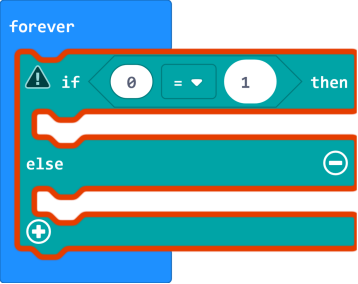
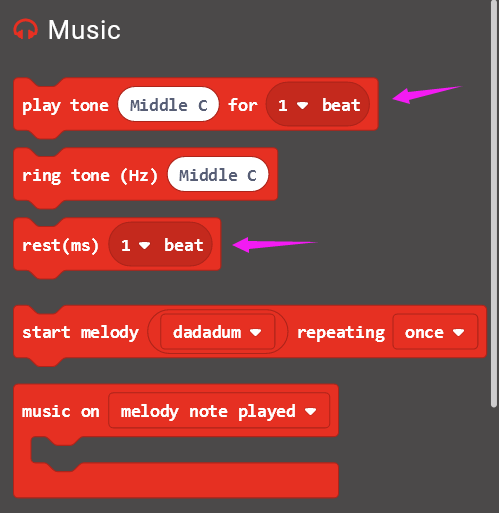
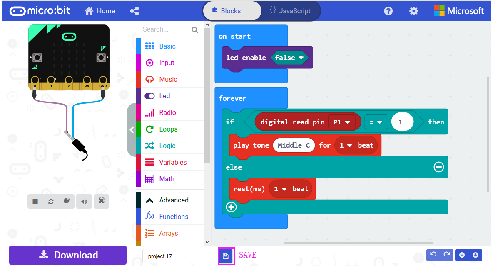
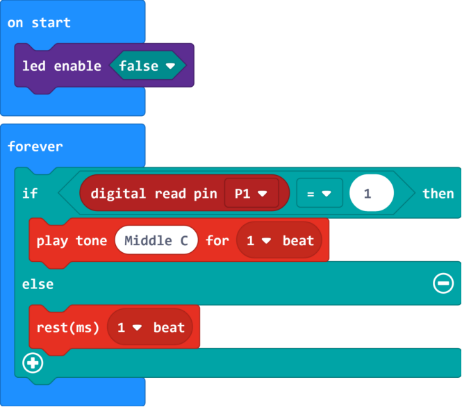
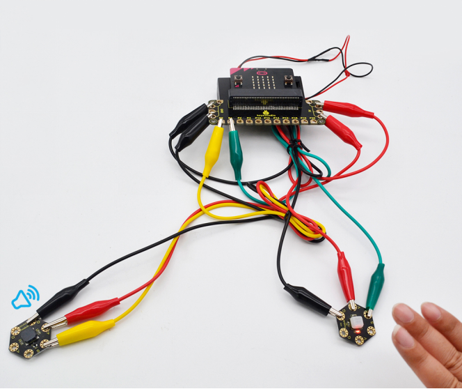

### Project 24 Motion Alarm

**1.Overview**

In the above projects, we’ve introduced each sensor module. We now combine those sensor modules to make interactive projects.

In this project, you will learn how to trigger a buzzer alarm when detecting someone moving nearby.

**2.Components Required**

-   Micro:bit main board \*1

-   Keyestudio Passive Buzzer Module for micro:bit \*1

-   keyestudio PIR Motion Module for micro:bit \*1

-   Alligator clip cable*6

-   USB cable \*1

**3.Connection Diagram**

Insert firmly the micro:bit main board into keyestudio Edge Connector IO Breakout Board. Then connect the sensor module to micro:bit main board with alligator clip lines.

For keyestudio Passive Buzzer Module, connect Ring S to P0, V to 3V, G to GND.

For keyestudio PIR Motion Module, connect Ring S to P1, V to 3V, G to GND.

Connect the micro:bit to your computer with a micro USB cable.

**4.Coding**

So now let's move to coding. Let us see how to code the passive buzzer to alarm when PIR motion module detects someone moving nearby.

Below are some steps to follow.

Open the [https://makecode.micro:bit.org/\#editor](https://makecode.microbit.org/#editor) to write your code.

Microsoft MakeCode is actually a platform that allows us to code for a micro:bit, and also provides an interactive simulator where we can debug and run our code, and will be able to see what to expect out right there on the site.

Go to MakeCode and choose **My Projects** and click on **New Projects**.

If you want to see the codes behind, then you can click on JavaScript and it will display JavaScript code there in IDE.

**5.Motion Alarm**

Let's get started with triggering the buzzer sound. To do so, you just need to go to **Basic** and scroll down to see an **on start** block.

Now drag and drop, and go to **Led** and click **more** to drag out the block **led enable(false)** into **on start** block.

And again go to **Basic** and drag the **forever** block beneath the on start block you just made.

Now drag and drop, and go to **Logic** and search for **if (true) then...else...**block.

Drag this logic conditional block into **forever** block. And add a comparison block to the logic conditional block.

Go to the **Pins**, drag and drop the **digital read pin(P0)** block into **if (0)=(1) then...else...**block, replacing the “**0**” field.

Look back at the connection diagram, we connect the PIR motion sensor’s signal pin to P1. So change the pin **P0** to **P1.**

Then go to **Music**, drag and drop the block **play tone(Middle C) for (1beat)** and **rest(ms)(1 beat)**.

If the PIR motion sensor detects someone moving nearby, then the buzzer will play a tone (Middle C); otherwise, buzzer turns off.

After completing the code, let's move on to name and download the program we’ve written.

**6.Test Code**

**7.Result**

Connect the micro:bit to your computer with a micro USB cable. You can right-click the microbit HEX file to send to your micro:bit main board.

When someone is moving nearby, the built-in led on PIR motion sensor lights and buzzer will play a tone (Middle C). otherwise, the led is off and buzzer not sounds.

