### Project 25 Make A Tone

**1.Overview**

In the above projects, we’ve introduced each sensor module. We now combine those sensor modules to make interactive projects.

In this project, you will learn how to make a buzzer play different tones based on the measured analog value of both ambient light and microphone sound.

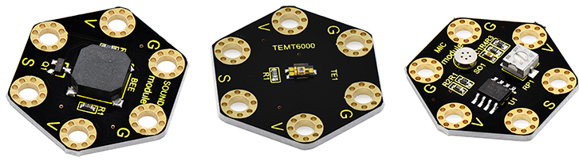

**2.Components Required**

-   Micro:bit main board \*1

-   Keyestudio Passive Buzzer Module for micro:bit \*1

-   Keyestudio TEMT6000 Light Module for micro:bit \*1

-   Keyestudio Microphone Module for micro:bit \*1

-   Alligator clip cable*9

-   USB cable \*1

**3.Connection Diagram**

Insert firmly the micro:bit main board into keyestudio Edge Connector IO Breakout Board. Then connect the sensor module to micro:bit main board with alligator clip lines.

For keyestudio Passive Buzzer Module, connect Ring S to P0, V to 3V, G to GND.

For keyestudio TEMT6000 Light Module, connect Ring S to P1, V to 3V, G to GND.

For keyestudio Microphone Module, connect Ring S to P2, V to 3V, G to GND.

Connect the micro:bit to your computer with a micro USB cable.

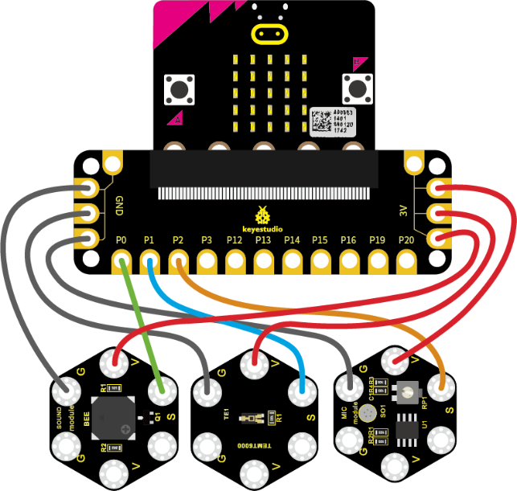

**4.Coding**

So now let's move to coding. Let us see how we can code buzzer sound according to the analog value of both TEMT6000 light module and microphone module. Below are some steps to follow.

Open the [https://makecode.micro:bit.org/\#editor](https://makecode.microbit.org/#editor) to write your code.

Microsoft MakeCode is actually a platform that allows us to code for a micro:bit, and also provides an interactive simulator where we can debug and run our code, and will be able to see what to expect out right there on the site.

Go to MakeCode and choose **My Projects** and click on **New Projects**.

If you want to see the codes behind, then you can click on JavaScript and it will display JavaScript code there in IDE.

**5.Ring Tone**

Let's get started with playing tones. To do so, you just need to go to **Basic** and scroll down to see an **on start** block.

Now drag and drop, and go to **Led** and click **more** to drag out the block **led enable(false)** into **on start** block.

And again go to **Basic** and drag the **forever** block beneath the on start block you just made.

Next, go to **Serial**, drag and drop the block **serial write value(x)=(0)** into the **forever** block and duplicate once.

In this way it can write both brightness and sound value to the serial port and show it on monitor.

Separately change the “**x**” to **brightness** and **noise**;

And drag out the block **analog read pin(P0)** from **Pins** to replace the “**0**” field.

According to the connection, microphone module’s signal pin is connected to P2; light module’s signal pin is connected to P1.

So we should write as follows:

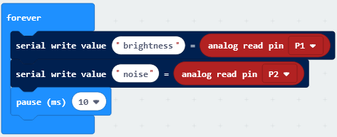

Now by followed, we are ready to add Loops and logic comparison function.

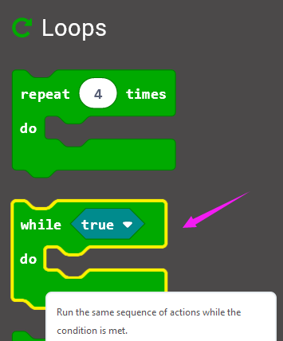

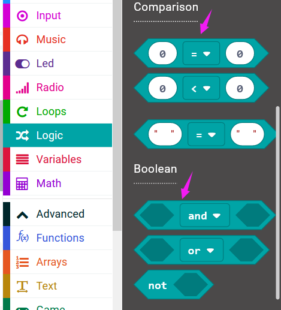

Supposed that both light and MIC analog value are smaller than or equal to 100, buzzer not beeps. How should we code?

First drag the **while(true)...do** block out from the **Loops**. Then add the Boolean and Comparison logic statements.

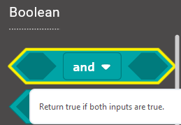

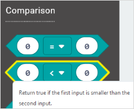

We duplicate and drag the Comparison block into Boolean block.

Then drag this block into the **while(true)...do** block, replacing the “**true**” field. And again duplicate the block **analog read pin(P1)** and the block **analog read pin(P2)** and drag them into the first input. Set both values smaller than and equal to 100.

While the condition is met, run the action that buzzer not beeps. We can go to drag the **rest(ms)(1 beat)** from **Music** into the while block just made.

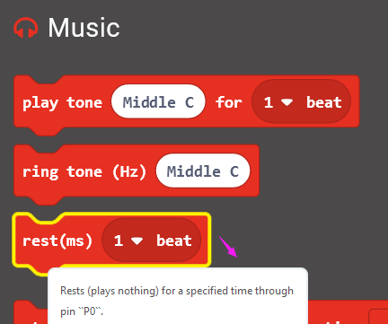

Now we’ve set both light and MIC analog value are smaller than or equal to 100, buzzer not beeps. As shown below.

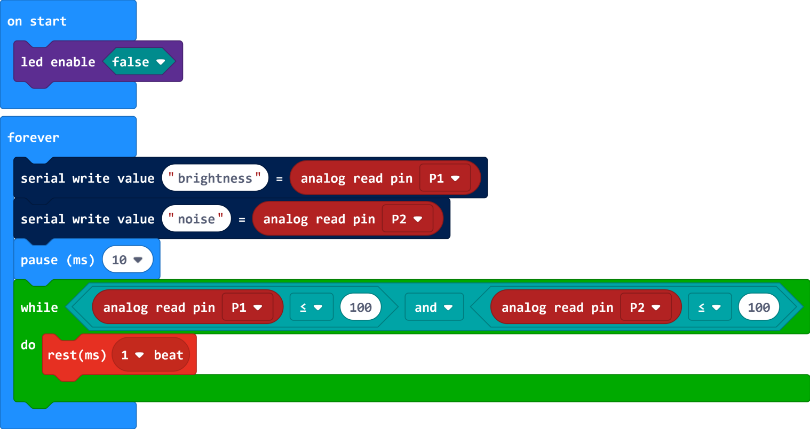

Furthermore, if we want to add several condition statements, be able to duplicate the **while...do...** block several times, and set to different input values to trigger buzzer ring different tones.

Have your try! Write the conditions as follows:

-   When the light analog value is greater than 100, and MIC analog value is smaller than or equal to 100, the buzzer will play a tone (Low B);

-   When the light analog value is smaller than or equal to 100, and MIC analog value is greater than 100, the buzzer will play a tone (Middle D);

-   When both light and MIC analog value are greater than 100, the buzzer play a tone (High E).

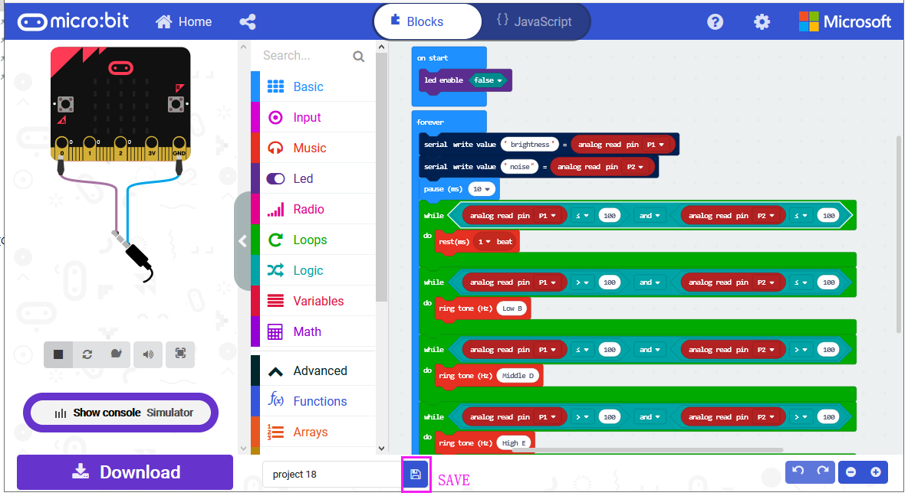

After completing the code, let's move on to name and download the program we’ve written.

**6.Test Code**

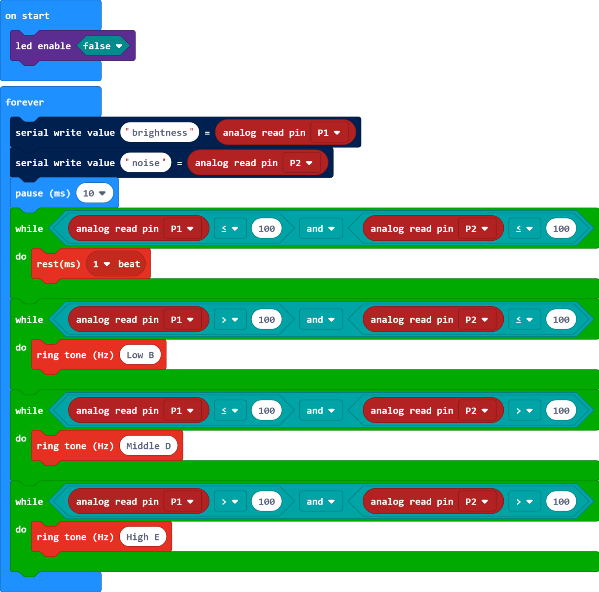

**7.Result**

Connect the micro:bit to your computer with a micro USB cable. You can right-click the microbit HEX file to send to your micro:bit main board.

Done uploading the code, it measures the analog value of ambient light and microphone sound, which can be applied to make a buzzer sound.When both light and MIC analog value are less than or equal to 100, buzzer not beeps; 

When the light analog value is greater than 100, and MIC analog value is less than or equal to 100, the buzzer will play a tone (Low B); When the light analog value is less than or equal to 100, and MIC analog value is greater than 100, the buzzer will play a tone (Middle D); When both light and MIC analog value are greater than 100, the buzzer play a tone (High E).

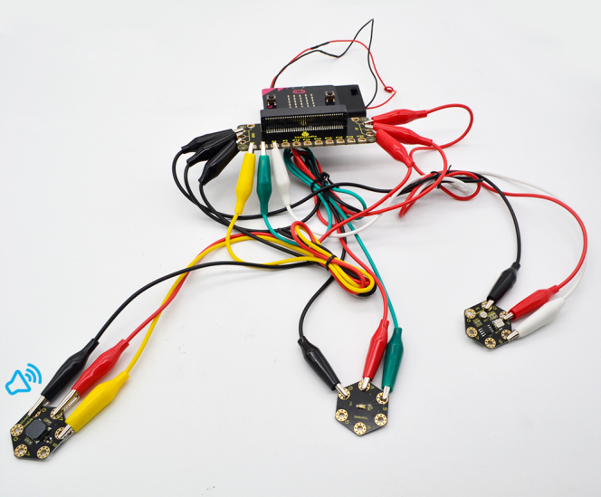