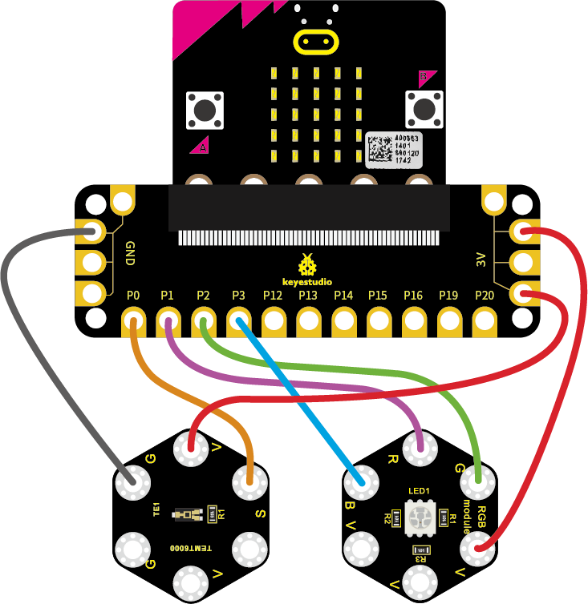
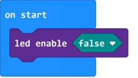
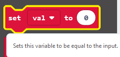
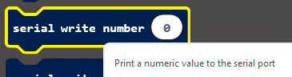
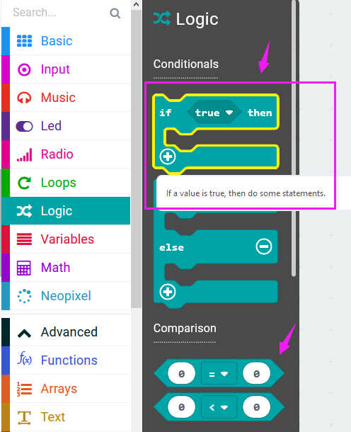
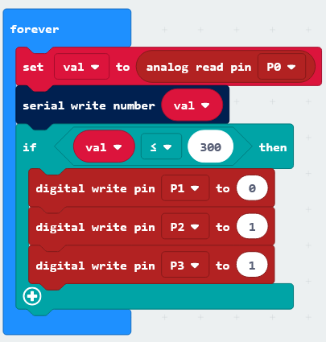
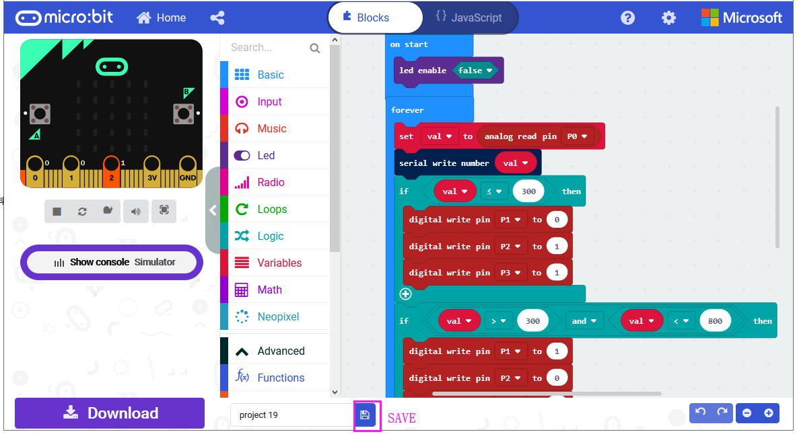
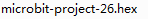
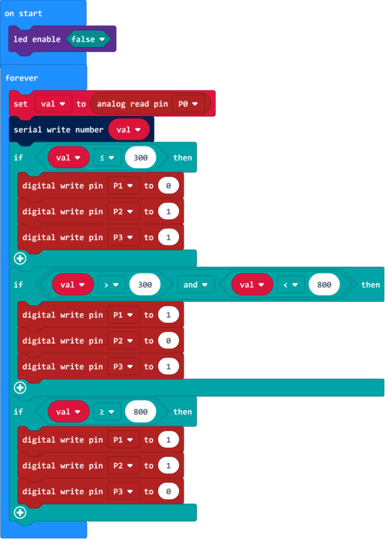
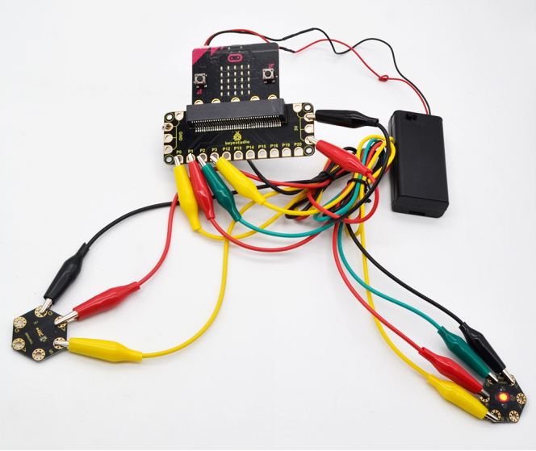

### Project 26 Use Light to Control RGB

**1.Overview**

In the above projects, we’ve introduced each sensor module. We now combine those sensor modules to make interactive projects.

In this project, you will learn how to trigger the RGB light shining colors based on the measured analog value of ambient light.

**2.Components Required**

-   Micro:bit main board \*1

-   Keyestudio TEMT6000 Light Module for micro:bit \*1

-   Keyestudio 5050 RGB Module for micro:bit \*1

-   Alligator clip cable \*6

-   USB cable \*1

**3.Connection Diagram**

Insert firmly the micro:bit main board into keyestudio Edge Connector IO Breakout Board. Then connect the sensor module to micro:bit main board with alligator clip lines.

For keyestudio TEMT6000 Light Module, connect Ring S to P0, V to 3V, G to GND.

For keyestudio RGB LED Module, connect Ring R to P1, G to P2, B to P3, V to 3V.

Connect the micro:bit to your computer with a micro USB cable.

**4.Coding**

So now let's move to coding. Let us see how we can code the RGB flash on different colors in different analog value of ambient light.

Below are some steps to follow.

Open the [https://makecode.micro:bit.org/\#editor](https://makecode.microbit.org/#editor) to write your code.

Microsoft MakeCode is actually a platform that allows us to code for a micro:bit, and also provides an interactive simulator where we can debug and run our code, and will be able to see what to expect out right there on the site.

Go to MakeCode and choose **My Projects** and click on **New Projects**.

If you want to see the codes behind, then you can click on JavaScript and it will display JavaScript code there in IDE.

**5.Use Light to Control RGB**

Let's get started with controlling RGB colors with light sensor. To do so, you just need to go to **Basic** and scroll down to see an **on start** block.

Now drag and drop, and go to **Led** and click **more** to drag out the block **led enable(false)** into **on start** block.

And again go to **Basic** and drag the **forever** block beneath the on start block you just made.

Then go to **Variables**, search for **set (val) to (0)** block and drag this block into **forever** block.

Go to **Pins**, drag and drop the block **analog read pin(P0)** into **set (val) to (0)** block, replacing the “**0**” field.

Look back at the connection diagram, we have connected the TEMT6000 light module to P0; **Red, Green, Blue LED to P1, P2, P3**.

The RGB pins are active at **LOW (record 0)**, which means set to 0 to turn on; so we can set the RGB pins to **HIGH (record 1)** to turn off.

Now we set to print the light value to the serial port using the **serial write number(0)** block from **Serial** and set the logic conditionals.

Drag the **val** block from the **Variables** and drop into **serial write number(0),** replacing the “**0**” field.

Then add the logic conditionals block, we go to use light value to turn the RGB LED on.

Now go to **Logic** and search for **if (true) then...**block.

Drag this logic conditionals block beneath the **serial write number** block.

And add a comparison block to the logic conditional block, replacing **(true)**.

We set to if val value is less than or equal to 300, then turn Red LED on.

In other word, go to drag and duplicate **digital write pin(P0) to (0)** block twice. For RGB, separately **set Pin1 to 0 (LOW, turn on); Pin2, Pin3 to 1 (HIHG, turn off)**.

Furthermore, you can follow the same method to turn on the Green LED or Blue LED.

Set the light value is greater than 300 and less than 800, turn Green LED on;

Set the light value is greater than or equal to 800, turn Blue LED on.

After completing the code, let's move on to name and download the program we’ve written.

**6.Test Code**

**7.Result**

Connect the micro:bit to your computer with a micro USB cable. You can right-click the microbit HEX file to send to your micro:bit main board.

When analog value of ambient light is less than or equal to 300, RGB light turns on red; when analog value is greater than 300 and less than 800, RGB light turns on green; when analog value is greater than or equal to 800, RGB light turns on blue;

