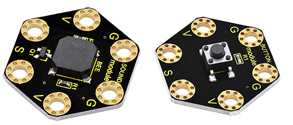
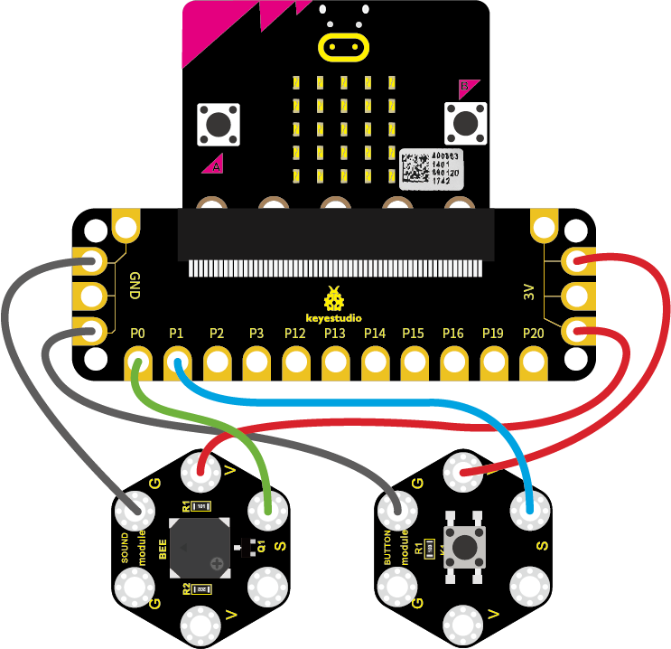
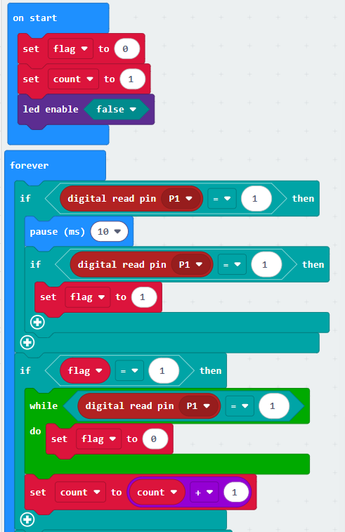
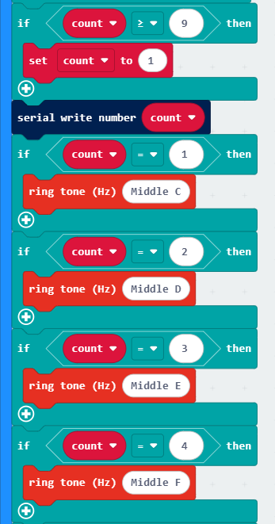
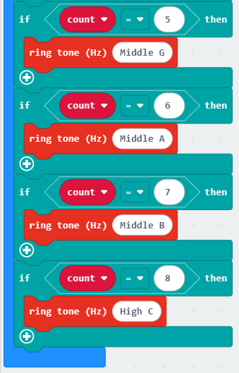

## Project 27 Use Button to Control Buzzer

**1.Overview**

In the above projects, we’ve introduced each sensor module. We now combine those sensor modules to make interactive projects.

In this project, you will learn how to make a buzzer play different tones with a tactile button.

**2.Components Required:**

-   Micro:bit main board \*1

-   Keyestudio Passive Buzzer Module for micro:bit \*1

-   Keyestudio Tactile Button Module for micro:bit \*1

-   Alligator clip cable \*6

-   USB cable \*1

**3.Connection Diagram**

Insert firmly the micro:bit main board into keyestudio Edge Connector IO Breakout Board. Then connect the sensor module to micro:bit main board with alligator clip lines.

For keyestudio Passive Buzzer Module, connect Ring S to P0, V to 3V, G to GND.

For keyestudio Tactile Button Module, connect Ring S to P1, V to 3V, G to GND.

Connect the micro:bit to your computer with a micro USB cable.

**4.Test Code:**

