## Project 3 LED Dot Matrix

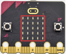

**1.Project Description**

Dot matrices are very commonplace in daily life. They have found wide applications in LED advertisement screens, elevator floor display, bus stop announcement and so on.

The LED dot matrix of Micro: Bit main board V2 contains 25 LEDs in a grid. Previously, we have succeeded in controlling a certain LED to light by integrating its position value into the test code. Supported by the same theory,we can turn on many LEDs at the same time to showcase patterns, digits and characters.

What’s more, we can also click”show icon“ to choose the pattern we like to display. Last but not the least, we can our design patterns buy ourselves.

**2.Components Needed**

-   Micro:bit main board V2 \*1

-   Micro USB cable\*1

**3.Test Code 1**

Link computer with micro:bit board by micro USB cable, and program in MakeCode editor.

（1）A. Enter“Led”→“more”→“led enable false” 

B. Click the drop-down triangle button to select “true”.

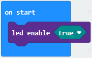

C. Combine it with “on start” block

(2)Click “Led” to move “plot x 0 y 0” into “forever”，then replicate “plot x 0 y 0” for 8 times, respectively set to “x 2”y 0”, “x 2”y 1”, “x 2”y 2”, “x 2”y 3”, “x2”y 4”, “x 1”y 3”, “x 0”y 2”, “x 3”y 3”, “x 4”y 2”.

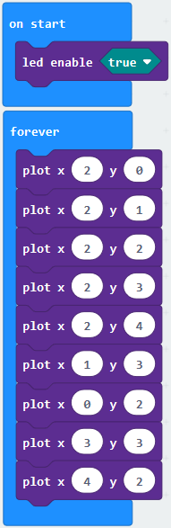

Complete Program：

Select “JavaScript"  and “Python” to switch into JavaScript and Python language code:

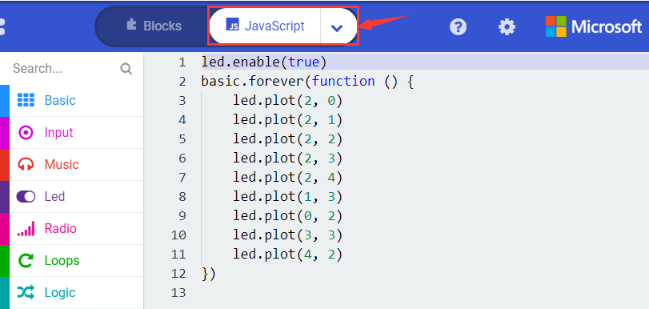

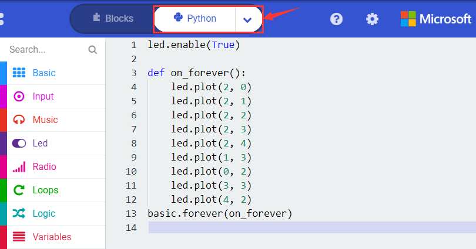

**4.Test Results 1**

Upload code 1 and power on , we will see the icon 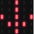.

**5.Test Code 2**

Link computer with micro:bit board by micro USB cable, and program in MakeCode editor.

(1) A. Enter“Basic”→“show number 0”block,

B. Duplicate it for 4 times, then separately set to“show number 1”,“show number 2”,“show number 3”,“show number 4”,“show number 5”.

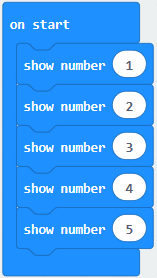

(2) Click“Basic”→“show leds”, then put it into“forever”block，tick blue boxes to light LED and generate“↓”pattern.

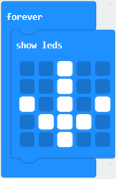

(3)  Move out the block“show string” from“Basic”block, and leave it beneath the“show leds” block.

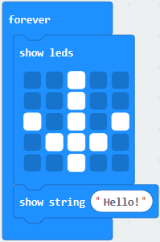

Choose“show icon”from“Basic”block, and leave it beneath the block“show string“Hello!”block.

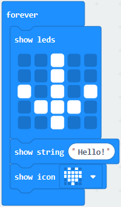

(4)A. Enter “Basic”→“show arrow North”;

B. Leave it into “forever” block, replicate “show arrow North” for 3 times, respectively set to “North East”, “South East”, “South West”, “North West”.

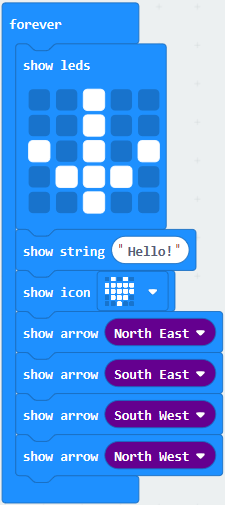

(5)Click “Basic” to get block “clear screen” then remain it below the block “show arrow North West”.

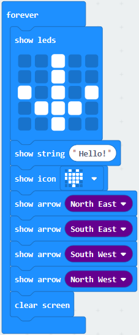

(5)Drag “pause (ms) 100” block from“Basic” block and set to 500ms, then leave it below “clear screen” block.

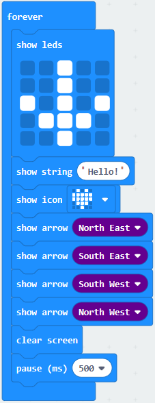

Complete Program:

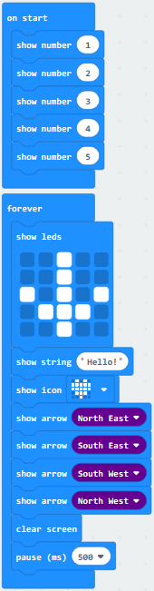

Select “JavaScript" and “Python” to switch into JavaScript and Python language code:

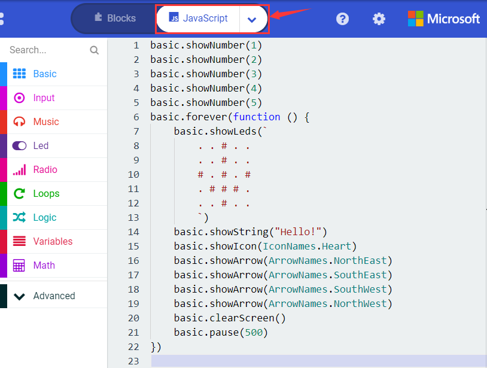

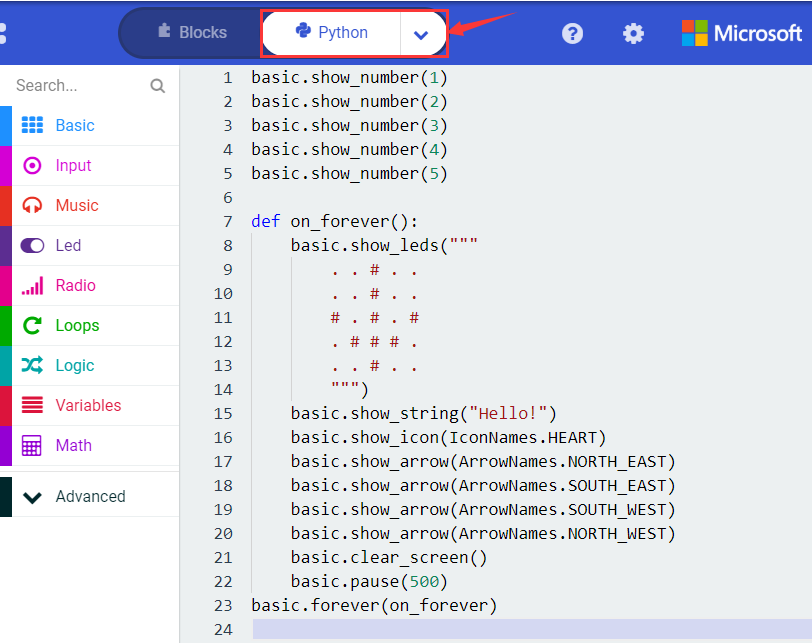

**6.Test Results 2**

Upload code 2 and plug micro:bit to power. Micro: bit starts showing number 1, 2, 3, 4,

and 5, then cyclically display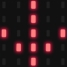，“Hello!”，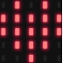，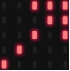，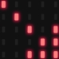，and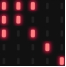patterns.