### Project 4 Programmable Buttons

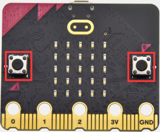

**1.Project Description**

Buttons can be used to control circuits. In an integrated circuit with a button, the circuit is connected when pressing the button and it is open the other way around.

Micro: Bit main board V2 boasts three buttons, two are programmable buttons(marked with A and B), and the one on the other side is a reset button. By pressing the two programmable buttons can input three different signals. We can press button A or B alone or press them together and the LED dot matrix shows A,B and AB respectively. Let’s get tarted.

**2.Components Needed**

-   Micro:bit main board V2 \*1

-   Micro USB cable\*1

**3.Test Code 1**

Link computer with micro:bit board by micro USB cable, and program in MakeCode editor.

（1）Delete“on start”and“forever”firstly，then click“Input”→“on button A pressed”.

（2）A. Click“Basic”→“show string”;

B. Then place it into“on button A pressed”block, change “Hello!”into“A”.

(2)Copy code string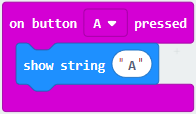once, tap the drop-down button“A”to select“B”and modify,character“A”into“B”.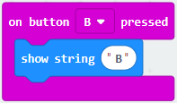

(3)Copyonce，and set to“on button A+B pressed”and“show string “AB”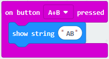.

Complete Code:

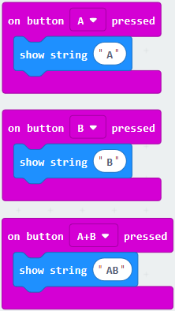

Select “JavaScript" and“Python”to switch into JavaScript and Python language code:

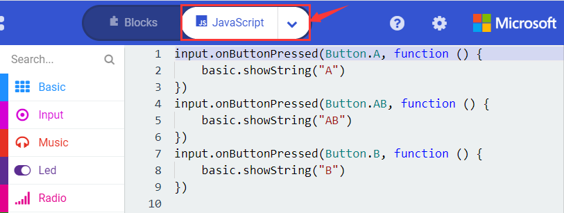

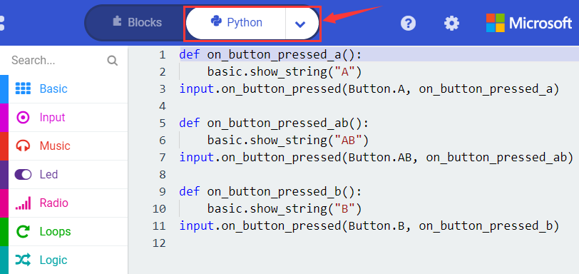

**4.Test Results 1**

After uploading test code 1 to micro:bit main board V2 and powering the main board via the USB cable, the 5\*5 LED dot matrix shows A if button A is pressed, B if button B pressed, and AB if button A and B pressed together.

**5.Test Code 2**

(1) A. Click“Led”→“more”→“led enable false”.

B. Put it into the block“on start”，click drop-down triangle button to select“true” .

(2) A. Tap“Variables”→“Make a Variable...”→“New variable name：”

B. Enter“item”in the dialog box and click“OK”，then variable“item”is produced. And move“set item to 0”into“on start”block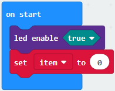.

(3)A. Click“Input”→“on button A pressed”.

B. Go to“Variables”→“ change item by 1 ”.

C. Place it into“on button A pressed”and 1 is modified into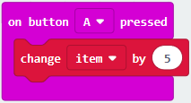.

(4) Duplicatecode string once, click the drop-down button to select“B”，then set“change item by -5”.

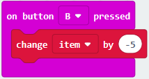

(5)A. Enter“Led”→“plot bar graph of 0 up to 0”.

B. Keep it into“forever”block.

C. Go to“Variables”to move“item”into 0 box，change 0 into 25.

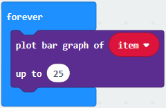

(6) A. Go to“Logic”to move out “if...true...then...”and “=”blocks.

B. Keep“=”into“true”box and set to “\>”.

C. Select“item”in the “Variables” and lay it down at left box of “\>”，change 0 into 25；Enter “Variables” to drag “set item to 0” block into “if...true..then...”, alter 0 into 25.

D. Enter“Variables”to drag“set item to 0”block into“if...true..then...”, alter 0 into 25.

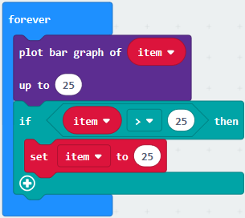

(7)A. Replicate code string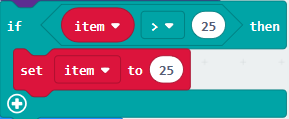once .

B. “\>” is modified into “\<” and 25 is changed into 0.

C. Leave it beneathcode string.

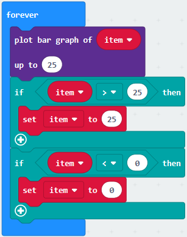

Complete Program：

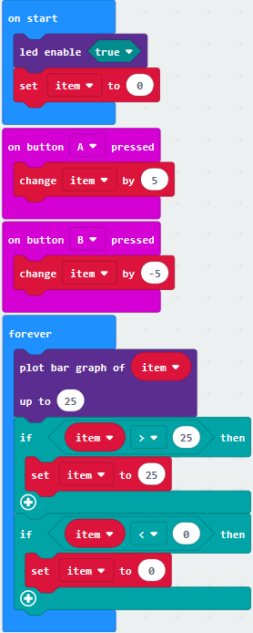

Select “JavaScript" and“Python”to switch into JavaScript and Python language code:

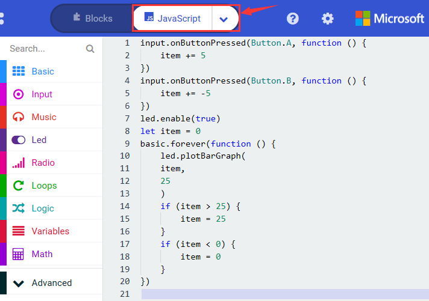

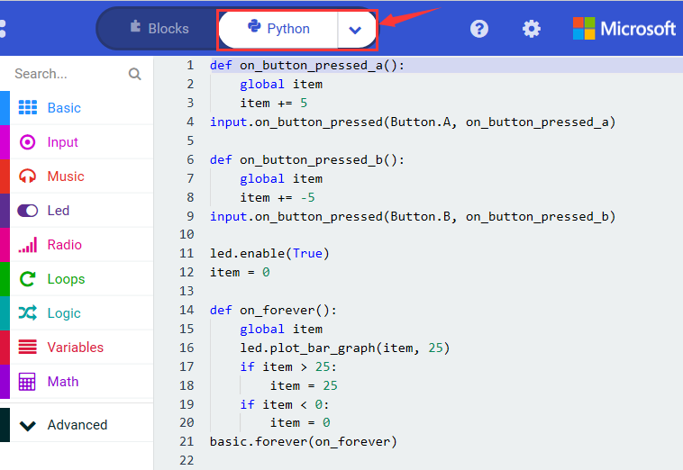

**6.Test Results 2**

Uploading test code 2 to micro:bit main board V2 and powering the main board via the USB cable, when pressing the button A the LEDs turning red increase while when pressing the button B the LEDs turning red reduce.