## Project 5 Temperature Detection

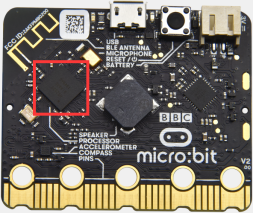

**1.Project Description**

Micro:bit main board V2 is not equipped with a temperature sensor, but uses the temperature sensor built into NFR52833 chip for temperature detection. Therefore, the detected temperature is more closer to the temperature of the chip, and there maybe deviation from the ambient temperature.

**2.Components Needed**

-   Micro:bit main board V2 \*1

-   Micro USB cable *1

**3.Test Code 1**

(1)Click“Advanced”→”Serial”→“serial redirect to USB” into “on start”.

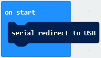

(2)Go to“Serial”→“serial write value“x”=0”into “forever”.

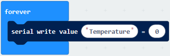

(3)Click“Input” → “temperature(℃)” into“into serial write value “x”=0 and change ”0” into “temperature”.

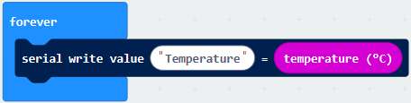

(4)Go to“Basic”→“pause (ms) 100”into “forever”and set pause to 500.

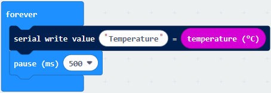

Complete Program：

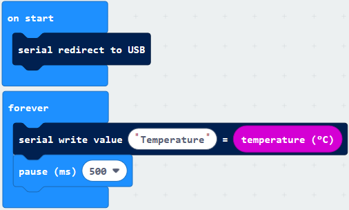

Select “JavaScript" and “Python” to switch into JavaScript and Python language code:

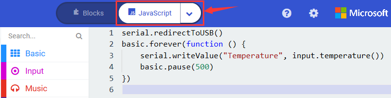

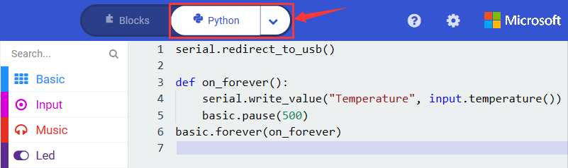

**4.Test Results 1**

After uploading test code 1 to micro:bit main board V2, powering the main board via the USB cable, and clicking “Show console Device”, the data of temperature shows in the serial monitor page as shown below.

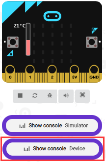

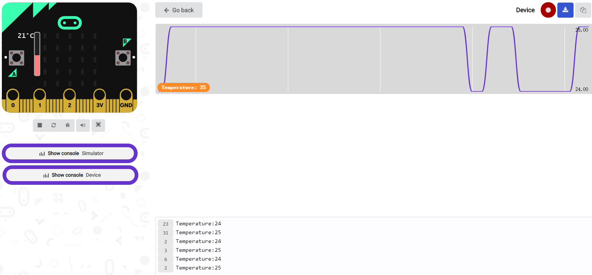

If you're running Windows 7 or 8 instead of Windows 10, via Google Chrome won't be able to match devices. You'll need to use the CoolTerm serial monitor software to read data.

You could open CoolTerm software, click Options, select SerialPort, set COM port and baud rate to 115200 (after testing, the baud rate of USB SerialPort communication on Micro: Bit main board V2 is 115200), click OK, and Connect. The CoolTerm serial monitor shows the change of temperature in the current environment, as shown in the figures below :

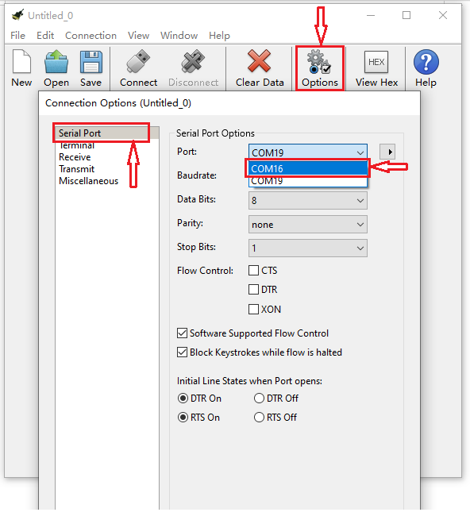

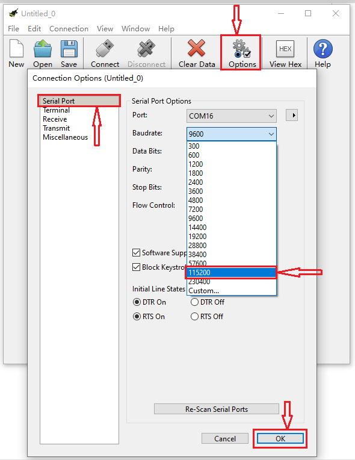

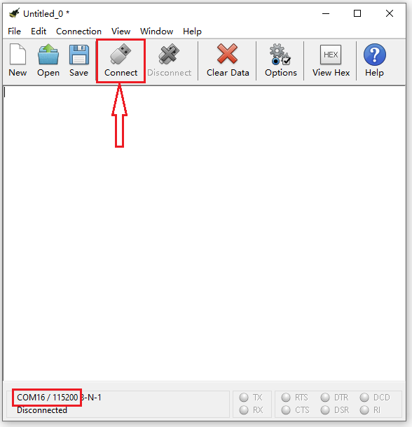

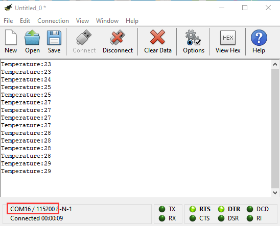

**5.Test Code 2**

Link computer with micro:bit board by micro USB cable, and program in MakeCode  editor.

(1)A. Go to“Led”→“more”→“led enable false”block.

B. Keep it into the“on start”block，tap the triangle button to select“true”.

(2)Tap “Logic” and drag “if...then...else” into “forever” block; and then drag “=” into “true”.

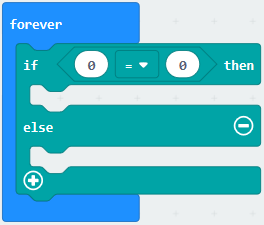

(3)Enter “Input” to move “temperature(℃)” into the left side of “=”; click the little triangle of “=” to choose “≥”,and change the “0” to “35”.

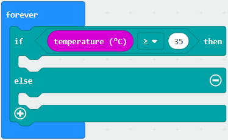

(4)Click “Basic” to find out block “show icon” and move it into“then”; copy and place the block “show icon” to “else” and click the little triangle of  “”to select “".

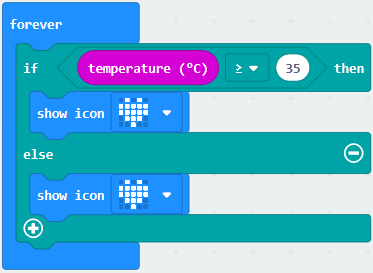

Complete Program：

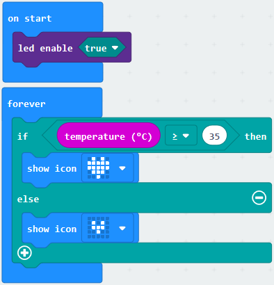

Select “JavaScript" and “Python” to switch into JavaScript and Python language code:

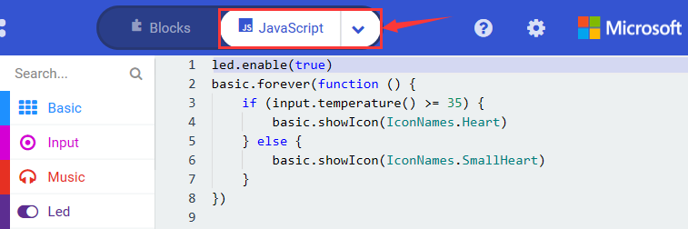

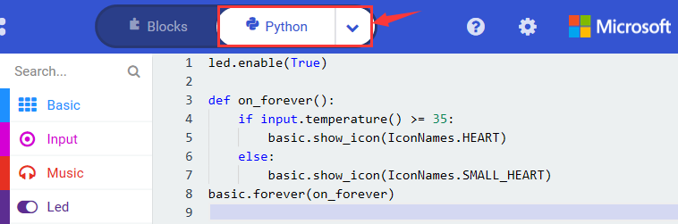

**6.Test Results 2**

After uploading the code 2, when the ambient temperature is less than 35℃, 5*5 LED will show. When the temperature is equivalent to or greater than 35℃, the patternwill appear.