### Project 6 Geomagnetic Sensor

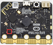

**1.Project Description**

This project aims to explain the use of the Micro: bit geomagnetic sensor, which can not only detect the strength of the geomagnetic field, but also be used as a compass to find bearings. It is also an important part of the attitude heading reference system (AHRS). 

Micro: Bit main board V2 uses LSM303AGR geomagnetic sensor, and the dynamic range of magnetic field is ±50 gauss. In the board, the magnetometer module is used in both magnetic detection and compass. In this experiment, the compass will be introduced first, and then the original data of the magnetometer will be checked.

The main component of a common compass is a magnetic needle, which can be rotated by the geomagnetic field and point toward the geomagnetic North Pole (which is near the geographic South Pole) to determine direction.

**2.Components Needed**

-   Micro:bit main board V2 \*1

-   Micro USB cable\*1

**3.Test Code 1**

Link computer with micro:bit board by micro USB cable, and program in MakeCode editor.

（1）A. Click“Input”→“more”→“calibrate compass”.

B. Lay down it into block“on start”.

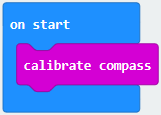

（2）A. Go to“Input”→“on button A pressed”.

B. Enter“Basic”→“show number”, put it into“on button A pressed”block;

C. Tap“Input”→“compass heading(℃)”， and place it into“show number”.

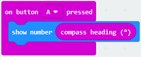

Complete Program：

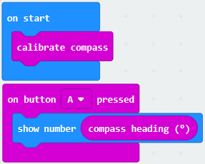

Select“JavaScript" and“Python”to switch into JavaScript and Python language code:

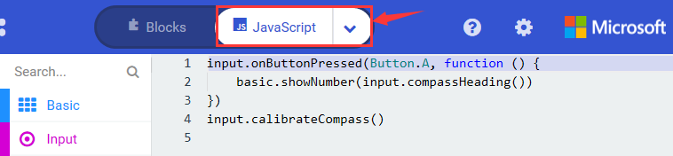

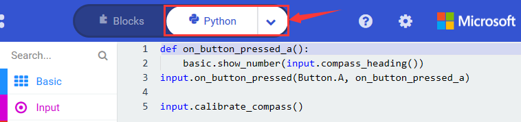

**4.Test Results 1**

After uploading test code to micro:bit main board V2 and powering the board via the USB cable, and pressing the button A, the board asks us to calibrate compass and the LED dot matrix shows “TILT TO FILL SCREEN”. Then enter the calibration page. Rotate the board until all 25 LEDs are on red as shown below.

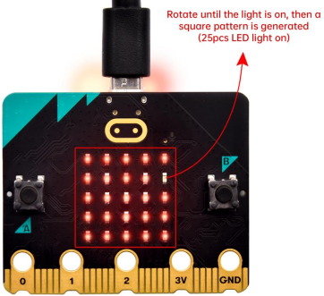

After that, a smile pattern appears, which implies the calibration is done. When the calibration process is completed, pressing the button A will make the magnetometer reading display directly on the screen. And the direction north, east, south and west correspond to 0°, 90°, 180° and 270°.

**5.Test Code 2**

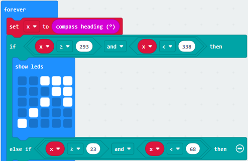

This module can keep reading data to determine direction, so does point to the current magnetic North Pole by arrow.

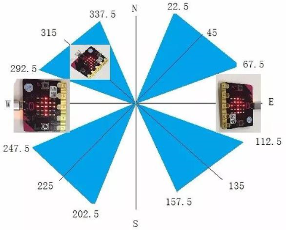

For the above picture, the arrow pointing to the upper right when the value ranges from 292.5 to 337.5. Since 0.5 can’t be input in the code the values we get are 293 and 338.

Link computer with micro:bit board by micro USB cable, and program in MakeCode editor.

(1)

A. Enter“Input”→ “more”→“calibrate compass”.

B. Move“calibrate compass”into“on start”.

(2)

A. Click“Variables”→“Make a Variable...”→“New variable name：”

B. Input“x”in the blank box and click“OK”, and the variable “x” is generated.

C. Drag out“set x to”into“forever”block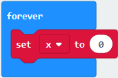.

(3)

A. Go to“Input”→“compass heading(℃)”, and keep it into“0”box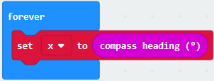.

B. Tap“Logic”→“if...then...else”, leave it below block“sex x to compass heading”, then clickicon for 6 times.

(4)

A. Place“and”into“true”block,.

B. Then move“=”block to the left box of “and” .

C. Click“Variables”to drag“x”to the left “0”box, change 0 into 293 and set to “≥”; 

D. Then copy“x≥293”once and leave it to the right “0”box and set to“x\<338”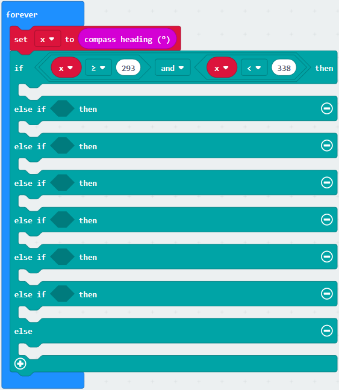.

(5)

A. Go to“Basic”→“show leds” .

B. Lay it down beneath block, then click“show leds”and the pattern 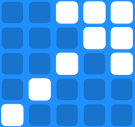appears.

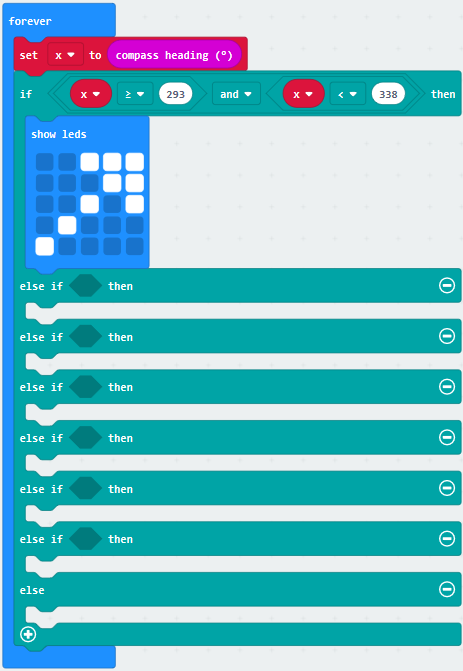

(6)

A. Duplicate 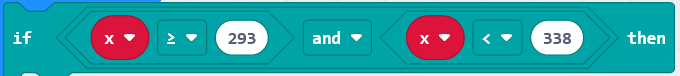for 6 times. 

B. Separately leave them into the blank boxes behind “else if”. 

C. Set to“x≥23 and x\<68”,“x≥68 and x\<113 ”,“x≥113 and x\<158 ”,“x≥158 and x\<203 ”,“x≥203 and x\<248 ”,“x≥248 and x\<293 ”respectively.

D. Then copy “show leds”for 7 times and keep them below the “else if.......then” block respectively. Click the blue boxes to form the pattern“","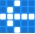","","","","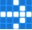"and"".

Complete Program：

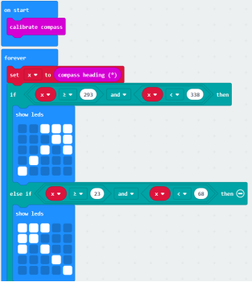

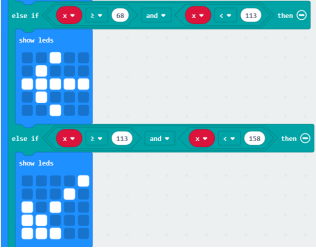

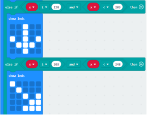

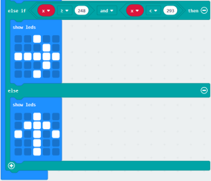

Select“JavaScript" and“Python”to switch into JavaScript and Python language code:

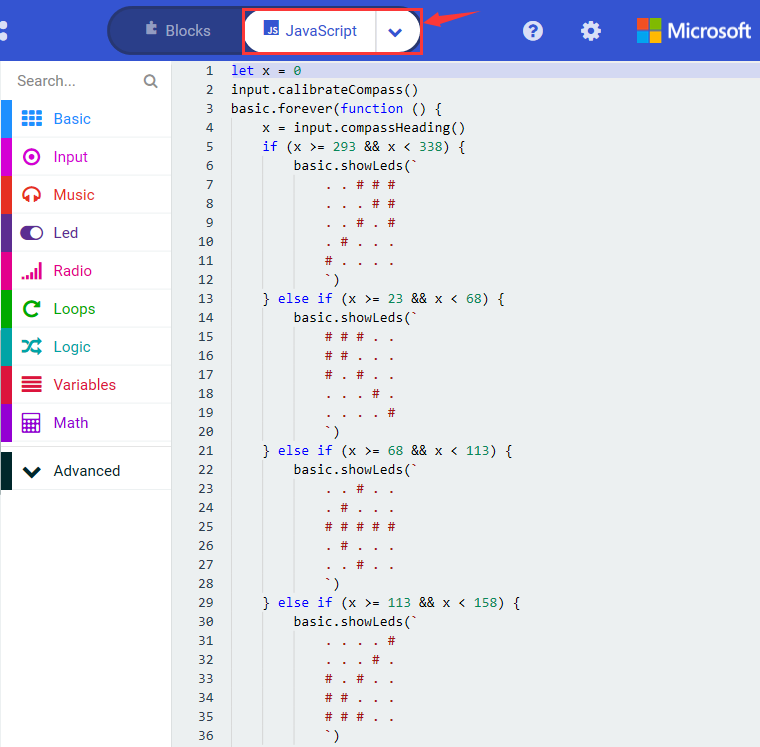

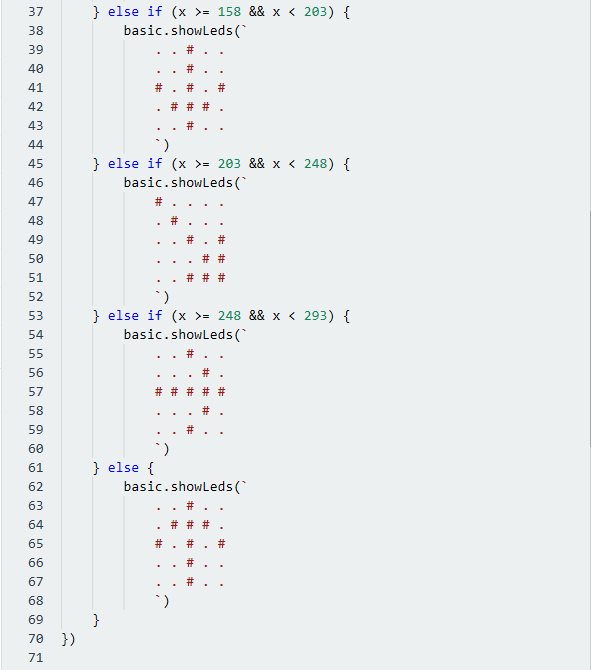

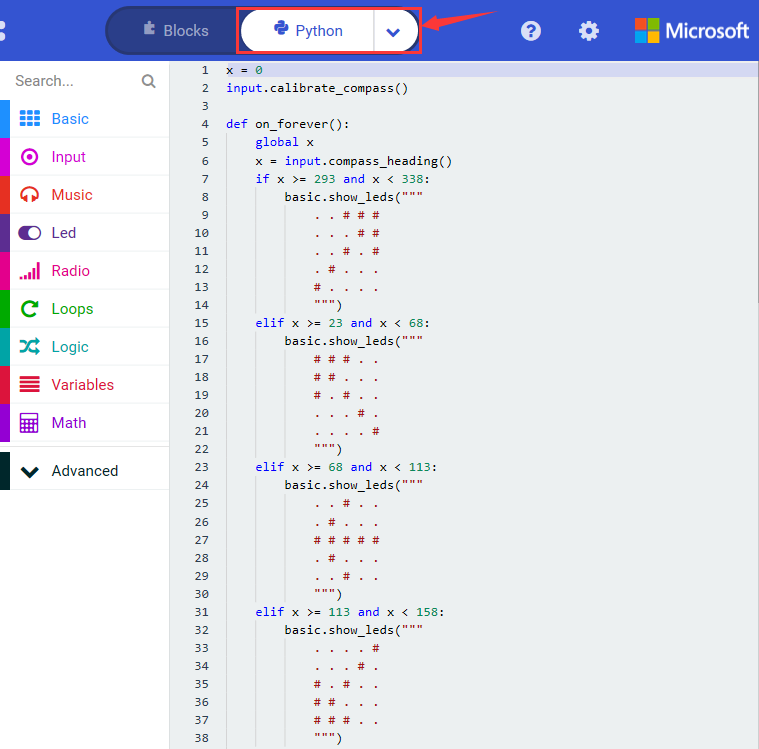

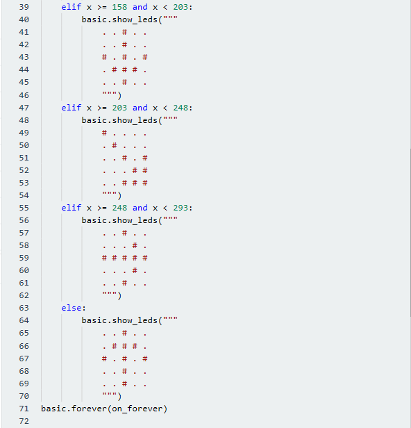

**6.Test Results 2**

Upload code 2 and plug micro:bit to power. After calibration, tilt micro:bit board, the LED dot matrix displays the direction signs. 

 