## Project 7 Accelerometer

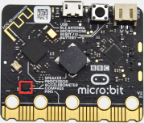

**1.Project Description**

The Micro: Bit main board V2 has a built-in LSM303AGR gravity acceleration sensor, also known as accelerometer, with a resolution of 8/10/12 bits. The code section sets the range to 1g, 2g, 4g, and 8g.

We often use accelerometer to detect the status of machines.

In this project, we will introduce how to measure the position of the board with the accelerometer. And then have a look at the original three-axis data output by the accelerometer.

**2.Components Needed**

-   Micro:bit main board V2 \*1

-   Micro USB cable\*1

**3.Test Code 1**

Link computer with micro:bit board by micro USB cable, and program in MakeCode editor.

(1) A. Enter“Input”→“on shake”.

B. Click“Basic”→“show number”, place it into“on shake”block, then change 0 into 1.

(2) A. Copy code stringfor 7 times.

B. B. separately click the triangle button to select“logo up”,“logo down”,“screen up”,“screen down”,“tilt left”,“tilt right”and“free fall”, then respectively change 1 into 2, 3, 4, 5, 6, 7, 8.

Complete Program：

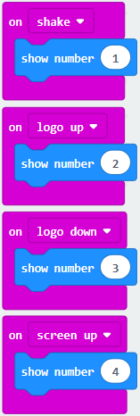

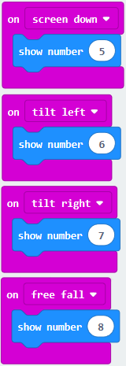

Select“JavaScript" and“Python”to switch into JavaScript and Python language code:

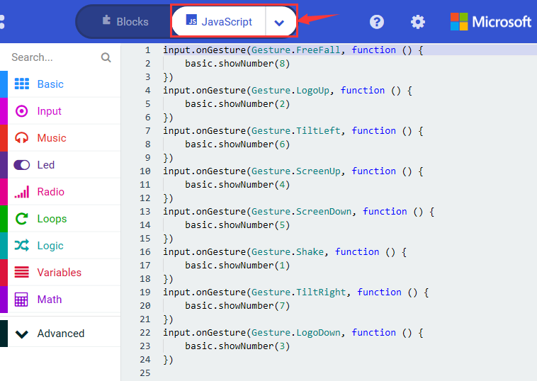

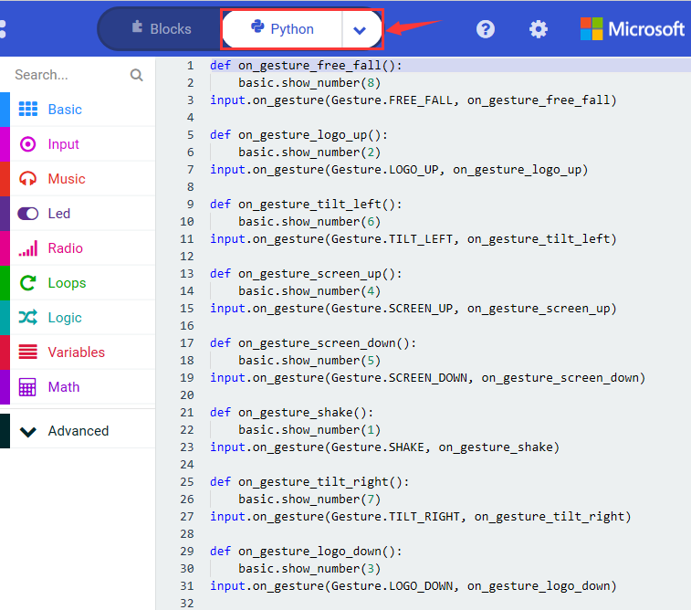

**4.Test Results 1**

After uploading the test code 1 to micro:bit main board V2 and powering the board via the USB cable, if we shake the Micro: Bit main board V2. no matter at any direction, the LED dot matrix displays the digit “1”.

When it is kept upright （put its logo above the LED dot matrix）, the number 2 will show.

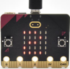

When it is kept upside down( make its logo below the LED dot matrix) , it will show as below.

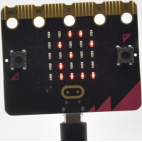

When it is placed still on the desk, showing its front side, the number 4 appears.

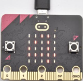

When it is placed still on the desk, showing its back side, the number 5 will exhibit.

When the board is tilted to the left , the LED dot matrix shows the number 6 as shown below.

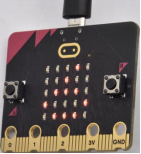

When the board is tilted to the right , the LED dot matrix displays the number 7 as shown below.

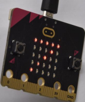

When the board is knocked to the floor, this process can be considered as a free fall and the LED dot matrix shows the number 8. (please note that this test is not recommended for it may damage the main board.)

Attention: if you’d like to try this function, you can also set the acceleration to 3g, 6g or 8g. But still ,we don not recommend.

**5.Test Code 2**

(1) A. Go to“Advanced”→“Serial”→“serial redirect to USB”.

B. Drag it into“on start”

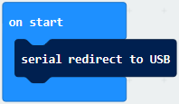

(2) A. Enter“Serial”→“serial write value x =0”.

B. Leave it into“forever”block.

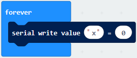

(3) A. Click“Input”→“acceleration(mg) x”；

B. Keep it into“0”box and capitalize the“x”.

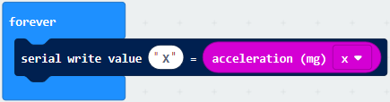

(4)Go to“Basic”and move out“pause (ms) 100”below the block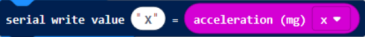 , then set to 100ms.

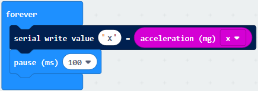

(5)Replicate code string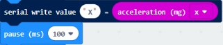for 3 times and keep them into“forever”block，separately set the whole code string as follows: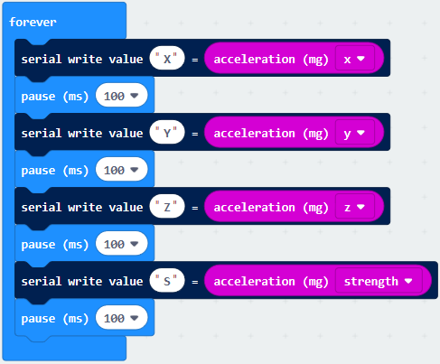

Complete Program：

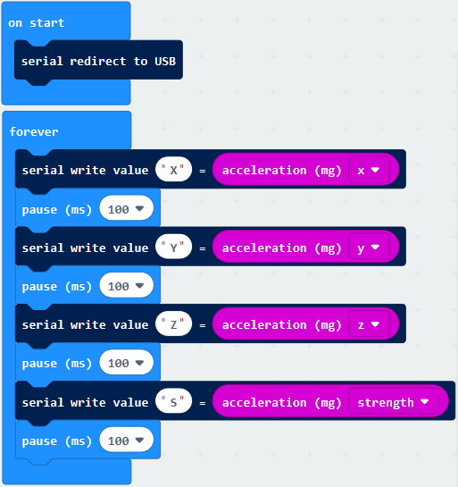

Select “JavaScript" and “Python” to switch into JavaScript and Python language code:

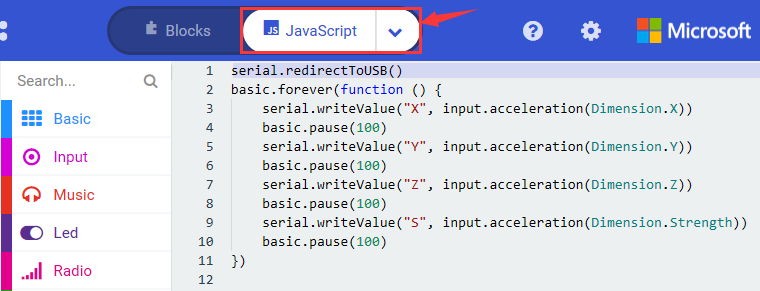

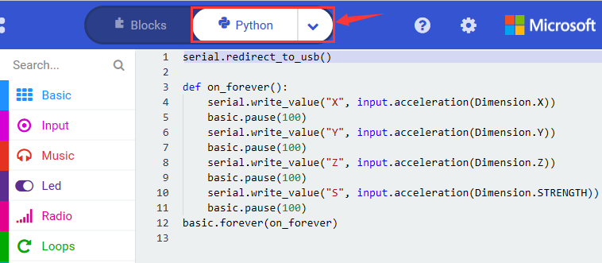

**6. Test Results 2**

Upload test code to micro:bit main board V2, power the main board via the USB cable, and click “Show console Device”.

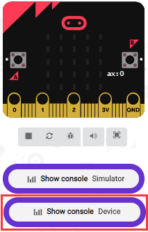

After referring to the MMA8653FC data manual and the Components schematic diagram of the Micro: Bit main board V2, the accelerometer coordinate of the Micro: Bit V2 motherboard are shown in the figure below:

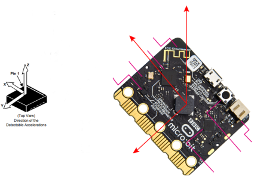

The following interface shows the decomposition value of acceleration in X axis, Y axis and Z axis respectively, as well as acceleration synthesis (acceleration synthesis of gravity and other external forces).

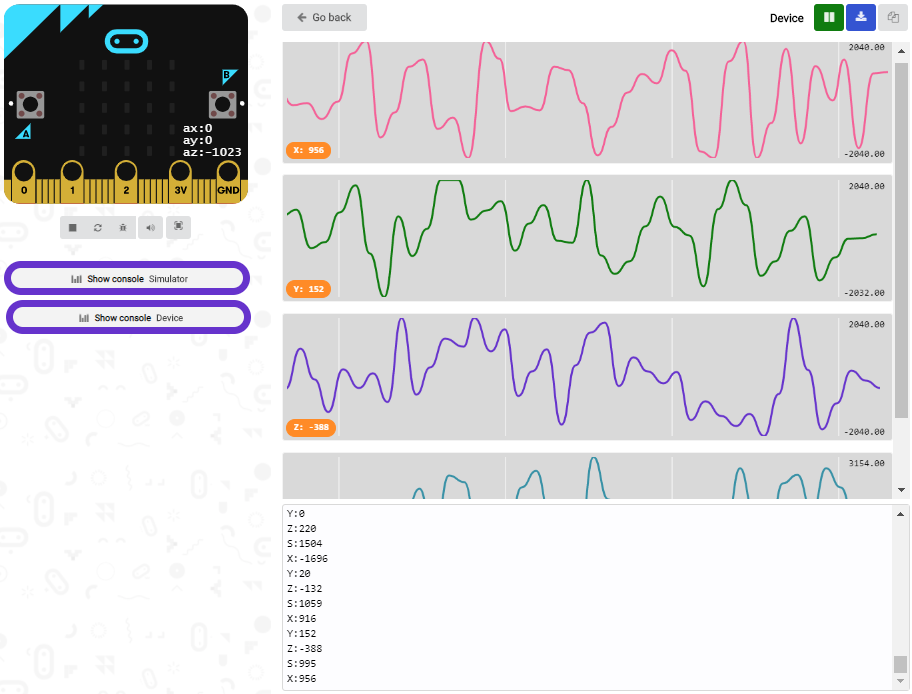

If you're running Windows 7 or 8 instead of Windows 10, via Google Chrome won't be able to match devices. You'll need to use the CoolTerm serial monitor software to read data.

You could open CoolTerm software, click Options, select SerialPort, set COM port and baud rate to 115200 (after testing, the baud rate of USB SerialPort communication on Micro: Bit main board V2 is 115200), click OK, and Connect. The CoolTerm serial monitor shows the data of X axis, Y axis and Z axis , as shown in the figures below :

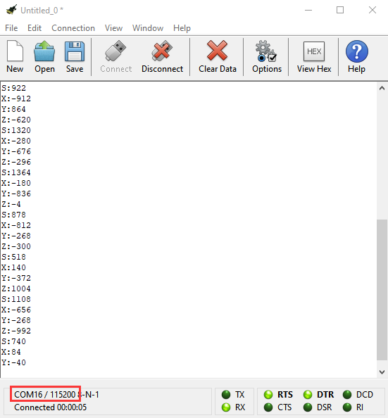