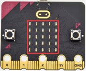
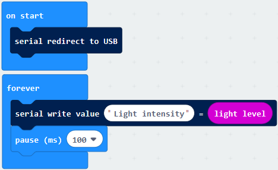
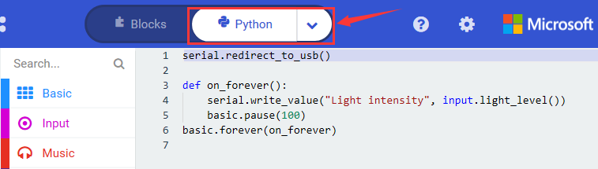
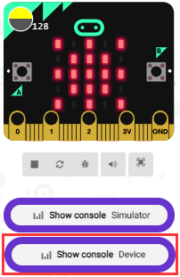
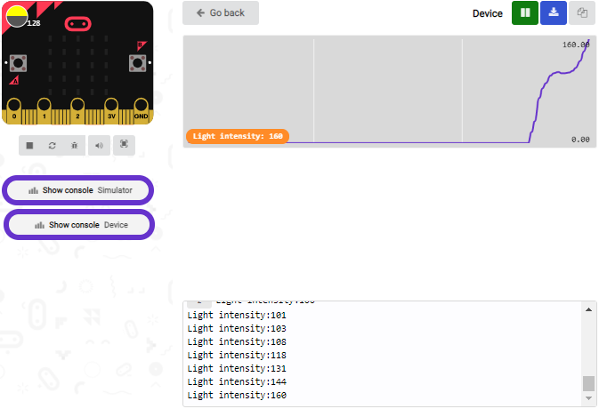
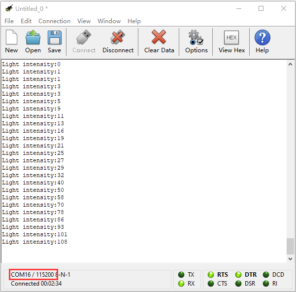

## Project 8: Light Detection

**1.Project Description**

In this project, we focus on the light detection function of the Micro: Bit main board V2. It is achieved by the LED dot matrix since the main board is not equipped with a photoresistor.

**2.Components Needed**

-   Micro:bit main board V2 \*1

-   Micro USB cable\*1

**3.Test Code**

Link computer with micro:bit board by micro USB cable, and  program in MakeCode editor.

(1) A. Enter“Advanced”→“Serial”→“serial redirect to USB”;

B. Drag it into“on start”block.

(2) A. Go to“Serial”→“serial write value x =0”;

B. Move it into“forever”.

(3) A. Click“Input”→“acceleration(mg) x”.

B. Put“acceleration(mg) x”in the“0”box and change “x”into“Light intensity”. 

(4) A. Click“Basic”→“pause (ms) 100”;

B. Lay it down into“forever”and set to 100ms.

Complete Program：

Select “JavaScript" and“Python”to switch into JavaScript and Python language code:

**4.Test Results**

Upload the test code to micro:bit main board V2, power the board via the USB cable and click “Show console Device”.

When the LED dot matrix is covered by hand, the light intensity showed is approximately 0; when the LED dot matrix is exposed to light,the light intensity displayed gets stronger with the light as shown below.

If you're running Windows 7 or 8 instead of Windows 10, via Google Chrome won't be able to match devices. You'll need to use the CoolTerm serial monitor software to read data.

You could open CoolTerm software, click Options, select SerialPort, set COM port and baud rate to 115200 (after testing, the baud rate of USB SerialPort communication on Micro: Bit main board V2 is 115200), click OK, and Connect. The CoolTerm serial monitor shows the value of light intensity , as shown in the figures below :

