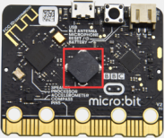
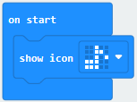
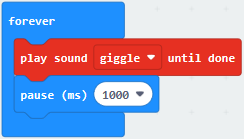
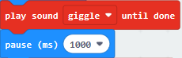
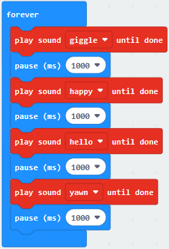
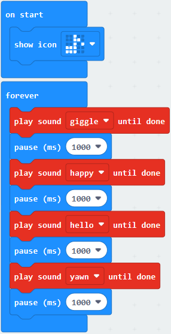
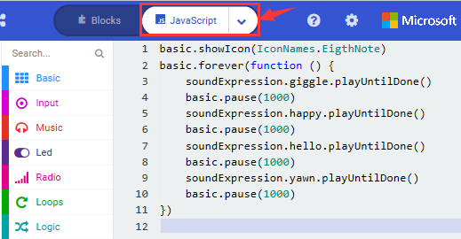
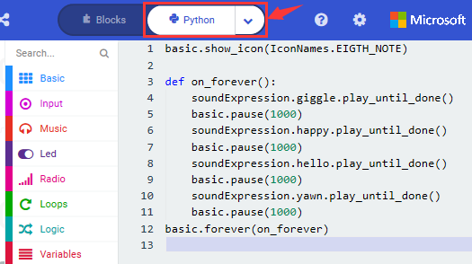

## Project 9 Speaker

**1.Project Description**

The Micro: Bit main board V2 has an built-in speaker, which makes adding sound to the programs easier. We can program the speaker to air all kinds of tones like playing the song *Ode to Joy*.

**2.Components Needed**

-   Micro:bit main board V2 \*1

-   Micro USB cable\*1

**3.Test Code**

Link computer with micro:bit board by micro USB cable, and program in MakeCode editor.

(1)Enter“Basic”module to find “show icon”and drag it into “on start”block;

Click the little triangle to find"".

(2) Enter“Music”module to find and drug“play sound giggle until done”  into “forever”block;

Enter“Basic”module to find and drug“pause(ms) 100” into “forever” block ;

Change 100 into 1000;

(3)Copy three times and place it into “forever” block ;

Click the little triangle to select “happy”,”hello”,”yawn”;

Complete Program：

Select“JavaScript" and“Python”to switch into JavaScript and Python language code:

**4.Test Results**

After uploading the test code to micro:bit main board V2 and powering the board via the USB cable, the speaker utters sound and the LED dot matrix shows the logo of music.