# 4. Troubleshooting

## 4.1 How to Update the Firmware

**Hardware** is the physical part of a micro:bit.

**Software** is made up of the programs you write and run on your micro:bit.

**Firmware** is in the middle: a special kind of software that makes devices function properly. It’s physically stored in the micro:bit’s interface chip and doesn’t change when you write programs or turn your micro:bit off, but it can be updated.

The micro:bit will work with the firmware it came with, but there may be times when you may want to update the firmware to use new features like [WebUSB](https://microbit.org/get-started/user-guide/web-usb/).

**Checking your firmware version**

To find out what version of the firmware you have on your micro:bit, **Plug it in via USB**, open up the **DETAILS.TXT** file from the **MICROBIT** drive and look for the number on the line that begins 'Interface Version'. In this example, the firmware version is 0254:

```
# DAPLink Firmware - see https://mbed.com/daplink
Unique ID: 9904360249624e45004a601400000027000000009796990b
HIC ID: 9796990b
Auto Reset: 1
Automation allowed: 0
Overflow detection: 0
Incompatible image detection: 1
Page erasing: 0
Daplink Mode: Interface
Interface Version: 0254
Bootloader Version: 0254
Git SHA: ec3fec91e815b1fe27cefb8bc4ffa85ca3317502
Local Mods: 0
USB Interfaces: MSD, CDC, HID, WebUSB
Bootloader CRC: 0xdb256cca
Interface CRC: 0xd0f0bacf
Remount count: 0
URL: https://microbit.org/device/?id=9904&v=0254
```

**How to update the firmware**

**Download the hex file  :  [hex file](./hex_file.7z)**

Disconnect the USB cable and battery pack from the micro:bit.

Hold the reset button at the back of the micro:bit and plug the USB lead into the device. You should see a drive appear in your file manager called **MAINTENANCE** (instead of MICROBIT).

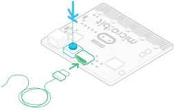

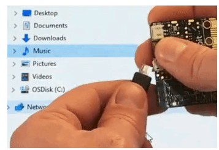

The **MAINTENANCE** drive will look like this, depending on your computer:

**Windows**

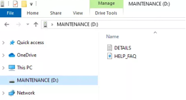

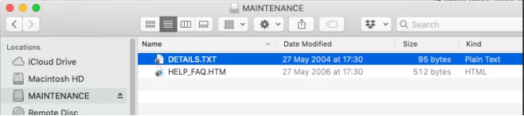

- Download the hex file from this page to your computer.
- Drag and drop the new firmware .HEX file you downloaded from this page onto the **MAINTENANCE** drive and wait for the yellow LED on the back of the device to stop flashing. When the upgrade is completed, the micro:bit will reset, ejecting itself from the computer and re-appear in normal **MICROBIT** drive mode.
- Finally, check the **DETAILS.TXT** file that is on the **MICROBIT** drive and make sure that it has the same version number as the .HEX firmware that you just downloaded and flashed to the interface chip.

## 4.2 Troubleshooting for MAINTENANCE Mode

1.Recently, many users encounter the issue that Micro:bit board doesn’t respond when connected to computer. 

If the way you operate is correct, maybe you accidentally press the reset button and enter the Maintenance mode or lead to lose the firmware due to misoperation.

Plug in Micro:bit board, the“MAINTENANCE”drive appears. That means the program can’t be downloaded.

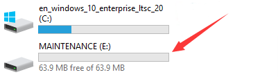

Note:

Download the **hex file** from this page to your computer.

**Download the hex file  :  [hex file](./hex_file.7z)**

2.After the latest firmware is downloaded, then drag it into the“MAINTENANCE”drive as follows, which makes Micro:bit come back to normal mode.

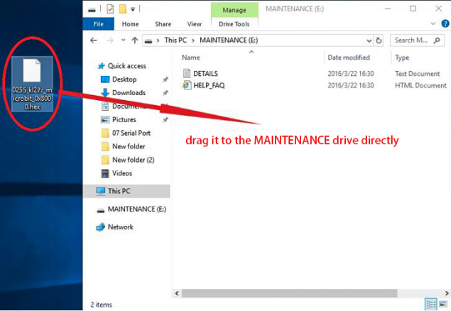

**How to avoid to enter“MAINTENANCE”mode ?**

1. When you connect a USB cable to the micro:bit, don’t press the reset button. Otherwise, the MAINTENANCE mode will be activated.

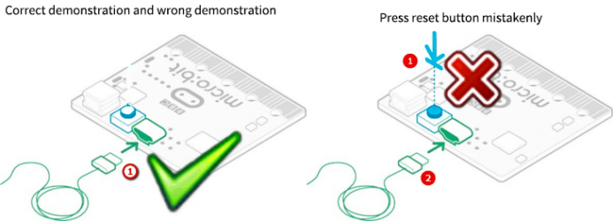

2. Don't unplug the cable suddenly when downloading the micro:bit program; otherwise, the firmware will be lost and“MAINTENANCE”mode will be activated.

3. In the experiment, wrong wiring-up also cause short circuit or loses the firmware.

## 4.3 Troubleshooting downloads with WebUSB

**1. Check your cable**

Make sure that your micro:bit is connected to your computer with a micro USB cable. You should see a **MICROBIT** drive appear in Windows Explorer when it’s connected.

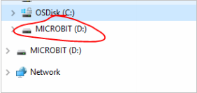

**If you can see the MICROBIT drive go to step 2**.

If you can’t see the drive:

- Make sure that the USB cable is working. >Does the cable work on another computer? If not, find a different cable to use. Some cables may only provide a power connection and don’t actually transfer data.
- Try another USB port on your computer.

Is the cable good but you still can’t see the **MICROBIT** drive? Hmm, you might have a problem with your micro:bit. Try the additional steps described in the falut finding page at microbit.org. If this doesn’t help, you can create a support ticket to notify the Micro:bit Foundation of the problem. **Skip the rest of these steps**.

**2. Check your firmware version**

It’s possible that the firmware version on the micro:bit needs an update. Let’s check:

1. Go to the **MICROBIT** drive.
2. Open the **DETAILS.TXT** file.

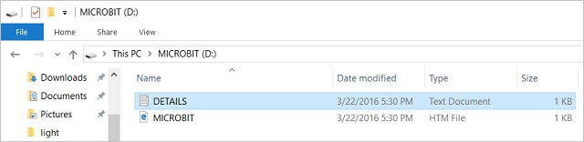

3. Look for a line in the file that says the version number. It should say **Version: ...**

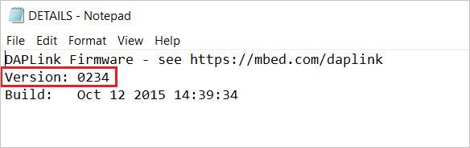

or **Interface Version: ...**

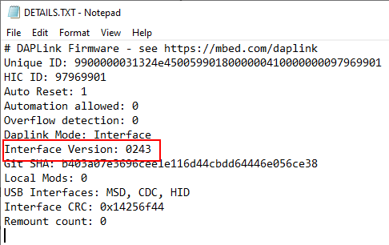

If the version is **0234**, **0241**, **0243** you **NEED** to update the firmware on your micro:bit. Go to **Step 3** and follow the upgrade instructions.

If the version is **0249**, **0250** or higher, **you have the right firmware** go to step **4**.

**3. Update the firmware**

1. Put your micro:bit into **MAINTENANCE Mode**. To do this, unplug the USB cable from the micro:bit and then re-connect the USB cable while you hold down the reset button. Once you insert the cable, you can release the reset button. You should now see a **MAINTENANCE** drive instead of the **MICROBIT** drive like before. Also, a yellow LED light will stay on next to the reset button. 

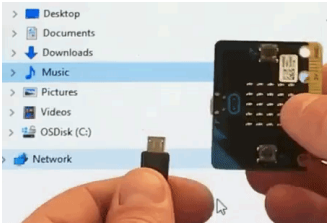

2. [**Download the firmware .hex file**](https://microbit.org/guide/firmware/)

3. Drag and drop that file onto the **MAINTENANCE** drive.

4. The yellow LED will flash while the HEX file is copying. When the copy finishes, the LED will go off and the micro:bit resets. The **MAINTENANCE** drive now changes back to **MICROBIT**.

5. The upgrade is complete! You can open the **DETAILS.TXT** file to check and see that the firmware version changed to the match the version of the **HEX** file you copied.

If you want to know more about connecting the board, MAINTENANCE Mode, and upgrading the firmware, read about it in the [Firmware guide](https://microbit.org/guide/firmware/).

**4. Check over version of Browser**

WebUSB is a fairly new feature and may require you to update your browser. Check that your browser version matches one of these:

- Chrome 65+ for Android, Chrome OS, Linux, macOS and Windows 10.

**5. Pair device**

Once you’ve updated the firmware, open the **Chrome Browser**, go to the editor and click on **Pair Device** in the gearwheel menu. See [WebUSB](https://makecode.microbit.org/device/usb/webusb) for pairing instructions.

Enjoy fast downloads!